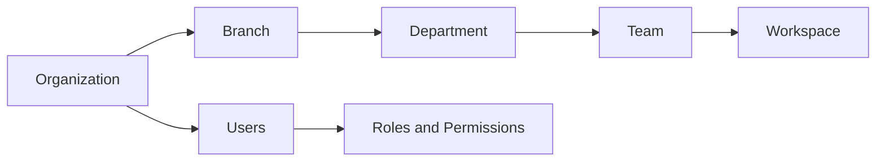
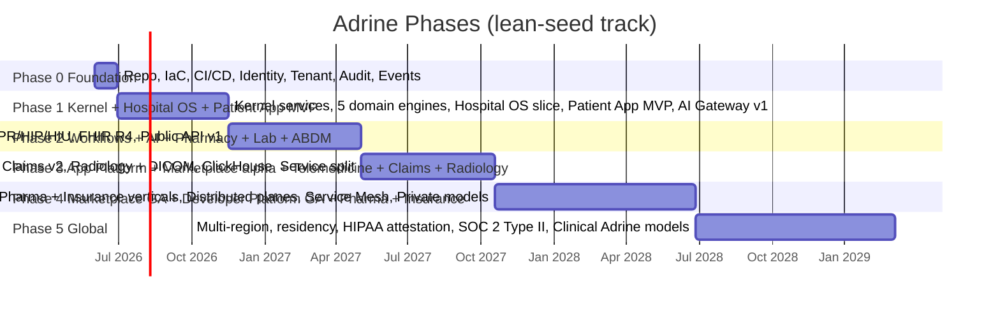

# Adrine Cloud Infrastructure - Master Execution Blueprint

> Scope confirmed: greenfield rebuild from a working HMS prototype (concept-port, no data migration); lean-seed team (3-6 eng, 2 parallel tracks); first wedge is Hospital OS + tightly-bundled Patient App; polyglot stack (TS + Go + Rust + Python) on AWS, India-first (DPDP, ABDM/ABHA, GST) with global-ready architecture.

---

## 1. Strategic positioning and company architecture vision

Adrine is positioned as the **operating cloud of healthcare**, sitting one layer above traditional vertical SaaS:

- **AWS analogue** for healthcare infrastructure primitives (auth, tenancy, storage, events, integrations).
- **Stripe analogue** for healthcare APIs (uniform, versioned, developer-grade).
- **Shopify analogue** for healthcare apps (marketplace, SDK, app runtime).
- **OpenAI analogue** for healthcare intelligence (AI gateway, agents, MCP runtime).
- **Zapier analogue** for healthcare automation (no-code workflow builder).

Company is built as a **platform engineering company**, not a vertical SaaS company. Revenue layers: (1) SaaS modules per tenant, (2) usage-metered platform fees (AI tokens, workflow runs, API calls, storage), (3) marketplace revenue share, (4) enterprise deployments. Sequenced so that the kernel pays for itself via Hospital OS + Patient App in years 0-2, and ecosystem revenue compounds from year 3.

---

## 2. Architectural north star

```mermaid
flowchart TB
  subgraph experiences [Experience Layer]
    HOS[Hospital OS]
    COS[Clinic OS]
    LIMS[LIMS]
    PHOS[Pharmacy OS]
    INS[Insurance/Claims]
    TM[Telemedicine]
    PSA[Patient Super App]
    DEV[Developer Apps]
  end

  subgraph appPlatform [App Platform and Marketplace]
    APR[App Runtime]
    APS[App SDK]
    MKT[Marketplace]
  end

  subgraph apiPlatform [API Platform]
    REST[REST]
    GQL[GraphQL]
    WH[Webhooks]
    SDKS[SDKs]
    PUB[Public APIs]
  end

  subgraph aiPlane [AI / MCP Plane]
    AIG[AI Gateway]
    AGR[Agent Runtime]
    MCP[MCP Host]
    MEM[Agent Memory]
    MOD[Model Router]
  end

  subgraph workflowPlane [Workflow and Event Plane]
    EVT[Event Spine]
    WFE[Workflow Engine - Temporal]
    NCB[No-code Builder]
    AUTO[Automation Rules]
  end

  subgraph kernel [Platform Core - Kernel]
    AUTH[Identity and Access]
    TEN[Tenant Service]
    CFG[Config Engine]
    FF[Feature Flags]
    MR[Module Registry]
    AUD[Audit and Compliance]
    NTF[Notification]
    FILE[File and Document]
    BILL[Subscription and Billing]
    SRCH[Search]
  end

  subgraph domain [Healthcare Domain Engines]
    PAT[Patient]
    ENC[Encounter]
    EMR[EMR/EHR]
    SCH[Scheduling]
    BILE[Billing/Claims]
    LAB[Lab]
    RAD[Radiology]
    PH[Pharmacy]
    ICU[ICU]
    TE[Telemedicine]
  end

  subgraph interop [Interop Cloud]
    FHIR[FHIR R4]
    HL7[HL7 v2]
    DCM[DICOM]
    ABDM[ABDM/ABHA]
    TERM[Terminologies]
    CONN[Connectors SDK]
  end

  subgraph dataPlane [Data and Cloud Infrastructure]
    PG[(PostgreSQL + RLS)]
    RD[(Redis)]
    VEC[(pgvector / Vector DB)]
    OS[(OpenSearch - later)]
    CH[(ClickHouse - later)]
    S3[(S3 Object Store)]
    LAKE[(Data Lake - later)]
  end

  subgraph ctrl [Control Plane - Internal]
    ADM[Admin Console]
    BILLOPS[Billing Ops]
    MOD2[Module Provisioning]
    GOV[AI Governance]
    OBS[Observability and SRE]
  end

  experiences --> appPlatform
  experiences --> apiPlatform
  appPlatform --> apiPlatform
  apiPlatform --> aiPlane
  apiPlatform --> workflowPlane
  apiPlatform --> kernel
  apiPlatform --> domain
  workflowPlane --> domain
  aiPlane --> domain
  domain --> interop
  domain --> dataPlane
  kernel --> dataPlane
  ctrl --> kernel
  ctrl --> aiPlane
  ctrl --> workflowPlane
  ctrl --> appPlatform
```



---

## 3. Universal engineering principles (non-negotiable)

- **Multi-tenant by default.** No code path may run without a resolved `tenantId`. There is no "global" data outside the control plane.
- **Event-first.** Every state change emits a typed, versioned domain event. Workflows, AI, analytics, and integrations are consumers, never coupled callers.
- **Configuration over code.** Tenant-specific behavior lives in config (forms, workflows, permissions, branding, AI policies). Forks per tenant are forbidden.
- **API-first.** Every internal capability has a typed contract before it has a UI.
- **AI only through the AI Gateway.** No SDK keys, no direct model calls in domain services. Gateway enforces policy, budget, audit, redaction.
- **Async-first UX.** User-facing requests target p95 < 200 ms server-time. AI, notifications, analytics, workflow side-effects are queued and streamed.
- **Healthcare-grade security.** PHI encrypted at rest (column-level for high-sensitivity), in transit, and in logs (redaction). Row-level isolation enforced in the database, not in app code alone.
- **Observable by construction.** Every request carries a trace; every event carries a correlation id; every AI call carries a token-and-cost record.
- **Reversible.** Every deploy must be rollback-safe. Migrations are expand-then-contract. Feature flags gate every new module.
- **Boring where boring works.** Polyglot is justified per service, not per preference. Default to TypeScript unless a hot path demands otherwise.

---

## 4. Platform architecture (kernel, planes, experiences)

The platform is organized as **one kernel, four planes, and an experience layer**:

- **Kernel (Platform Core):** identity, tenancy, config, feature flags, module registry, audit, notifications, files, billing, search. Every other layer imports the kernel; the kernel imports nothing above it.
- **Domain plane:** reusable healthcare engines (patient, encounter, EMR, scheduling, billing, claims, lab, radiology, pharmacy, ICU, telemedicine). Pure capabilities, no product opinion.
- **Workflow and Event plane:** event spine + Temporal-backed workflow engine + no-code builder + automation rules.
- **AI and MCP plane:** AI gateway, agent runtime, MCP host, agent memory, model router, governance.
- **Interop plane:** FHIR, HL7, DICOM, ABDM/ABHA, terminologies, connector SDK.
- **App and API platform:** REST, GraphQL, webhooks, SDKs, public APIs, app runtime, marketplace.
- **Experience layer:** Hospital OS, Patient App, and future verticals - all are clients of the planes, never the source of truth.

Dependency rule (compile-time enforced via package boundaries): `experience -> app/api platform -> domain -> workflow/ai/interop -> kernel -> data`. No upward imports.

---

## 5. Infrastructure and cloud architecture (AWS, polyglot)

**Cloud baseline:** AWS, primary region `ap-south-1` (Mumbai). Architecture is region-pluggable from day 1 to enable EU/US later.

**Compute progression:**
- Phase 0-2: **ECS Fargate** (low ops, fast). One service per "plane" deployment unit.
- Phase 3+: **EKS** (Kubernetes) when team size and service count justify it. Migration is contract-preserving.

**Core managed services:**
- **RDS PostgreSQL** (Multi-AZ, with read replicas in Phase 2+) - primary operational store with row-level security.
- **ElastiCache Redis** - cache, rate limit, ephemeral state, BullMQ queues for TS services.
- **S3** - files, reports, DICOM blobs, model artifacts, data lake bronze layer.
- **MSK or self-managed NATS JetStream** - event spine. Start with **NATS JetStream on Fargate** (cheap, simple, durable streams); migrate to **MSK Kafka** in Phase 3 when fan-out and retention requirements demand it.
- **KMS** - per-tenant CMKs for column-level encryption of PHI fields.
- **Secrets Manager** + **SSM Parameter Store** - secrets and config.
- **CloudFront + Route 53 + WAF + Shield** - edge.
- **SES / SNS** - email and SMS plumbing (notification service abstracts away).
- **OpenSearch Service** - introduced in Phase 2 for cross-tenant search.
- **CloudWatch + AWS Distro for OpenTelemetry** - first-mile telemetry, exported to Grafana stack.

**Polyglot service map:**
- **TypeScript (NestJS for kernel + domain APIs, Next.js for experiences, tRPC where internal):** all kernel services, domain engines, experience BFFs, control plane, public REST/GraphQL.
- **Go:** event router, notification fan-out workers, integration sync workers, HL7/FHIR adapters at scale (Phase 2+), high-throughput webhook dispatcher.
- **Rust:** DICOM/PACS streaming, FHIR transformation pipeline at scale, optional immutable audit ledger. **Deferred to Phase 3+** unless a measured hot path forces it earlier.
- **Python (FastAPI):** AI Gateway, Agent Runtime, MCP Host, embedding/RAG service, clinical AI pipelines, model evaluation harness.

**IaC:** Terraform (workspaces per environment), Terragrunt for DRY composition. Helm charts only when EKS lands. Atlantis or Terraform Cloud for plan/apply review.

---

## 6. Multi-tenant architecture

**Tenant hierarchy:**



**Isolation strategy (layered):**
- **Logical isolation by default:** every PHI/PII table has `tenant_id`, `branch_id` columns; **PostgreSQL Row-Level Security policies** enforce isolation at the database layer, with a session GUC `app.tenant_id` set per request.
- **Schema-per-tenant** option for enterprise tier (single-tenant Postgres schema or dedicated database).
- **Dedicated cluster** option for sovereign deployments (Phase 4+).
- **Compute isolation:** AI jobs and heavy workflow runs run in tenant-tagged worker pools with quotas.

**Tenant lifecycle:** provision (control plane) -> bootstrap defaults (modules, roles, branding, workflows) -> module enablement -> usage metering -> renewal/expiry -> data export -> deprovision (DPDP/GDPR right-to-erasure compliant).

**Tenant configurations are first-class data:** stored in `tenant_config` tables, versioned, diff-able, promotable from staging-tenant to production-tenant via the control plane.

---

## 7. Data architecture

**Operational store:** PostgreSQL 16 with RLS. Per-domain schemas (`patient`, `encounter`, `billing`, ...). Multi-AZ from Phase 1; read replicas from Phase 2; logical replication to ClickHouse from Phase 3.

**Caching and ephemeral:** Redis (clusters per environment, per-tenant key prefixes). Used for rate limits, hot lookups, session, AI prompt cache.

**Search:** start with Postgres FTS + pg_trgm. Move cross-tenant and full-text-heavy search to **OpenSearch** in Phase 2. Vectors via **pgvector** in Phase 1; graduate to a dedicated vector DB (Qdrant or Pinecone) only if scale demands.

**Object storage:** S3 with bucket-per-environment, prefix-per-tenant; lifecycle policies for medical document retention windows (configurable by jurisdiction).

**Analytics warehouse:** **ClickHouse on AWS** introduced in Phase 3, fed by CDC from Postgres (Debezium) and the event spine. Bronze/Silver/Gold layering.

**Data lake:** S3-backed Iceberg tables for events, AI telemetry, workflow runs, operational history. Queryable via Athena, later Trino.

**Migration discipline:** every schema change goes through `expand -> backfill -> contract` with feature flags. Migration tool: **Atlas** or **Prisma Migrate** for TS, with one source of truth per domain.

---

## 8. Event-driven architecture

**Event spine:** NATS JetStream (Phase 0-2) -> Kafka via MSK (Phase 3+). Same logical contract.

**Event taxonomy:**

- Namespace: `adrine.<domain>.<entity>.<verb>`. Examples: `adrine.patient.profile.created`, `adrine.encounter.opd.checked_in`, `adrine.lab.sample.collected`, `adrine.ai.agent.invoked`.
- Every event carries: `event_id`, `tenant_id`, `branch_id`, `actor_id`, `occurred_at`, `version`, `causation_id`, `correlation_id`, `payload`, `pii_redaction_level`.
- Versioning: additive only; breaking changes mint a new `v2` stream.
- Replayable: 30 days hot, 365 days cold in S3.

**Consumers:** workflows, automations, AI agents, notifications, analytics, integrations, webhooks. Each consumer is a documented contract in the **Event Catalog** (control plane).

**Reliability:** outbox pattern from Postgres to the spine (transactional). Idempotent consumers (event_id dedup). Dead-letter streams with operator replay tooling in the control plane.

---

## 9. Workflow orchestration architecture

**Engine:** **Temporal** (self-hosted on Fargate then EKS). Justification: durable execution, polyglot SDKs (TS/Go/Python), versioning, replay, signals, child workflows - exactly what multi-step healthcare workflows need.

**No-code builder:** visual DAG editor compiles to a **Workflow IR (JSON)** that the runtime interprets and executes on Temporal. Same IR is what power users author in YAML and what the marketplace ships.

**Workflow building blocks:** triggers (event, schedule, manual, webhook), conditions, actions (domain API call, notification, AI agent invocation, integration call), delays, human approvals, escalations, sub-workflows, compensation.

**Examples baked into the platform:**
- OPD patient journey (check-in -> token -> consultation -> Rx -> billing -> follow-up reminder).
- Critical lab result escalation (notify doctor -> AI triage -> ICU alert if thresholds breached).
- Discharge summary generation (collect encounter -> AI draft -> doctor review -> patient delivery -> ABDM push).
- Pre-authorization claim (collect docs -> insurer API -> follow-up -> approval/denial -> billing adjust).

**Governance:** workflow templates are versioned, signed, and tenant-promotable. The control plane shows running workflows, failure rates, p95 duration, and offers replay.

---

## 10. AI and MCP runtime architecture

**AI Gateway (Python/FastAPI):** every AI call in Adrine routes through it.
- **Model router:** OpenAI, Anthropic, Gemini, plus self-hosted (vLLM) for private deployments; routing by capability, cost, latency, tenant policy.
- **Budget and quotas:** per tenant, per module, per agent, per user.
- **Policy and guardrails:** PHI redaction in/out, prompt-injection defenses, jailbreak filters, clinical safety policies.
- **Observability:** every request stored with tokens, cost, latency, model, redaction trace.

**Agent Runtime + MCP Host:**
- **Tool Registry:** typed tools (domain APIs, workflow triggers, integrations) registered with permission scopes.
- **Agent Runtime:** plans, executes, retries, with a sandboxed execution surface; supports both single-shot agents and long-running agents bound to workflows.
- **MCP Host:** speaks Model Context Protocol so external MCP servers (and Adrine's own) plug in uniformly. Adrine exposes its own MCP servers for Patient, EMR, Scheduling, Billing - so external agents can be tenant-installed.
- **Agent Memory:** short-term (conversation), long-term (pgvector + summarization), episodic (workflow context).

**AI agent ecosystem (Phase 2-3):**
- Hospital: discharge summarizer, coding/ICD assistant, ICU monitor, OT scheduler optimizer.
- Lab: anomaly detection on results, QC automation, reflex testing.
- Pharma: sales-rep coach, compliance review.
- Patient: multilingual healthcare assistant, medication reminder agent, care navigator.
- Operational: revenue cycle agent, denial-management agent, no-show prediction.

**Models:** start with hosted (OpenAI/Anthropic/Gemini). Phase 3: self-hosted open-weights (Llama, Qwen, MedPaLM-class) for cost/privacy. Phase 4: fine-tunes on de-identified, consented operational data. Phase 5: clinical-specialized Adrine models.

---

## 11. API platform architecture

- **REST** is the default external contract; **OpenAPI 3.1** is the source of truth. SDKs are generated from it (TS, Python, Go) via `openapi-generator` and hand-polished.
- **GraphQL** is offered for experience BFFs and the developer portal, not for the public surface.
- **Webhooks** are first-class; signed with per-tenant secret, retried with exponential backoff, with delivery logs in the control plane.
- **Versioning:** date-based (`2026-05-01`), Stripe-style. Old versions supported for 18 months minimum.
- **Auth:** OAuth 2.1 + PKCE for user contexts; API keys + signed JWT for service contexts; scoped per module and per tenant.
- **Rate limits:** sliding-window per key per route, with burst credits; visible in the developer portal.
- **Idempotency:** `Idempotency-Key` header on all mutating routes.
- **Observability:** every API call carries `request_id`, `tenant_id`, `actor_id`; full trace in Tempo, sampled body for debug-tier only.

---

## 12. App platform and marketplace architecture

**App model:** an app is a signed bundle declaring required scopes, webhooks, UI surfaces (slots in experience apps), workflows it installs, AI agents it registers, and configuration schema.

**App Runtime:**
- **Frontend:** UI slots in experience shells via micro-frontend contracts (Module Federation) for trusted apps; iframed sandbox for untrusted apps.
- **Backend:** apps run as serverless functions (Lambda or Cloudflare Workers) talking only to Adrine APIs through scoped tokens, never directly to the database.
- **Permissions:** OAuth-style consent screen per tenant; admin can revoke and audit.

**Marketplace:** listing, review, signing, versioning, install/uninstall, revenue share. Soft-launched in Phase 3, GA in Phase 4.

**Eventually** organizations build internal apps (dashboards, automations, AI assistants) using the App SDK without Adrine engineering involvement.

---

## 13. Healthcare domain engines (reusable primitives)

Each engine ships with: data model, REST/GraphQL API, events, default workflows, default permissions, default AI tools, default analytics, default config schema.

- **Patient Engine** - unified patient graph, ABHA-linked identity, deduplication, consent state.
- **Encounter Engine** - OPD/IPD/ICU/emergency/virtual visits as a unified abstraction.
- **EMR/EHR Engine** - problems, allergies, meds, vitals, notes, attachments; FHIR-aligned internal model.
- **Scheduling Engine** - resources (doctors, rooms, devices), slots, rules, waitlists.
- **Billing Engine** - items, packages, taxes (GST), invoices, payments, refunds.
- **Claims Engine** - pre-auth, claim submission, adjudication, denial workflows; TPA/insurer connectors.
- **Pharmacy Engine** - master, stock, dispense, substitution, expiry, purchase orders.
- **Lab Engine (LIMS)** - panels, samples, analyzer integrations, QC, approvals, report delivery.
- **Radiology Engine (RIS)** - orders, modalities, DICOM, reporting, PACS references.
- **ICU Engine** - vitals streaming, scoring, alerts, care plans.
- **Telemedicine Engine** - virtual consultation, e-Rx, async messaging.

These are **capabilities**, not products. Hospital OS, Clinic OS, LIMS, etc. compose them.

---

## 14. Interoperability cloud

- **FHIR R4** native: every domain entity has a FHIR projection; external integration uses FHIR by default.
- **HL7 v2** adapters (Go) for legacy hospital devices and lab analyzers.
- **DICOM** ingest and PACS reference (S3-backed object store with index in Postgres); Rust streaming service in Phase 3.
- **ABDM/ABHA** (India): HFR (facility), HPR (professional), HIP (data fiduciary), HIU (data requester), consent manager integration, Gateway. Bake into Patient and Encounter engines from Phase 2.
- **Terminologies:** ICD-10/11, SNOMED CT, LOINC, RxNorm; central terminology service with caching and licensing controls.
- **Connector SDK:** typed framework for building new integrations; ships with template, test harness, certification flow.

---

## 15. Patient ecosystem architecture

**Patient Super App** (mobile-first PWA in Phase 1, native React Native in Phase 2):
- ABHA-linked identity (India), federated identity (global later).
- Appointments, reports, prescriptions, payments, family profiles, wearable sync, telemedicine, AI health assistant.
- **Patient Identity Federation:** one patient identity can be linked across many provider tenants without exposing cross-tenant PHI to providers; the patient controls consent.
- Consent ledger (immutable) - the patient sees and revokes every data share.

The Patient App is **not a feature** of the Hospital OS; it is a peer experience on the platform. The Hospital OS pushes data to a patient's consented record via the same APIs an external developer would use.

---

## 16. Control plane / internal admin platform

The control plane is the **most important internal system** and is treated as a product:

- **Tenant lifecycle:** create, configure, suspend, deprovision.
- **Module provisioning:** enable/disable modules per tenant with cost preview.
- **Subscription and billing operations:** plans, quotas, invoices, dunning, GST.
- **AI governance:** budget ceilings, model allowlists per tenant, prompt-policy management.
- **Workflow operations:** running workflows, failures, replays, template library.
- **Marketplace moderation:** app review, signing keys, takedown.
- **Feature flags and rollouts:** percent rollouts, tenant cohorts, kill switches.
- **Observability:** SLO dashboards per service, error budgets, trace search.
- **Support tooling:** impersonation with full audit trail, ticket linking.
- **Emergency controls:** kill switches per module, region, tenant; circuit breakers.

Built as an internal Next.js app with strict auth (SSO + MFA + step-up for destructive ops) and a complete audit log.

---

## 17. Observability architecture

- **OpenTelemetry** is mandatory in every service; SDK preconfigured in the shared platform packages.
- **Metrics:** Prometheus-compatible -> **Grafana Cloud** (Phase 0-2) -> self-hosted **Mimir** (Phase 3+).
- **Traces:** Tempo (Grafana stack) end-to-end across HTTP, NATS/Kafka, Temporal, AI gateway.
- **Logs:** Loki, structured JSON, PHI redaction at the logger layer.
- **Errors:** Sentry (frontends and backends) with release tagging.
- **Synthetic checks:** Checkly for critical user journeys (patient appointment, OPD check-in, AI assistant query).
- **SLOs per service:** documented, dashboards auto-generated, error budgets enforced by deploy gating in CI.

---

## 18. Security and compliance architecture

- **Compliance baseline:** DPDP (India) day 1; HIPAA technical safeguards baked in day 1; GDPR readiness; SOC 2 Type II target by end of Phase 3; ISO 27001 alongside.
- **PHI handling:** column-level encryption with per-tenant CMKs (AWS KMS) for high-sensitivity fields; envelope encryption for files; redaction at log/AI boundaries.
- **Identity:** OIDC, MFA mandatory for staff, SSO (SAML/OIDC) for enterprise tenants, WebAuthn supported.
- **Authorization:** RBAC + ABAC, evaluated by a central policy engine (start with Casbin or OPA in-process; graduate to a service if hot).
- **Audit:** append-only, hash-chained audit log per tenant; tamper-evident. Phase 3+: anchor digests to an external write-once store (S3 Object Lock).
- **Consent:** consent records are first-class data, queryable, revocable, with ABDM consent-manager integration.
- **Vulnerability management:** SAST (Semgrep), dependency scan (Snyk/Trivy), secret scan (gitleaks), DAST against staging, quarterly pentest from Phase 2.
- **Zero-trust:** mTLS between services (via service mesh in Phase 3+), short-lived workload identities, least-privilege IAM roles.

---

## 19. Developer ecosystem architecture

- **Developer portal** (`developers.adrine.cloud`): API reference, SDKs, sandboxes, app submission, marketplace stats, usage and billing.
- **Sandboxes:** per-developer tenant, prefilled with synthetic data; resets daily.
- **SDKs:** TS, Python, Go - generated from OpenAPI, hand-polished, semver'd.
- **CLI:** `adrine` CLI for scaffolding apps, deploying, running migrations, viewing logs.
- **Certification program:** apps that handle PHI must pass an automated and manual review.
- **Open-source posture:** SDKs, CLI, connector SDK, MCP servers are open source; the platform itself is source-available later if it accelerates adoption.

---

## 20. Monorepo and project structure

Single repository, polyglot, enforced boundaries. Tooling: **pnpm workspaces + Turborepo** for TS, **Go workspaces** for Go, **uv** for Python, **cargo workspaces** for Rust. Top-level layout:

```
adrine/
  apps/
    hospital-os/                 Next.js - provider-facing
    patient-app/                 Next.js (PWA) -> React Native later
    control-plane/               Next.js - internal admin
    developer-portal/            Next.js - external devs
  services/
    kernel-api/                  NestJS - auth, tenant, config, audit, notify, files, billing
    domain-api/                  NestJS - patient, encounter, emr, scheduling, billing, claims, lab, pharmacy
    workflow-runtime/            Temporal worker (TS)
    workflow-builder/            NestJS - no-code builder + IR compiler
    ai-gateway/                  FastAPI - model router, policy, budget, audit
    agent-runtime/               FastAPI - agent execution + MCP host
    event-router/                Go - NATS/Kafka routing, outbox drain, DLQ
    notification-worker/         Go - SMS/email/WhatsApp/push fan-out
    integration-hub/             Go - HL7/FHIR/ABDM adapters
    webhook-dispatcher/          Go - signed delivery, retries
    dicom-stream/                Rust (Phase 3+)
  packages/
    sdk-ts/                      generated + polished TS SDK
    sdk-py/                      generated + polished Python SDK
    sdk-go/                      generated + polished Go SDK
    ui/                          shared design system (shadcn-based)
    api-contracts/               OpenAPI specs, event schemas (JSON Schema)
    workflow-ir/                 Workflow IR types and validators
    tenant-context/              tenant resolution, RLS helpers
    auth-client/                 OIDC client, scope checks
    otel-bootstrap/              OpenTelemetry preconfig
    config-schema/               typed tenant configs
    db/                          Prisma schemas + Atlas migrations (per domain)
  infra/
    terraform/                   modules + envs (dev, staging, prod-ap-south-1)
    helm/                        charts (Phase 3+)
    docker/                      base images
  ops/
    runbooks/
    slos/
    dashboards/
  docs/
    adrs/                        Architecture Decision Records
    rfcs/
    guides/
  tools/
    cli/                         `adrine` CLI
    scripts/
  .github/
    workflows/                   CI/CD per service
```

**Boundary enforcement:** ESLint `no-restricted-imports` + Turborepo `boundaries` + a `depcruise` check in CI prevents upward imports (domain cannot import experience, kernel cannot import domain).

---

## 21. Development standards and governance

- **API standard:** OpenAPI 3.1 first; PR fails if spec drift. Response envelope `{ data, meta, errors }`. Errors are RFC 7807 problem+json with stable codes.
- **Event standard:** JSON Schema in `api-contracts/events`. Lint in CI: required fields, naming, additive-only diffs.
- **Workflow standard:** every workflow ships an IR file, a test file (Temporal time-skipped tests), and a runbook.
- **AI standard:** all AI calls via `@adrine/ai-client`; the client refuses to attach raw PHI without a redaction policy id.
- **Module standard:** every module folder has the same skeleton: `api/`, `domain/`, `events/`, `workflows/`, `ai-tools/`, `permissions/`, `analytics/`, `config/`, `migrations/`, `tests/`, `README.md`, `OWNERS`.
- **Tenant standard:** every public function takes a `TenantContext`; lint rule forbids `process.env`-style globals to access tenant config.
- **Performance standard:** p95 server-time per route < 200 ms for interactive routes; defined in service SLOs; load tests gate releases for hot routes.
- **PR standard:** PRs require an ADR link if architecturally significant; CODEOWNERS enforce review by the owning team; CI must include unit + contract + a smoke E2E.

---

## 22. Engineering organization structure

**Lean-seed (now, 3-6 engineers, two parallel tracks):**

- **Track A - Platform Core:** Platform Lead (kernel + infra + security) + 1 engineer. Owns Phase 0/1 platform deliverables.
- **Track B - Healthcare and Experience:** Domain Lead (engines + Hospital OS) + 1 engineer. Owns the Hospital OS slice.
- **Shared - AI/Workflows/Patient App:** AI/Workflow engineer (often the founder's strongest leverage hire). Owns AI gateway v1, workflows v1, Patient App MVP.
- **Optional 6th hire:** integrations engineer (ABDM, FHIR) once Phase 2 starts.

**Post Series A (12-15 engineers):**

- Platform Infrastructure (kernel, IaC, SRE)
- Workflow and Automation (Temporal, no-code builder)
- AI Infrastructure (gateway, agents, MCP)
- Healthcare Domain (engines)
- Interoperability (FHIR, HL7, ABDM, DICOM)
- Experience (Hospital OS, Clinic OS, Patient App)
- Control Plane and DevEx (admin, dev portal, SDKs)

**Scale (40+ engineers):** team-of-teams with platform-as-product internal customer model; each plane (Kernel, Workflow, AI, Domain, Interop, Data, Experience, Control) becomes a product group with its own PM, design, and SRE pairing.

**Governance:** weekly Architecture Review (ADRs ratified), monthly Platform Council (cross-team contracts), quarterly Strategy Review. RFCs required for cross-plane changes.

---

## 23. Deployment architecture

- **Environments:** `dev` (per-engineer ephemeral), `staging` (prod-like, anonymized data), `prod-ap-south-1` (live), `prod-<region>` added per geo expansion.
- **CI:** GitHub Actions. Stages per service: lint -> typecheck -> unit -> contract -> build -> image scan -> deploy-to-dev.
- **CD:** trunk-based, merge-to-deploy to dev; promotion to staging on green; manual approval to prod.
- **Release strategy:** **feature flags** (Unleash or OpenFeature self-hosted) for runtime gating; **blue/green** for stateful services; **canary** (5% -> 25% -> 100%) for high-traffic routes.
- **Database migrations:** expand-then-contract; gated by flag; pre-deploy and post-deploy steps separate.
- **Rollback:** every deploy produces a rollback plan artifact; one-click rollback in the control plane.
- **Secrets:** Secrets Manager with rotation; never in env files in repo.
- **Disaster recovery:** RPO 5 min (PITR Postgres), RTO 60 min Phase 1, 15 min Phase 3. Quarterly DR drills from Phase 2.

---

## 24. Scaling strategy (monolith to distributed planes)

**Phase 1-2: Modular monolith per plane.** Two deployable units:
- `kernel-api + domain-api` (one process per environment, scaled horizontally)
- `experience apps` (independent)
Plus dedicated services for `ai-gateway`, `workflow-runtime`, `event-router`, `notification-worker`. This is already partly distributed by responsibility, but the **domain monolith stays one process** to keep velocity high.

**Phase 3: First split.** Carve `claims`, `lab`, and `pharmacy` engines out of the domain monolith into their own services when each shows independent scaling profile and team ownership. Introduce a service mesh (Linkerd) and Kafka.

**Phase 4: Plane-level distribution.** AI plane, Workflow plane, Integration plane fully independent. Data plane introduces ClickHouse + Iceberg + Trino.

**Phase 5: Multi-region.** Active-active for stateless services; active-passive for Postgres with region pinning per tenant for residency.

**Key rule:** services split when **team ownership + scaling + failure isolation** all justify it. Splitting on "it feels too big" is forbidden.

---

## 25. Product strategy and GTM

**Wedge:** Hospital OS + Patient App, sold as a bundle.
- The Hospital OS gives revenue and PHI gravity.
- The Patient App gives daily-active users and the network effect.
- Together they tell the "platform" story to investors and to enterprise buyers.

**ICP for Phase 1:** small-to-mid hospitals (50-300 beds) in India, multi-specialty, willing to be design partners. 3-5 design partners by month 4, 10-20 paying tenants by month 9.

**Pricing model:**
- **Base per-bed or per-active-user subscription** (Hospital OS).
- **Patient App free** to patients, monetized via provider adoption.
- **Usage-metered platform fees** (AI tokens, workflow runs, API calls, storage) starting Phase 2.
- **Marketplace revenue share** Phase 4.

**Expansion sequencing:**
1. Hospital OS + Patient App (Phase 1).
2. Pharmacy + Lab-lite + ABDM (Phase 2).
3. Claims + Telemedicine + Radiology + App Platform alpha (Phase 3).
4. Marketplace GA + Pharma + Insurance verticals + Developer Platform GA (Phase 4).
5. Global expansion + sovereign deployments + private models (Phase 5).

---

## 26. Migration strategy from current HMS prototype

Since the prototype is a learning artifact (no data migration), the strategy is **concept-port, not code-port**:

1. **Inventory** (Week 1): list every workflow, screen, and data model the prototype implements. Tag each as "keep concept", "redesign", or "drop".
2. **Domain extraction** (Weeks 2-3): translate "keep" items into the new domain engine specs (Patient, Encounter, EMR, Scheduling, Billing). The new engines are FHIR-aligned even if the prototype was not.
3. **UX continuity** (Weeks 3-4): port the screens that worked well into the new Hospital OS shell (Next.js + shared UI package). Keep terminology familiar to early users.
4. **Design partner continuity** (Month 2): keep prototype users (if any) on the prototype until the new Hospital OS reaches feature parity for OPD; then offer a manual onboarding with synthetic seeding.
5. **Decommission** (Month 6-9): once design partners are stable on the new platform, archive the prototype repo; preserve the learnings in `docs/adrs/`.

Cardinal rule: **do not import the prototype code**. It will pull old assumptions into the new kernel.

---

## 27. Roadmap and execution phases



---

## 28. Phase 1 (MVP) detailed scope - the only phase that matters right now

**Goal:** 3-5 paying design-partner hospitals on Hospital OS, 1,000+ patients on the Patient App, by month 6 from start.

**Deliverables:**

- **Kernel services (kernel-api):** auth (OIDC + MFA + SSO-ready), tenants (org/branch/dept), config engine v1, feature flags, module registry stub, audit log v1, notification (email + SMS + WhatsApp), file service (S3 + signed URLs), billing (subscriptions + GST invoices), search (Postgres FTS).
- **Domain engines (domain-api):** Patient, Encounter (OPD + IPD-lite), EMR-lite (problems, allergies, meds, vitals, notes), Scheduling, Billing.
- **Hospital OS app:** OPD workflow end-to-end, IPD admit/discharge-lite, pharmacy dispense-lite (against in-house orders only), billing + invoices + GST, reports module v1.
- **Patient App MVP:** ABHA-linked sign-in, appointments, view reports, view prescriptions, payments, AI health assistant (single agent through gateway).
- **AI Gateway v1:** OpenAI + Anthropic adapter, policy + budget + audit, prompt template registry, single retrieval pattern (pgvector + recent encounter summaries).
- **Event spine:** NATS JetStream with outbox pattern from kernel and domain APIs.
- **Workflow runtime:** Temporal cluster set up; 3 baked-in workflows (OPD journey, discharge summary draft, appointment reminder); no-code builder is **Phase 2**.
- **Control plane v1:** tenant CRUD, module enablement (toggle only), audit search, AI budget config, basic SLO dashboards.
- **Observability:** OpenTelemetry across all services, Grafana Cloud, Sentry, Checkly synthetics on top-3 journeys.
- **Compliance baseline:** DPDP-compliant onboarding flow, consent capture, encryption at rest, audit log, data-export endpoint, deletion workflow.

**Explicit non-goals in Phase 1:**
- No marketplace.
- No app platform.
- No public developer APIs (private beta only).
- No ABDM yet (Phase 2 - it is non-trivial and needs design-partner commitment).
- No claims, no telemedicine, no radiology, no full LIMS.
- No microservice splits, no service mesh, no Kafka, no ClickHouse, no EKS, no Rust.

---

## 29. Risk register and mitigations

- **Scope creep into "all 11 verticals" too early** -> hard gate: Phase 1 ships only Hospital OS + Patient App.
- **Compliance gaps blocking enterprise sales** -> bake DPDP day 1, HIPAA technical safeguards day 1, schedule SOC 2 Type I by end of Phase 2.
- **AI cost runaway** -> AI Gateway enforces per-tenant budgets and per-route token caps from v1.
- **Premature distributed systems** -> deployment units are services by responsibility; logical splits only happen in Phase 3+ based on measured pain.
- **PHI leakage via logs/AI** -> mandatory redaction at logger and AI client layers; CI lint forbids logging raw `Patient` types.
- **Vendor lock-in (Temporal, OpenAI)** -> AI Gateway abstracts model providers; workflow IR is portable away from Temporal if ever needed.
- **Hiring quality at lean-seed** -> first 5 hires are senior generalists; juniors only after Phase 2.
- **ABDM regulatory shifts** -> integration is isolated in `integration-hub/abdm` with a stable internal interface; specifics swappable.
- **Founder bandwidth** -> control plane is treated as a product so founders are not a runtime dependency for tenant operations.

---

## 30. KPIs per phase

- **Phase 0:** repo bootstrapped, CI green on day 1, one tenant provisioned end-to-end on staging.
- **Phase 1:** 3-5 design-partner hospitals live, 1k+ patients on Patient App, p95 server-time < 200 ms on top-10 routes, AI cost per active doctor < target.
- **Phase 2:** 10-20 paying tenants, 1 public no-code workflow built by a tenant without engineering help, ABDM HIP/HIU certified.
- **Phase 3:** Marketplace alpha with 3 third-party apps, first non-founder-built workflow template in production at 5+ tenants, service split done with zero data incidents.
- **Phase 4:** Marketplace GA with 25+ apps, developer portal with 500+ registered devs, 99.95% uptime per plane.
- **Phase 5:** multi-region live, first sovereign enterprise deployment, SOC 2 Type II achieved.

---

## How to use this plan

Treat sections 1-21 as **standing architecture** (rarely change), sections 22-25 as **organizational and product** (revisit quarterly), and sections 26-30 as **execution** (review monthly). Every architecturally significant decision should produce an ADR under `docs/adrs/`. Phase boundaries are review-and-replan points, not autopilot transitions.
