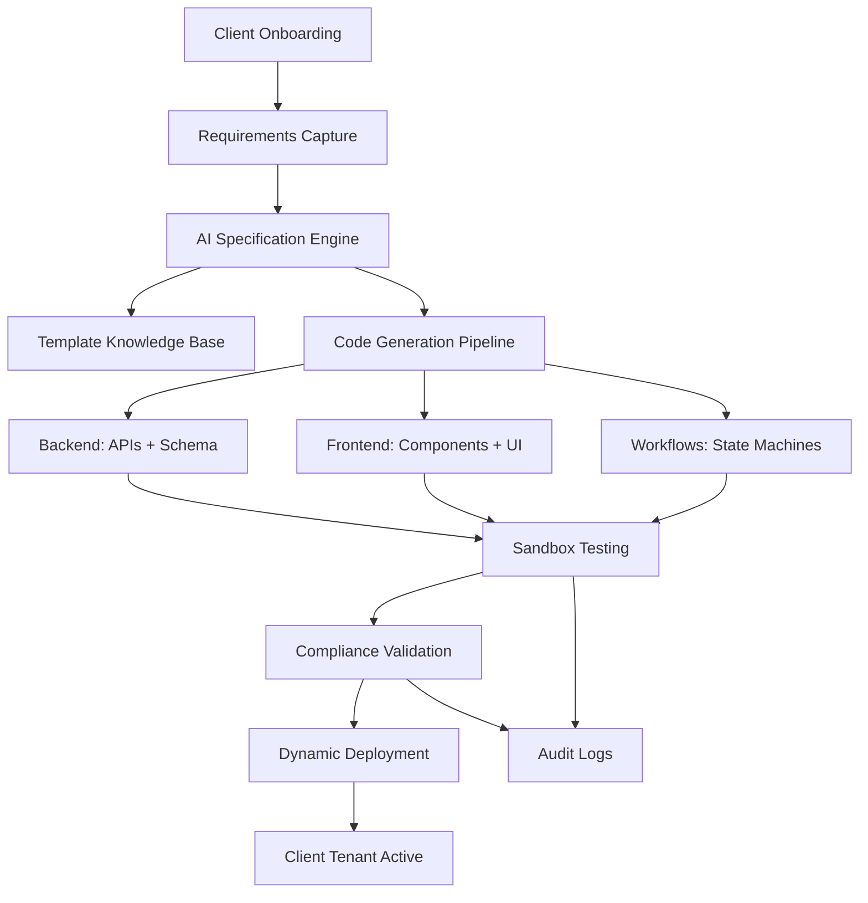

# **Adrine AI-Powered Customization Engine**
**Same-Day Client Module Deployment Strategy**

---

## **🎯 Executive Challenge**

As Adrine company, we provide hospital management systems for healthcare providers. **Critical Problem:** New clients want all their specific customization requirements immediately upon onboarding. 

**Solution:** Build an AI infrastructure that delivers client-specific customization modules **on the same day** they onboard.

---

## **🏗️ AI Customization Engine Architecture**

### **Core Concept**
Transform client requirements into production-ready modules automatically:
- **Input:** Structured client specifications (JSON/YAML) or natural language
- **Processing:** AI-powered code generation with healthcare compliance
- **Output:** Backend APIs, Frontend components, Database schemas, Workflows
- **Deployment:** Instant tenant-specific module registration

---

## **🔄 End-to-End Flow**



---

## **🛠️ Technical Architecture**

### **1. Input Layer**
```typescript
interface ClientCustomizationSpec {
  // Entities & Data Model
  entities: {
    name: string;
    fields: FieldDefinition[];
    validations: ValidationRule[];
    relationships: Relationship[];
  }[];
  
  // Workflows & Business Logic
  workflows: {
    name: string;
    steps: WorkflowStep[];
    roles: string[];
    approvals: ApprovalRule[];
  }[];
  
  // UI Requirements
  ui: {
    dashboards: DashboardSpec[];
    forms: FormSpec[];
    reports: ReportSpec[];
  };
  
  // Integrations
  integrations: {
    lab?: LabIntegration;
    radiology?: RadiologyIntegration;
    pharmacy?: PharmacyIntegration;
    billing?: BillingIntegration;
  };
  
  // Compliance & Security
  compliance: {
    hipaa: HIPAARequirements;
    gdpr: GDPRRequirements;
    auditLevel: 'standard' | 'enhanced';
  };
}
```

### **2. AI Processing Layer**

#### **A. LLM Pipeline Stack**
| Component | Model | Purpose |
|-----------|-------|---------|
| **Specification Parser** | GPT-4/Claude | Convert natural language to structured spec |
| **Code Generator** | Codex-style fine-tuned | Generate TypeScript/React/Prisma code |
| **Workflow Synthesizer** | Claude/Gemini | Create state-machine workflows |
| **Compliance Validator** | Custom AI + Rules | HIPAA/GDPR compliance checking |
| **Test Generator** | AI-assisted | Auto-generate unit/integration tests |

#### **B. Template Knowledge Base**
```typescript
interface ModuleTemplate {
  id: string;
  category: 'registration' | 'billing' | 'lab' | 'pharmacy' | 'custom';
  template: {
    backend: CodeTemplate;
    frontend: ComponentTemplate;
    database: SchemaTemplate;
    workflows: WorkflowTemplate;
  };
  customizations: CustomizationRule[];
  compliance: ComplianceTemplate;
}
```

### **3. Generation Pipeline**

#### **Backend Generation**
```typescript
// AI-generated backend structure
backend/
├── api/
│   ├── routes/[tenant]/[module].ts      # Dynamic API routes
│   ├── middleware/tenantIsolation.ts    # Multi-tenant middleware
│   └── controllers/[module]Controller.ts
├── models/
│   └── [module].ts                       # TypeScript models
├── services/
│   └── [module]Service.ts                # Business logic
└── migrations/
    └── [tenant]_[module]_[timestamp].sql # Database schema
```

#### **Frontend Generation**
```typescript
// AI-generated frontend structure
frontend/
├── components/
│   └── [tenant]/
│       ├── [module]/
│       │   ├── [Module]Form.tsx         # Dynamic forms
│       │   ├── [Module]Dashboard.tsx    # Custom dashboards
│       │   └── [Module]Reports.tsx      # Reports UI
├── pages/
│   └── [tenant]/[module]/
└── hooks/
    └── use[Module].ts                    # Custom hooks
```

---

## **🚀 Implementation Strategy**

### **Phase 1: Foundation (Month 1-2)**
1. **Template Library Creation**
   - Extract common patterns from existing Adrine modules
   - Create 20+ reusable module templates
   - Build template knowledge base with vector embeddings

2. **AI Pipeline Development**
   - Set up LLM integration (OpenAI/Claude API)
   - Build specification parser
   - Create code generation templates
   - Implement basic compliance rules

### **Phase 2: Sandbox & Testing (Month 3)**
1. **Automated Testing Framework**
   - Ephemeral tenant instances
   - Automated unit/integration tests
   - Compliance validation suite
   - Performance benchmarking

2. **Dynamic Deployment System**
   - Module registration API
   - Tenant isolation enforcement
   - Rollback mechanisms
   - Version control for generated modules

### **Phase 3: Production Rollout (Month 4-6)**
1. **Client Onboarding Integration**
   - Admin UI for requirement capture
   - Real-time generation dashboard
   - Client preview system
   - One-click deployment

2. **Advanced Features**
   - Natural language specification input
   - Workflow optimization suggestions
   - Automated compliance updates
   - Performance monitoring

---

## **🔒 Compliance & Quality Assurance**

### **Automated Compliance Checks**
```typescript
interface ComplianceValidator {
  hipaa: {
    phiEncryption: boolean;
    auditLogging: boolean;
    roleBasedAccess: boolean;
    dataRetention: Policy;
  };
  gdpr: {
    consentManagement: boolean;
    dataPortability: boolean;
    rightToErasure: boolean;
    breachNotification: Policy;
  };
  clinical: {
    drugSafetyChecks: boolean;
    dosageValidation: boolean;
    allergyChecks: boolean;
    criticalValueAlerts: boolean;
  };
}
```

### **Quality Gates**
1. **Schema Validation** - Database schema integrity
2. **Type Safety** - TypeScript compilation
3. **Unit Tests** - 80%+ coverage requirement
4. **Integration Tests** - End-to-end workflow validation
5. **Security Scans** - OWASP Top 10 checks
6. **Performance Tests** - Load and stress testing
7. **Compliance Audit** - HIPAA/GDPR verification

---

## **⚡ Speed Optimization Techniques**

### **1. Tiered Cognition**
- **L1 (Fast)**: Template adaptation (95% of requests)
- **L2 (Medium)**: Workflow synthesis (4% of requests)
- **L3 (Deep)**: Full reasoning (1% of requests)

### **2. Caching Strategy**
- **Module Cache**: Previously generated modules
- **Pattern Cache**: Common customization patterns
- **Template Cache**: Pre-compiled templates
- **Validation Cache**: Compliance rule results

### **3. Parallel Processing**
```typescript
// Simultaneous generation pipeline
const [backend, frontend, workflows, tests] = await Promise.all([
  generateBackend(spec),
  generateFrontend(spec),
  generateWorkflows(spec),
  generateTests(spec)
]);
```

---

## **📊 Success Metrics**

### **Time Metrics**
- **Spec to Deployment**: < 4 hours
- **Module Generation**: < 30 minutes
- **Testing & Validation**: < 2 hours
- **Client Onboarding**: Same day

### **Quality Metrics**
- **Bug Rate**: < 1% in production
- **Compliance Pass Rate**: 100%
- **Client Satisfaction**: > 95%
- **Module Reuse Rate**: > 80%

### **Business Impact**
- **Onboarding Speed**: 10x faster
- **Engineering Efficiency**: 70% reduction
- **Customization Revenue**: +40%
- **Client Retention**: +25%

---

## **🔧 Technology Stack**

| Layer | Technology | Rationale |
|-------|-----------|-----------|
| **AI/LLM** | OpenAI GPT-4, Claude, Gemini | Best-in-class code generation |
| **Vector DB** | Pinecone/ChromaDB | Module pattern retrieval |
| **Backend** | Next.js API Routes, Prisma | Existing Adrine stack |
| **Frontend** | React, Tailwind, shadcn/ui | Consistent with Adrine |
| **Workflow** | Temporal.io or XState | Complex healthcare workflows |
| **Testing** | Playwright, Jest | Automated validation |
| **Deployment** | Kubernetes, Docker | Enterprise scaling |
| **Monitoring** | Datadog, Sentry | Observability |

---

## **🎯 Immediate Action Items**

### **Week 1-2: Foundation**
1. Set up AI development environment
2. Create module template extraction process
3. Build basic specification parser

### **Week 3-4: MVP Generation**
1. Implement simple module generator
2. Create sandbox testing environment
3. Build basic compliance validator

### **Week 5-6: Integration**
1. Integrate with existing Adrine system
2. Implement dynamic module registration
3. Create admin UI for requirement capture

### **Week 7-8: Production Ready**
1. Full compliance validation suite
2. Performance optimization
3. Client onboarding automation

---

## **🔄 Continuous Improvement**

### **Learning Loop**
1. **Collect**: Usage data, client feedback, error patterns
2. **Analyze**: Module performance, compliance issues
3. **Optimize**: Templates, AI models, validation rules
4. **Deploy**: Improved templates and models

### **Knowledge Base Evolution**
- **Module Patterns**: Continuously updated with new customizations
- **Compliance Rules**: Updated with regulatory changes
- **Best Practices**: Learned from successful deployments
- **Performance Data**: Used to optimize generation speed

---

## **💰 ROI & Business Case**

### **Investment**
- **Development**: 6 months, 2-3 engineers
- **AI Costs**: $2,000/month (LLM APIs)
- **Infrastructure**: $1,000/month

### **Returns**
- **Faster Onboarding**: 10x reduction in time
- **Lower Engineering Costs**: 70% reduction
- **Higher Client Satisfaction**: 95%+ retention
- **New Revenue Streams**: Customization as premium service

### **Payback Period**: 3-4 months

---

## **🚀 Next Steps**

1. **Executive Approval** for AI customization initiative
2. **Team Formation** with AI/ML and healthcare expertise
3. **Technology Procurement** (LLM APIs, vector database)
4. **MVP Development** with 2-3 pilot clients
5. **Production Rollout** to full client base

---

**Result:** Adrine can deliver **same-day customization** for any healthcare client, maintaining **enterprise-grade compliance** while dramatically reducing engineering effort and accelerating revenue growth.

---

*This architecture enables Adrine to scale customization delivery without sacrificing quality, compliance, or performance in the highly regulated healthcare industry.*
