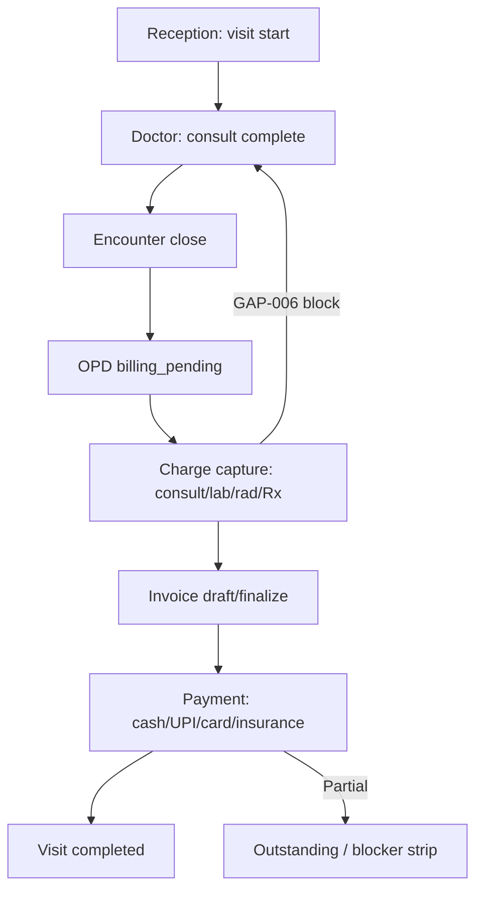
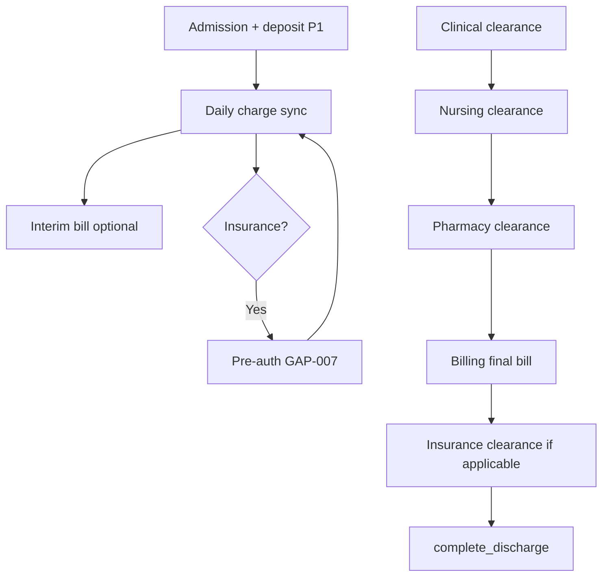
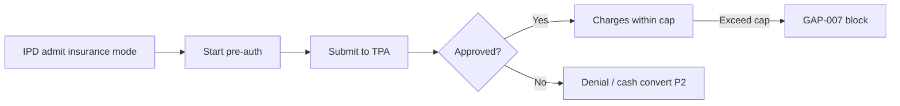

# Billing & Finance Role Module — Product & Implementation Plan

**Last updated:** 2026-05-24  
**App:** `apps/hospital-os` · **Role key:** `billing` · **Base path:** `/billing-dept`  
**Navigation source:** `apps/hospital-os/src/config/roleNavigation.ts` (`ROLE_TABS.billing`)

This plan describes everything a **hospital revenue cycle / finance desk** needs in a multi-specialty enterprise HMS (India: GST, HSN/SAC, TPA/pre-auth, UPI/card/cash, IPD interim/final bill), mapped to what exists today (Live / C1-leaning / Preview per [MASTER_OPERATIONAL_CONNECTIVITY_MATRIX.md](../../MASTER_OPERATIONAL_CONNECTIVITY_MATRIX.md)) and what to build next. It does **not** specify a visual redesign — all new work must reuse `BillingDeptShell`, `BillingStepWizard`, `BillingGateAlerts`, shadcn/ui, and existing billing-dept page patterns.

**Audit honesty:** Per [ENTERPRISE_AUDIT_REPORT.md](../../ENTERPRISE_AUDIT_REPORT.md) §4.6–4.7, the **financial core is strong(invoice + idempotent charge lines + payments + transitions)** — `billing-sync.service` is among the largest services. **BillingGatesService** implements **GAP-006** (encounter close / OPD `billing_pending`) and **GAP-007** (insurance pre-auth on IPD/high-cost). Hospital OS **BillingDeptShell** surfaces GAP-006/007 on every `/billing-dept/*` page. However, **charge master / tariff**, **GST tax invoice PDF**, **package profitability**, **claim submission**, and **day-end reconciliation** are thin or Preview — many routes **look complete while demo-first**.

**Revenue cycle is core** — not a MIS dashboard. P0 Definition of Done (§9) requires governed **encounter → charge capture → invoice → payment → discharge financial clearance** on platform-linked visits/admissions — not “invoice UI with demo rows.”

### SaaS commercial model (explicit)

Hospitals pay Adrine a **fixed subscription** (kernel-api metering, module entitlements). The **billing role module is the hospital’s patient billing and collections** — invoices, payments, insurance desk, GST reports for **patients and payers**. It is **not** Adrine platform billing (tenant subscription invoices live in kernel/admin — out of scope here).

---

## 1. Role purpose and personas

### Purpose

The billing & finance module is the **hospital revenue cycle operations layer**: charge capture from clinical and ancillary departments, invoice generation and settlement, deposits/advances and credit limits, package and health-plan application, insurance empanelment and pre-authorization lifecycle, TPA charge mapping and reconciliation, GST reporting, finance MIS, and **billing/insurance discharge clearance** in unified orchestration (GAP-012). Billing **owns billable truth and collections**; it does **not** prescribe, dispense, triage, or run marketing CRM.

### Personas

| Persona | Typical duties | Primary screens |
|---------|----------------|-----------------|
| **OPD billing clerk** | Consult/lab/rad/pharmacy charges, same-day invoice, payment | Invoices, Payments |
| **IPD biller** | Interim bills, daily charges, final bill, deposit | IPD Billing |
| **Insurance / TPA desk** | Pre-auth, empanelment, claim status, TPA tariffs | Pre-auth, Insurance, TPA Charges |
| **Finance manager** | Revenue, reconciliation, GST, write-offs (governed) | Finance, Reconciliation, GST Reports |
| **Cashier** | Payment modes, receipts, refunds | Payments |
| **CFO / MS view** (read-heavy) | Department revenue, packages, MIS export | Dashboard, Revenue, Reports → Admin MIS handoff |

### Login context

`LoginPage` maps role `billing` to `/billing-dept`. Branch/tenant from platform session; finance runtime via `canUseFinanceRuntime()`.

---

## 2. Screen and tab inventory

### 2.1 Current role tabs (`roleNavigation.ts`)

| Tab key | Label | Path | Page component | Connectivity / readiness (2026-05-24) |
|---------|-------|------|----------------|----------------------------------------|
| `dashboard` | Dashboard | `/billing-dept` | `BillingDashboard` | **C1/C2** — live KPIs when runtime on; demo tiles offline |
| `invoices` | Invoices | `/billing-dept/invoices` | `BillingInvoices` | **C1/C2** — `BillingSyncService` + wizard; demo rows when offline |
| `payments` | Payments | `/billing-dept/payments` | `BillingPayments` | **C1/C2** — platform payments when runtime on |
| `ipd-billing` | IPD Billing | `/billing-dept/ipd-billing` | `BillingIPD` | **C1/C2** — charge sync, clearance panel, GAP-006/007 |
| `packages` | Packages | `/billing-dept/packages` | `BillingPackages` | **Preview** — illustrative package catalog |
| `health-plans` | Health Plans | `/billing-dept/health-plans` | `BillingHealthPlans` | **Preview** — demo plans |
| `revenue` | Revenue | `/billing-dept/revenue` | `BillingRevenue` | **Preview** — demo charts |
| `insurance` | Insurance | `/billing-dept/insurance` | `BillingInsurance` | **C1/C2** — insurance desk; partial platform |
| `pre-auth` | Pre-auth | `/billing-dept/pre-auth` | `BillingPreAuth` | **C1/C2** — wizard; GAP-007 focus |
| `tpa-charges` | TPA Charges | `/billing-dept/tpa-charges` | `BillingTPACharges` | **C1/C2** — TPA tariff mapping UI |
| `reconciliation` | Reconciliation | `/billing-dept/reconciliation` | `BillingReconciliation` | **C1/C2** — `GET /finance/operations/live` |
| `gst` | GST Reports | `/billing-dept/gst` | `BillingGST` | **Preview** — demo GST summary |
| `finance` | Finance | `/billing-dept/finance` | `BillingFinance` | **C1/C2** — finance desk aggregates |
| `reports` | Reports | `/billing-dept/reports` | `BillingReports` | **C1/C2** — mixed live/demo |

### 2.2 Routed in `App.tsx` (`BILLING_PAGES`)

All fourteen paths above — static map only; **no** dynamic `:id` routes today.

| Path | Component | In role tabs | Notes |
|------|-----------|--------------|-------|
| `/billing-dept` | `BillingDashboard` | Yes | `BillingDeptShell`; shortcuts to pre-auth/reconciliation |
| `/billing-dept/invoices` | `BillingInvoices` | Yes | `BillingStepWizard`; largest transactional UI |
| `/billing-dept/payments` | `BillingPayments` | Yes | UPI/card/cash modes in UI |
| `/billing-dept/ipd-billing` | `BillingIPD` | Yes | Interim/final; `OperationalDischargePanel` |
| `/billing-dept/packages` | `BillingPackages` | Yes | Preview banner via `getBillingPageBanner` |
| `/billing-dept/health-plans` | `BillingHealthPlans` | Yes | Preview |
| `/billing-dept/revenue` | `BillingRevenue` | Yes | Preview |
| `/billing-dept/insurance` | `BillingInsurance` | Yes | GAP-007 alerts |
| `/billing-dept/pre-auth` | `BillingPreAuth` | Yes | Insurance transition wizard |
| `/billing-dept/tpa-charges` | `BillingTPACharges` | Yes | TPA code mapping |
| `/billing-dept/reconciliation` | `BillingReconciliation` | Yes | Live ops when runtime on |
| `/billing-dept/gst` | `BillingGST` | Yes | Preview |
| `/billing-dept/finance` | `BillingFinance` | Yes | Desk view |
| `/billing-dept/reports` | `BillingReports` | Yes | Export shell |

### 2.3 Cross-module routes (coordination, not billing-owned)

| Path | Owner | Billing use |
|------|-------|-------------|
| `/reception/billing` | Reception | Front-desk fees; handoff to dept for complex cases |
| `/doctor/consultation/:id` | Doctor | `ConsultationBlockerStrip` billing fulfillment |
| `/pharmacy/billing` | Pharmacy | Counter Rx settlement — sync to central invoice |
| `/lab/billing-handoff` | Lab | Charge preview before/at release |
| `/nurse/discharge` | Nurse | Nursing clearance before billing finalization |
| `/admin/mis`, `/admin/revenue-cycle` | Admin | Executive MIS — billing feeds, not duplicate UI |
| `/admin/finance` | Admin | Hospital P&L preview — not patient billing |

### 2.4 Removed / out of nav (product decisions)

| Item | Notes |
|------|--------|
| Generic `WorkflowStepStrip` on billing routes | **Do not add** — use `BillingStepWizard` and gate alerts |
| Full GL / ERP / SAP | **Out of scope** — Tally export P2 only |

### 2.5 Planned screens (gaps — not in nav yet)

| Proposed path | Screen | Rationale |
|---------------|--------|-----------|
| `/billing-dept/charge-master` | Service & tariff master | P0 gap — audit LB-12 |
| `/billing-dept/deposits` | Deposits & advances ledger | IPD admission deposits |
| `/billing-dept/credit` | Credit limits & corporate accounts | Governed billing |
| `/billing-dept/refunds` | Refunds & credit notes | Reason-coded |
| `/billing-dept/write-offs` | Write-offs (approval chain) | Finance manager |
| `/billing-dept/day-book` | Cashier day book / shift close | P1 India ops |
| `/billing-dept/e-invoice` | GST e-invoice (IRN) | **P1 India** |
| `/billing-dept/claims` | Claim submission & status | **P2** |
| `/billing-dept/denials` | Denial management & rework | **P2** |
| `/billing-dept/installments` | Installment plans | IPD/high-value |
| `/billing-dept/corporate` | Corporate billing & SO | B2B contracts |
| `/billing-dept/estimates` | Cost estimates before admission | Patient quoting |

---

## 3. Revenue cycle as explicit core (target architecture)

### 3.1 Revenue cycle domains (enterprise target)

| Domain | Target capability | Today (honest) |
|--------|-------------------|----------------|
| **Charge capture** | Idempotent lines from OPD/IPD/lab/rad/pharmacy/OT | **Partial** — `BillingSyncService`, duplicate skip when platform |
| **Charge master** | Tariff, HSN/SAC, dept, package link | **Missing** — free-text service names in UI |
| **Invoice** | Draft → finalize → send → pay | **C1/C2** — `guardInvoiceTransition` |
| **Payments** | Cash, card, UPI, partial, insurance | **C1/C2** — `PaymentRecord` on platform |
| **OPD exit gate** | `billing_pending`, encounter closed | **GAP-006** API + shell alerts |
| **IPD interim/final** | Running bill, package consumption | **C1/C2** UI; package math thin |
| **Packages / health plans** | Bundle pricing, entitlements | **Preview** demo |
| **Insurance / TPA** | Empanelment, pre-auth lifecycle | **GAP-007** API + pre-auth wizard |
| **GST** | Rate on lines, tax invoice, e-invoice | Rate fields exist; **no** compliant PDF/IRN |
| **Reconciliation** | Day book, TPA, payment gateway | Reconciliation route **partial live** |
| **Discharge billing** | `grant_billing_clearance`, insurance clearance | **Live** on IPD billing + discharge panel |
| **Refunds / write-offs** | Governed adjustments | **Missing** UI |
| **Corporate / credit** | Limits, SO billing | **Missing** |

### 3.2 Where revenue cycle UX lives

1. **Invoices + Payments** — OPD/emergency daily cashiering.
2. **IPD Billing** — interim/final + discharge financial gate.
3. **Pre-auth + Insurance + TPA** — payer workflows (GAP-007).
4. **Reconciliation + Finance + GST** — back-office close.
5. **Dashboard** — supervisor queues and shortcuts.

---

## 4. Feature breakdown by screen (P0 / P1 / P2)

### Dashboard (`/billing-dept`)

| Priority | Features |
|----------|----------|
| **P0** | When runtime on: store-backed collected/outstanding/invoice counts; branch gate hints (GAP-006/007); CTAs to invoices/IPD/pre-auth |
| **P1** | Department revenue breakdown from platform (not demo `DEMO_REVENUE_BREAKDOWN`) |
| **P2** | CFO widgets; drill to admin MIS |

### Invoices (`/billing-dept/invoices`)

| Priority | Features |
|----------|----------|
| **P0** | List from `hospitalStore` + platform sync; create/finalize path; `BillingStepWizard`; GAP-006 blocker when encounter not closed |
| **P0 (gap)** | Replace demo-only invoice rows when offline with empty state + honest banner |
| **P1** | Charge lines from department feeds (lab/rad/pharmacy) auto-merge; HSN/GST per line |
| **P1** | Receipt print; send to patient (SMS/email P2) |
| **P2** | Bulk invoice; corporate split billing |

### Payments (`/billing-dept/payments`)

| Priority | Features |
|----------|----------|
| **P0** | Record payment against invoice; partial payment; UPI/card/cash modes; platform `collectPayment` when on |
| **P1** | Refund flow with reason; payment gateway hook |
| **P2** | Installment schedule |

### IPD Billing (`/billing-dept/ipd-billing`)

| Priority | Features |
|----------|----------|
| **P0** | Active admission charge list; sync from platform; **`OperationalDischargePanel`** — `grant_billing_clearance`, insurance clearance |
| **P0** | GAP-007 block when insurance mode requires pre-auth not approved |
| **P1** | Interim bill print; deposit/advance apply; package consumption |
| **P1** | Final bill with itemized dept summary |
| **P2** | Length-of-stay auto room charges; DRG-style grouping |

### Pre-auth (`/billing-dept/pre-auth`)

| Priority | Features |
|----------|----------|
| **P0** | Start → submit → approve/deny wizard; ties to admission insurance entity |
| **P1** | Extension/revision; approved amount cap enforcement on new charges (GAP-007) |
| **P2** | NHCX / payer API integration |

### Insurance (`/billing-dept/insurance`) & TPA Charges (`/billing-dept/tpa-charges`)

| Priority | Features |
|----------|----------|
| **P0** | Desk view of open authorizations; stuck insurance count on dashboard |
| **P1** | Empanelment master (payer, plan, copay rules) |
| **P1** | TPA procedure code → hospital charge mapping |
| **P2** | Claim batch submission; remittance advice import |

### Packages (`/billing-dept/packages`) & Health Plans (`/billing-dept/health-plans`)

| Priority | Features |
|----------|----------|
| **P1** | Platform-backed package definitions; apply on IPD admission |
| **P1** | Health plan membership at registration handoff |
| **P2** | Package profitability analytics |

### Revenue (`/billing-dept/revenue`) & Reports (`/billing-dept/reports`)

| Priority | Features |
|----------|----------|
| **P1** | Live revenue by department from charge lines — remove Preview demo |
| **P1** | Day book export; auditor-friendly CSV |
| **P2** | RVU/doctor share feed to admin doctor-sharing |

### Reconciliation (`/billing-dept/reconciliation`)

| Priority | Features |
|----------|----------|
| **P0** | `GET /finance/operations/live` when runtime on; mismatch warnings |
| **P1** | Cashier shift close; UPI settlement match |
| **P2** | Tally export (**P2** — not full ERP) |

### GST Reports (`/billing-dept/gst`)

| Priority | Features |
|----------|----------|
| **P1** | GSTR-ready summary from invoice lines (platform-backed) |
| **P1** | GST e-invoice IRN generation (**P1 India**) |
| **P2** | E-way for goods transfer (pharmacy) |

### Finance (`/billing-dept/finance`)

| Priority | Features |
|----------|----------|
| **P1** | Outstanding AR aging; payer mix |
| **P2** | Write-off queue with kernel `ApprovalChain` |

### Planned screens (§2.5)

**Charge master** is **P0** for enterprise parity (audit LB-12); **deposits**, **refunds**, **day book** are **P1**; **claims/denials** are **P2**.

---

## 5. End-to-end workflows

### 5.1 OPD: encounter → charge capture → invoice → payment → exit

**Platform spine:** `complete_consultation` → encounter close → `billing_pending` → idempotent charge lines → `guardInvoiceTransition` → payment → OPD `completed`.

**UI spine:** Doctor `ConsultationBlockerStrip` + Reception billing handoff → `/billing-dept/invoices` wizard; **BillingGateAlerts** for GAP-006.

### 5.2 IPD: admission → running charges → interim → final → discharge clearance

**Today:** IPD billing page + discharge panel implement **billing/insurance clearance** — **C1-leaning**; deposit ledger UI **missing** (P1).

### 5.3 Insurance: pre-auth lifecycle

**Platform:** `BillingGatesService.assertInsurancePreauthForIpd`; UI on `/billing-dept/pre-auth` + shell alerts.

---

## 6. Cross-role handoffs

Aligned with [RECEPTIONIST_MODULE.md](./RECEPTIONIST_MODULE.md), [DOCTOR_MODULE.md](./DOCTOR_MODULE.md), [NURSE_MODULE.md](./NURSE_MODULE.md), [LAB_TECHNICIAN_MODULE.md](./LAB_TECHNICIAN_MODULE.md), and [PHARMACIST_MODULE.md](./PHARMACIST_MODULE.md).

| From / To | Trigger | Data passed |
|-----------|---------|-------------|
| **Reception → Billing** | Complex case, IPD deposit | Visit/admission id, patient UHID |
| **Doctor → Billing** | Consult complete, procedures | Charge keys, encounter id |
| **Lab / Rad / Pharmacy → Billing** | Order release / dispense | Idempotent charge lines, amounts |
| **Nurse → Billing** | Discharge nursing clearance | Admission ready for final bill |
| **Billing → Nurse/Doctor** | Blockers | Unpaid/dispute flags on discharge panel |
| **Billing → Administrator** | MIS export | Revenue aggregates → `/admin/mis` |
| **Billing → Patient** | Invoice/receipt | PDF, UPI link (P2) |
| **Insurance desk → IPD** | Pre-auth approved | Approved cents cap |
| **Billing → CRM** | — | **Out of scope** — no campaign tools |

---

## 7. Explicitly out of scope for Billing & Finance

| Capability | Owner module |
|------------|--------------|
| Clinical prescribing, charting | **Doctor** — `/doctor/*` |
| Dispensing, formulary | **Pharmacy** — `/pharmacy/*` |
| LIMS / lab verify-release | **Lab** — `/lab/*` |
| Patient registration, queue | **Reception** — `/reception/*` |
| Nursing care, MAR | **Nurse** — `/nurse/*` |
| CRM, drip campaigns | **CRM** — `/crm/*` |
| HR payroll, staff salaries | **HR** — `/hr/*` |
| Full GL, ERP, SAP, payroll accounting | **External ERP** — Tally export hook **P2** only |
| Adrine SaaS subscription invoicing | **Kernel / Platform admin** |
| Inventory procurement 3-way match | **Inventory** — feeds costs, not patient invoice owner |
| Marketing pricing experiments | **CRM / Admin** |

Billing may **read** clinical order status for charge justification — not operate clinical consoles.

---

## 8. Definition of Done — Billing & Finance P0

P0 is **not** “invoice page renders.” P0 is done when billing staff can close **OPD and IPD financial paths** on **platform runtime on** with **governed gates**:

1. **OPD:** Cannot finalize/settle invoice until visit is `billing_pending` and encounter closed (**GAP-006**) — UI shows `BillingGateAlerts` reason, not silent failure.
2. **Charges:** Department charges (lab/rad/pharmacy/consult) appear as idempotent lines without duplicate spam when platform on.
3. **Invoice:** Create → finalize → payment records persist via platform; partial payments supported.
4. **IPD:** Running charges visible on IPD billing; interim/final actions respect admission state.
5. **Pre-auth:** IPD insurance mode blocks high-cost/posting when pre-auth not approved (**GAP-007**) — visible on IPD billing and pre-auth wizard.
6. **Discharge:** `grant_billing_clearance` and insurance clearance via `OperationalDischargePanel` when charges settled per policy.
7. **Reconciliation:** Live ops endpoint populates reconciliation view when runtime on — not static demo only.
8. **Honesty:** Preview routes (packages, revenue, health-plans, gst) show **`BillingReadinessStrip`** — no false Live badge.
9. **Reception handoff:** Complex cases deep-link to billing dept; reception billing shows handoff chip (P1 — mirror consultation blockers).
10. **Shell consistency:** All `/billing-dept/*` pages use `BillingDeptShell` with gate alerts when platform on.
11. `pnpm --filter hospital-os typecheck` passes.

---

## 9. Implementation waves

| Wave | Focus | Deliverables |
|------|-------|--------------|
| **W0** (done) | Billing dept shell | 14 routes, `BillingDeptShell`, GAP-006/007 alerts, invoice/payment wizards, IPD clearance panel |
| **W1** | **RCM P0 honesty** | Charge capture visibility; demo row purge on invoices/payments when platform on; reception billing blocker mirror; day-book stub |
| **W2** | **Charge master P0** | `/billing-dept/charge-master` — tariff, HSN/SAC, dept; wire order→charge mapping |
| **W3** | **GST P1** | Line-level GST from master; tax invoice PDF; e-invoice IRN prep |
| **W4** | **IPD deposits + packages** | Deposit ledger; platform-backed packages on admission |
| **W5** | **Insurance desk P1** | Empanelment; TPA mapping live; pre-auth cap enforcement UI |
| **W6** | **Refunds + credit notes** | Governed refund wizard; credit note invoice type |
| **W7** | **Reconciliation + day book** | Cashier shift close; UPI match; Tally export **P2** |
| **W8** | **Corporate + credit** | Credit limits; corporate SO billing |
| **W9** | **Claims P2** | Submission, denial management, remittance import |

**Recommended wave 1 implementation focus (next sprint):** **W1 — RCM P0 honesty** — platform-only invoice/payment lists when runtime on, explicit GAP-006/007 copy on failed mutations, charge line audit trail on invoice detail, and reception→billing handoff blockers — without redesigning `BillingDeptShell`.

---

## 10. API and domain dependencies

### 10.1 Runtime and store

| Layer | Usage in billing module |
|-------|------------------------|
| `hospitalStore` | `invoices`, `collectPayment`, `createInvoice`, admissions, OPD visits |
| `BillingSyncService` (domain-api) | Idempotent charge sync, invoice transitions |
| `BillingGatesService` | GAP-006 encounter/OPD; GAP-007 insurance |
| `canUseFinanceRuntime()` / `finance-runtime.ts` | Dashboard, reconciliation, dept catalog |
| `useBillingDeptPlatform`, `useBillingStoreAggregates` | Live KPIs |
| `useBillingDeptGates`, `useBillingPageBanner` | Shell gate hints |
| `getBillingPageBanner` | `routeReadiness.ts` per-route preview/live |
| `OperationalDischargePanel` | IPD billing + multi-role clearance |
| `useConsultationBlockers` | Doctor billing fulfillment chip |

### 10.2 Domain-api (representative)

| Domain | Endpoints / actions | Screens |
|--------|----------------------|---------|
| Billing | Invoices, payments, transitions, charge lines | Invoices, Payments |
| Billing dept | `GET /billing/dept/*` catalog, dashboard | Dashboard, Finance, GST |
| Finance ops | `GET /finance/operations/live` | Reconciliation |
| Insurance | Pre-auth transitions, admission insurance | Pre-auth, Insurance, IPD |
| OPD | `billing_pending`, visit complete | GAP-006 |
| IPD | Admission billing, discharge | IPD Billing |
| Discharge | Billing/insurance clearance | IPD panel |

### 10.3 Kernel-api

`ApprovalChain` for write-offs/discounts (**P2** wire); tenant/branch session.

### 10.4 Hooks and shared components (reuse)

| Asset | Path |
|-------|------|
| `BillingDeptShell` | `@/components/billing/BillingDeptShell` |
| `BillingStepWizard` | `@/components/billing/BillingStepWizard` |
| `BillingGateAlerts` | `@/components/billing/BillingGateAlerts` |
| `BillingReadinessStrip` | `@/components/billing/BillingReadinessStrip` |
| `BillingPlatformStrip` | `@/components/billing/BillingPlatformStrip` |
| `billing-gate-messages.ts` | GAP-006/007 copy |
| `useBillingDeptPlatform` | `@/hooks/useBillingDeptPlatform` |
| `BillingDeptController` (domain) | `services/domain-api/src/billing/` |

---

## 11. UI theme constraints (no redesign)

All billing work must match existing Hospital OS patterns:

- **Shell:** `BillingDeptShell` on **every** billing-dept page — title, subtitle, optional actions.
- **Gates:** `BillingGateAlerts` when `platformOn` — GAP-006 encounter/billing_pending, GAP-007 pre-auth.
- **Wizards:** `BillingStepWizard` for multi-step invoice/payment/pre-auth — preserve step indicator style.
- **Readiness:** `BillingReadinessStrip` for preview/local-demo modes from `getBillingPageBanner`.
- **Layout:** `space-y-6`; `text-2xl font-bold` page titles inside shell.
- **Components:** shadcn `Card`, `Table`, `Dialog`, `Badge`, `Button`; INR formatting; `IndianRupee` icon pattern.
- **Blockers:** Mirror doctor/reception blocker **copy** where financial exit blocked — do not reintroduce `WorkflowStepStrip`.
- **Do not** conflate with Admin finance preview tiles — billing-dept is operational patient RCM.

---

## 12. Honesty checklist (audit alignment)

Per [ENTERPRISE_AUDIT_REPORT.md](../../ENTERPRISE_AUDIT_REPORT.md) and connectivity matrix:

- **Invoices/payments/IPD billing** are **C1/C2** — strongest billing routes; still merge demo data when runtime off.
- **Packages, revenue, health-plans, gst** are **Preview** — `getBillingPageBanner` returns `preview`.
- **GAP-006/007** are **closed on API**, **partial in UX** — shell shows alerts; reception exit and OPD insurance path still gaps.
- **Charge master** and **GST tax invoice** are **open** (audit LB-12) — UI must not imply compliance.
- **Claim loop / NHCX** not started — insurance pages are desk + pre-auth, not full payer integration.
- Production safety (auth, RLS, tests) is **not** implied by this UI plan.
- **Adrine platform subscription billing** is kernel/admin — not `/billing-dept/*`.

---

## Appendix A — Exhaustive feature backlog (P2 / future)

- **NHCX / FHIR Coverage** for India insurance exchange
- **Payment gateway:** Razorpay/PayU hooks, UPI QR on invoice
- **Corporate:** panel billing, employee ID, split copay
- **Installments:** EMI plans with interest policy
- **Cost estimation:** packaged surgery quotes
- **Doctor revenue share:** feed approved shares to admin
- **Audit:** immutable invoice amendment log
- **Multi-currency:** medical tourism (edge)
- **Budget alerts:** ward daily charge burn rate
- **Integration:** Tally, Zoho Books export
- **Patient app:** view bill/pay online ( **`patient-app` out of scope** for this program)

---

## Appendix B — File map (implementation reference)

| Concern | Location |
|---------|----------|
| Role tabs | `apps/hospital-os/src/config/roleNavigation.ts` |
| Routes | `apps/hospital-os/src/App.tsx` → `BILLING_PAGES` |
| Readiness | `apps/hospital-os/src/config/routeReadiness.ts` (`getBillingPageBanner`) |
| Pages | `apps/hospital-os/src/pages/billing/*.tsx` |
| Shell / gates | `apps/hospital-os/src/components/billing/*` |
| Hooks | `apps/hospital-os/src/hooks/useBillingDeptPlatform.ts`, `useBillingDeptGates.ts` |
| Finance runtime | `apps/hospital-os/src/runtime/finance-runtime.ts` |
| Domain sync | `services/domain-api/src/billing/billing-sync.service.ts` |
| Gates | `services/domain-api/src/billing/billing-gates.service.ts` |
| Gaps registry | `packages/hospital-operations/src/analysis/gaps.ts` |
