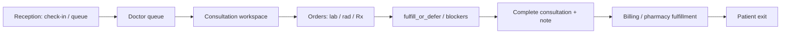
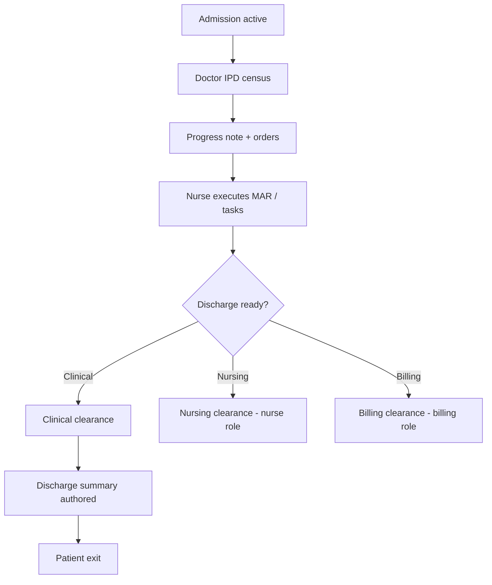

# Doctor Role Module — Product & Implementation Plan

**Last updated:** 2026-05-21  
**App:** `apps/hospital-os` · **Role key:** `doctor` · **Base path:** `/doctor`  
**Navigation source:** `apps/hospital-os/src/config/roleNavigation.ts` (`ROLE_TABS.doctor`)

This plan describes everything a **consultant / attending physician** needs in a multi-specialty enterprise HMS, mapped to what exists today (Live / C1-leaning / Preview per [MASTER_OPERATIONAL_CONNECTIVITY_MATRIX.md](../../MASTER_OPERATIONAL_CONNECTIVITY_MATRIX.md)) and what to build next. It does **not** specify a visual redesign — all new work must reuse `AppLayout`, role tabs, shadcn/ui, `PatientContextBar`, platform runtime hooks, and existing doctor page patterns.

**Audit honesty:** Per [ENTERPRISE_AUDIT_REPORT.md](../../ENTERPRISE_AUDIT_REPORT.md), Hospital OS is **not a serious EMR today**. The doctor module has a strong **OPD visit + orders spine** (C1-leaning) but **clinical depth is thin** — `ClinicalNote.body` is free text; no persisted structured problem list, ICD-10, allergy hard-stops, vitals timeline, or document e-sign. This document plans the full enterprise doctor workspace while labeling current vs target honestly.

---

## 1. Role purpose and personas

### Purpose

The doctor module is the **clinical command center** for licensed prescribers: OPD consultation, structured charting (EMR), diagnostic and therapeutic orders, result review, IPD rounds and discharge clinical clearance, and governed handoffs to nursing, diagnostics, pharmacy, billing, OT, and ER. Doctors **own clinical decisions and documentation**; they do **not** run front desk, revenue cycle, inventory, HR payroll, or tenant administration.

### Personas

| Persona | Typical duties | Primary screens |
|---------|----------------|-----------------|
| **OPD consultant** | Daily queue, consultation, Rx, lab/rad orders, follow-up | Queue, Consultation, Labs, Radiology |
| **IPD consultant / ward doctor** | Census rounds, progress notes, orders, discharge summary input, clinical clearance | IPD, IPD patient profile |
| **Surgeon** | Procedure notes, OT requests, preference cards, pre-op orders | Consultation (procedures), IPD profile, OT handoff (planned) |
| **Duty / on-call doctor** | Cross-ward coverage, critical results, admissions from ER | Dashboard alerts, Labs/Radiology ack, IPD |
| **Teleconsult physician** | Remote queue, session notes, e-Rx | Teleconsult queue (Scheduling link — P1) |
| **Department head** (read-heavy) | Panel load, SLA, resident cosign queue | Analytics (P2), Clinical inbox (planned) |

### Login context

`LoginPage` requires **role + doctor name + department** for doctor users. `useDoctorScope` filters patients, queue, appointments, admissions, and orders by `user.name`, `user.department`, and `assignedDoctor` / `attendingDoctor` — multi-department consultants switch department at login (not mid-session tab).

---

## 2. Screen and tab inventory

### 2.1 Current role tabs (`roleNavigation.ts`)

| Tab key | Label | Path | Page component | Connectivity (2026-05-20) |
|---------|-------|------|----------------|---------------------------|
| `dashboard` | Dashboard | `/doctor` | `DoctorDashboard` | **C1-leaning** — store + `useClinicalPlatformListSync`; KPI charts partly derived |
| `patients` | Patients | `/doctor/patients` | `DoctorPatients` | **C1-leaning** — scoped “my patients” list |
| `queue` | OPD Queue | `/doctor/queue` | `DoctorQueue` | **C1-leaning** — platform board sync, call/start consult |
| `schedule` | Schedule | `/doctor/schedule` | `DoctorSchedule` | **C1-leaning** — appointment slice for logged-in doctor |
| `labs` | Labs | `/doctor/labs` | `DoctorLabs` | **C1-leaning** — result review for doctor’s orders |
| `radiology` | Radiology | `/doctor/radiology` | `DoctorRadiology` | **C1-leaning** — imaging review slice |
| `ipd` | IPD | `/doctor/ipd` | `DoctorIPD` | **C1-leaning** — ward census + platform IPD actions poll |
| `analytics` | Analytics | `/doctor/analytics` | `DoctorAnalytics` | **Preview (C4)** — demo/MIS style |

### 2.2 Dynamic routes (not in role tabs)

| Path | Component | Guard / notes |
|------|-----------|---------------|
| `/doctor/patients/:patientId` | `DoctorPatientProfile` | `useDoctorScope.canAccessPatient`; tabs: Timeline, Clinical, Orders, Financial |
| `/doctor/consultation/:patientId` | `DoctorConsultation` | `operational-route-guards`: patient must be **queued** or **in_consultation**; primary clinical workspace |
| `/doctor/ipd/:patientId` | `DoctorIPDPatientProfile` | Admission-scoped; discharge tab uses `OperationalDischargePanel` |

### 2.3 Consultation workspace composition (`DoctorConsultation` + `consultation/*`)

| Sub-area | File | Today |
|----------|------|--------|
| Vitals | `ConsultationVitals.tsx` | Local form state; **not** authoritative vitals timeline |
| Complaints / HPI | `ConsultationComplaints.tsx` | Structured UI; persisted via `saveConsultation` merge, not EMR problem list API |
| Examination | `ConsultationExamination.tsx` | SOAP-style sections; free text |
| Diagnosis | `ConsultationDiagnosis.tsx` | Text rows; **no ICD-10** codes on platform |
| Orders | `ConsultationOrders.tsx` | Lab/rad/procedure lines → platform orders when runtime on |
| Medications | `ConsultationMedications.tsx` | Rx lines → pharmacy orders |
| Right panel | `ConsultationRightPanel.tsx` | Advice, follow-up, admission recommend |
| Rx preview | `PrescriptionPreview.tsx` | Print-oriented preview |
| AI scribe | `ConsultationAIScribe.tsx` | **P2** — applies to local state only; governed egress TBD |

Shared chrome on consultation: `PatientContextBar` (`@/components/opd/PatientContextBar`), `ConsultationBlockerStrip`, `useConsultationBlockers` (lab/rad/pharmacy/billing live blockers).

### 2.4 Cross-module entry points (doctor-accessible, other roles’ routes)

| Path | Access | Use |
|------|--------|-----|
| `/emergency/*` → consult CTA | ER role primary; doctor may be linked patient | `EmergencyOrders` navigates to `/doctor/consultation/:uhid` |
| `/scheduling/teleconsult` | **Scheduler** role, not doctor tab | Teleconsult queue ownership — doctor gets read/deep-link P1 |
| `/nurse/vitals`, `/nurse/notes` | Nurse role | Doctor **reads** nurse-documented vitals (handoff) — no doctor route today |
| `/lab/reports`, `/radiology/reports` | Lab/Rad roles | Doctor labs/rad tabs are **doctor-filtered** slices, not full LIMS/PACS |

### 2.5 Removed / out of nav (product decisions)

| Item | Notes |
|------|--------|
| `WorkflowStepStrip` on doctor routes | **Do not reintroduce** — OPD journey hints were removed from doctor pages; use dashboard CTAs + `PatientContextBar` + queue state instead (parent constraint). |

### 2.6 Planned screens (gaps — not in nav yet)

Grouped by enterprise HMS expectation. Priority in §3 and §8.

| Proposed path | Screen | Rationale |
|---------------|--------|-----------|
| `/doctor/inbox` | Clinical inbox | Results pending ack, cosign pending, refill requests, tasks |
| `/doctor/emr/:patientId` | Longitudinal EMR chart | Problem list, allergies, meds, vitals timeline, documents — not only visit-scoped consult |
| `/doctor/on-call` | On-call list | Cross-department coverage roster |
| `/doctor/teleconsult` | Teleconsult queue | Deep link from Scheduling; video session shell |
| `/doctor/templates` | Note & order templates | Macros, SOAP templates, order sets |
| `/doctor/order-sets` | Favorites / order sets | One-click lab panels, admission bundles |
| `/doctor/procedures` | Procedure note library | Surgeon OP notes linked to OT |
| `/doctor/referrals` | Referral / second opinion | Outbound letters, inbound requests |
| `/doctor/critical` | Critical results ack | Lab/rad critical value inbox with attestation |
| `/doctor/discharge` | Discharge summary authoring | Structured DS + ICD; coordinates nurse/billing |
| `/doctor/ot` | OT requests & preference cards | Handoff to OT coordinator |
| `/doctor/prior-auth` | Prior auth triggers | Read-only status + order gating chips |
| `/doctor/death-mlc` | Death cert / MLC coordination | ER/legal workflow — P2 |
| `/doctor/credentials` | Credentials & CME | Read from HR — P2 |
| `/doctor/ai` | AI assist hub | Governed summarization boundaries — P2 |

---

## 3. EMR as explicit core (target architecture)

EMR is **not** optional for a serious doctor module — consultation UI alone is insufficient.

### 3.1 EMR domains (enterprise target)

| Domain | Target capability | Today (honest) |
|--------|-------------------|----------------|
| **Problem list** | Active/chronic problems, onset, status | Complaints UI only; **no** persisted problem list entity |
| **Allergies** | Coded allergens, severity, reaction; prescribe hard-stop | String on `Patient.allergies`; banner in consult only |
| **Medications** | Active med list, reconciliation, start/stop | Rx per visit; **no** longitudinal med list |
| **Vitals** | Timeline, percentiles, growth charts (peds) | Consult form defaults; nurse vitals **not merged** |
| **Clinical notes** | SOAP / structured sections, templates | Free-text `ClinicalNote.body` on encounter |
| **Diagnoses** | ICD-10 (India: NHA/ICD-10-AM), primary/secondary | Text `Diagnosis[]` in UI; platform requires “diagnosis” to complete consult |
| **Procedures / CPT** | Procedure coding for billing/OT | Text procedure lines only |
| **Documents** | PDF/imaging reports, consent, referrals | No clinical document store in doctor UI |
| **E-sign / attest** | Sign note, amend, addendum, cosign | `clinicalNotePresent: true` flag on transition only |
| **Immunization** | Schedule, due, administration | **P2** — not started |
| **Growth charts** | WHO/CDC curves | **P2** — not started |

### 3.2 EMR UX surfaces (where it lives)

1. **Consultation workspace** — encounter-scoped charting (current shell — extend, do not replace layout).
2. **Patient EMR chart** (`/doctor/emr/:id` planned) — longitudinal view across OPD/IPD/ER.
3. **IPD progress notes** — daily note linked to admission + encounter.
4. **Discharge summary** — structured artifact consumed by MRD/billing.

### 3.3 Platform dependencies (domain-api)

| API area | Doctor use |
|----------|------------|
| `Encounter` | Opened on OPD consult / IPD admission |
| `ClinicalNote` | Save note body; future: structured sections, sign event |
| EMR controller (existing) | Extend for problem/allergy/med lists — **backlog XL** per audit |
| `OpdService` transitions | `complete_consultation` requires note + diagnoses |
| Orders | Lab/rad/Rx with `opdVisitId` + `encounterId` |

---

## 4. Feature breakdown by screen (P0 / P1 / P2)

### Dashboard (`/doctor`)

| Priority | Features |
|----------|----------|
| **P0** | Today’s queue count, appointments, pending labs/rads, IPD census snippet; platform command snapshot when runtime on; links to queue/IPD/labs |
| **P1** | Critical result count; cosign pending; on-call badge |
| **P2** | Department productivity charts; RVU-style analytics (Preview tab merge) |

### OPD Queue (`/doctor/queue`)

| Priority | Features |
|----------|----------|
| **P0** | Scoped queue from platform board; **Call next** / start consult → `/doctor/consultation/:uhid`; wait minutes; `PatientContextBar` for active patient; `useClinicalPlatformListSync` |
| **P1** | Skip/recall with reason; token display; link to reception “called” audit |
| **P2** | Multi-room queue; priority rules |

### Consultation (`/doctor/consultation/:patientId`)

| Priority | Features |
|----------|----------|
| **P0** | Full consult workspace; orders + Rx; `saveConsultation` + `complete_consultation` path; `ConsultationBlockerStrip`; allergy banner; admission recommend → IPD |
| **P0 (EMR gap)** | Persist vitals/complaints/exam to **encounter note** (structured JSON sections minimum); ICD-ready diagnosis codes |
| **P1** | Problem list + med reconciliation panel; nurse vitals read-only strip; follow-up appointment book (Scheduler handoff); referral letter PDF |
| **P1** | India e-Rx: schedule drug flags (H/H1/X), generic substitution toggle |
| **P2** | AI scribe with governed PHI policy; voice dictation; clinical photo annotations synced to document store (not localStorage) |

### My Patients (`/doctor/patients`, `/doctor/patients/:id`)

| Priority | Features |
|----------|----------|
| **P0** | Scoped list; profile timeline (visits, orders, billing events) |
| **P1** | Open longitudinal EMR chart; problem list summary on profile |
| **P2** | Panel management (assign/unassign patients) |

### Schedule (`/doctor/schedule`)

| Priority | Features |
|----------|----------|
| **P0** | Day/week list of doctor’s appointments from store |
| **P1** | Platform scheduling API sync; block/unavailable markers |
| **P2** | Slot template edit (Scheduler owns master calendar) |

### Labs (`/doctor/labs`) & Radiology (`/doctor/radiology`)

| Priority | Features |
|----------|----------|
| **P0** | Filtered worklists for doctor’s patients; status; navigate to patient profile |
| **P1** | Result PDF/view; trend graphs; **critical value ack** with timestamp + user |
| **P2** | PACS viewer embed; lab delta checks |

### IPD (`/doctor/ipd`, `/doctor/ipd/:patientId`)

| Priority | Features |
|----------|----------|
| **P0** | Ward census; round status; platform `allowed-actions` poll; progress note tab (local/store) |
| **P0** | Discharge tab: `OperationalDischargePanel` — `start_clinical_clearance` / `grant_clinical_clearance` |
| **P1** | Daily progress note templates; IPD orders (med/lab) with encounter link |
| **P1** | Discharge summary draft (structured sections) — handoff to billing clearance |
| **P2** | ICU flowsheets; transfer requests |

### Analytics (`/doctor/analytics`)

| Priority | Features |
|----------|----------|
| **P2** | Keep Preview until platform metrics exist; or fold into dashboard P2 |

### Planned screens (§2.6)

See §2.6 — **Clinical inbox** and **EMR chart** are **P0** for enterprise parity but scheduled **W2–W3** after consultation EMR v1 (§8).

---

## 5. OPD workflow (consultant day)

### 5.1 Standard OPD flow

**Platform spine:** `GET /opd/visits/board` → `in_consultation` → orders with `opdVisitId` + `encounterId` → `complete_consultation` (requires clinical note + diagnoses) → billing transitions.

**UI spine:** Queue → Consultation with `PatientContextBar` + `ConsultationBlockerStrip`; **no** `WorkflowStepStrip` on doctor routes.

### 5.2 OPD feature checklist

| Step | Doctor action | Handoff |
|------|---------------|---------|
| Queue | Call/start consult | Reception `call_patient` (audit P1) |
| Chart | HPI, exam, diagnoses | EMR encounter (extend structured) |
| Orders | Lab/rad/procedure | Lab/Rad modules |
| Rx | e-Prescription | Pharmacy |
| Follow-up | Days + advice | Scheduler booking P1 |
| Admit | Recommend admission | Nurse admissions + reception bed |

---

## 6. IPD workflow (rounds → discharge)

### 6.1 IPD rounds flow

### 6.2 IPD responsibilities

| Area | Doctor owns | Coordinates with |
|------|-------------|------------------|
| Daily assessment | Progress note, plan | Nurse vitals/MAR |
| Orders | IPD lab/rx/rad | Lab, pharmacy, rad |
| Discharge clinical | Clearance + summary content | Billing (charges), Nurse (exit meds), MRD (records) |

**Today:** IPD list and discharge clearance panel are **C1-leaning**; discharge summary **artifact** is thin (audit gap GAP-012).

---

## 7. Cross-role handoffs

| From / To | Trigger | Data passed |
|-----------|---------|-------------|
| **Reception → Doctor** | Queue `call_patient` / check-in | `platformOpdVisitId`, token, department |
| **Doctor → Nurse** | Orders, admission | Order ids, `platformAdmissionId`, care plan text |
| **Nurse → Doctor** | Vitals, nursing notes | Vitals series, task completion (read in consult P1) |
| **Doctor → Lab / Rad** | Consult orders | `opdVisitId`, `encounterId`, test/study codes |
| **Lab / Rad → Doctor** | Results released | Result id, critical flag → inbox P1 |
| **Doctor → Pharmacy** | Rx | Prescription lines, schedule flags P1 |
| **Doctor → Billing** | Consult complete, procedures | Charge keys, blocker strip state |
| **Doctor → OT** | Procedure request | OT case id (planned `/doctor/ot`) |
| **ER → Doctor** | Stabilized / shared care | UHID → consultation deep link |
| **Doctor → Scheduler** | Follow-up / teleconsult | Appointment request P1 |
| **Doctor → CRM** | — | **Out of scope** — no campaign tools |

---

## 8. Explicitly out of scope for Doctor

| Capability | Owner module |
|------------|--------------|
| Patient registration, walk-in, queue calling at desk | **Reception** — `/reception/*` |
| Master appointment calendar, resource templates | **Scheduler** — `/scheduling/*` |
| MAR administration, nursing task board | **Nurse** — `/nurse/*` |
| Sample accession, LIMS verification | **Lab** — `/lab/*` |
| PACS worklist execution | **Radiology** — `/radiology/*` |
| Dispensing, stock | **Pharmacy** — `/pharmacy/*` |
| Invoicing, GST, TPA reconciliation | **Billing** — `/billing-dept/*` |
| Drip campaigns, lead pipeline | **CRM** — `/crm/*` |
| Inventory procurement | **Inventory** |
| OT slot scheduling (coordinator) | **OT coordinator** — `/ot` |
| ER triage board ownership | **Emergency** — `/emergency/*` |
| Tenant config, doctor fee sharing admin | **Admin** — `/admin/*` |
| HR payroll, leave | **HR** |

Doctor may **view** handoff status (blockers, results) and **trigger** clinical orders — not operate other roles’ consoles.

---

## 9. Definition of Done — Doctor P0

P0 is **not** “consultation page ships.” P0 is done when a consultant can run an OPD day on **platform runtime on** with **minimum EMR v1** and governed exit:

1. **Queue:** See authoritative department queue; start consult only for queued patients (guard enforced).
2. **Consultation:** Document encounter with **structured sections persisted** to platform (complaints, exam, plan — not only free-text blob).
3. **Diagnoses:** At least one **coded** diagnosis (ICD-10 code id) required to complete consult (UI + API).
4. **Allergies:** Display from patient record; **block or warn** on Rx if allergen match (rule v1).
5. **Orders:** Lab/rad/Rx created with `opdVisitId` + `encounterId`; blocker strip reflects live fulfillment.
6. **Complete consult:** `complete_consultation` succeeds with signed note flag and closed encounter per policy.
7. **Results:** Doctor labs/rad tabs show **released** results for scoped patients (read path).
8. **IPD:** Census + clinical discharge clearance actions via `OperationalDischargePanel` when admitted.
9. **Scope:** `useDoctorScope` enforced on all patient routes; department chosen at login.
10. **No** `WorkflowStepStrip` re-added to doctor routes.
11. `pnpm --filter hospital-os typecheck` passes; route readiness honest (Preview only for analytics/AI).

---

## 10. Implementation waves

| Wave | Focus | Deliverables |
|------|-------|--------------|
| **W0** (done) | OPD spine UX | Queue, consultation orders, `PatientContextBar`, `ConsultationBlockerStrip`, platform list sync — see backlog P0-OPD-* |
| **W1** | **EMR v1 in consultation** | Structured note sections → API; ICD-10 picker; allergy check on Rx; persist vitals snapshot on encounter |
| **W2** | Longitudinal chart | `/doctor/emr/:id` problem list, allergies, meds, vitals timeline (read nurse + write doctor) |
| **W3** | Clinical inbox + critical ack | `/doctor/inbox`; critical result attestation on labs/rad |
| **W4** | IPD notes + discharge summary | Progress note templates; DS sections; billing/nurse handoff chips |
| **W5** | Templates & order sets | Note macros, favorite panels, order sets |
| **W6** | Teleconsult + referrals | Scheduling deep link; referral letters |
| **W7** | e-Rx India + prior auth | Schedule drugs, substitution, auth status chips |
| **W8** | OT / procedure / surgeon | Procedure notes, OT preference handoff |
| **W9** | Enterprise P2 | AI governed assist, voice, immunization, growth charts, CME/credentials, death/MLC |

**Recommended wave 1 implementation focus (next sprint):** **W1 — EMR v1 inside existing `DoctorConsultation` shell** — structured encounter persistence, ICD-10 diagnoses, allergy-aware prescribing, and vitals snapshot — without redesigning the consultation layout.

---

## 11. API and domain dependencies

### 11.1 Runtime and store

| Layer | Usage in doctor module |
|-------|------------------------|
| `hospitalStore` (`HospitalProvider`) | Queue, patients, orders, `saveConsultation`, `transferOpdToIPD`, workflow timeline |
| `useDoctorScope` | Department + doctor filtering |
| `isPlatformRuntimeEnabled()` / `platform-session` | Gate API calls |
| `useClinicalPlatformListSync` | Dashboard, queue, department worklists |
| `useConsultationBlockers` | Live lab/rad/pharmacy/billing blockers |
| `platformOpdTransition` | `complete_consultation`, etc. |
| `ipd-runtime` | `platformListActiveIpdCensus`, `platformListIpdAllowedActions` |
| `command-runtime` | Dashboard branch snapshot counts |
| `operational-route-guards` | Consultation requires queued / in_consultation |
| `isPlatformAuthoritative()` | Badges when server is source of truth |

### 11.2 Domain-api (representative)

| Domain | Endpoints / actions | Screens |
|--------|----------------------|---------|
| OPD | Board, transitions, `complete_consultation` | Queue, Consultation |
| EMR / Encounter | Notes, encounter open/close | Consultation, IPD notes |
| Patients | Read demographics, allergies | Consultation, Patient profile |
| Lab / Rad / Pharmacy | Order create, result fetch | Consultation, Labs, Radiology |
| IPD | Census, allowed-actions, discharge clearance | IPD profiles |
| Scheduling | Appointment range (P1) | Schedule, follow-up |
| Billing | Invoice/blocker hydration | Consultation strip |

### 11.3 Kernel-api

Session tenant/branch; actor id for note signature and order audit (**P1** show in UI).

### 11.4 Hooks and shared components (reuse)

| Asset | Path |
|-------|------|
| `PatientContextBar` | `@/components/opd/PatientContextBar` (consultation), `@/components/shared/PatientContextBar` (queue) |
| `ConsultationBlockerStrip` | `@/components/opd/ConsultationBlockerStrip` |
| `OperationalDischargePanel` | `@/components/operational/*` |
| `PlatformConnectivityStrip` | `@/components/PlatformConnectivityStrip` |
| `useOpdJourneyStep` | `@/hooks/useOpdJourneyStep.ts` (journey mapping; no strip UI) |
| `formatWaitMinutes` | `@/lib/opd/queue-presenters` |
| `clinicalOpdSpine` | `@adrine/hospital-operations` journeys (reference only) |

---

## 12. UI theme constraints (no redesign)

All doctor work must match existing Hospital OS patterns:

- **Shell:** `AppLayout` with role tabs from `ROLE_TABS` / `getTabsForRole`.
- **Layout:** `motion.div` `space-y-6` headers (`text-2xl font-bold tracking-tight` + muted subtitle).
- **Consultation:** Three-column mental model preserved — left chart tabs, center content, right plan/preview; tablet mode toggle stays.
- **Components:** shadcn `Card`, `Button`, `Badge`, `Input`, `AppSelect`; `sonner` toasts.
- **Status:** `routeReadiness` — analytics = Preview; queue/consultation = Live (C1-leaning) only when platform-backed.
- **Patient context:** `PatientContextBar` on queue (active patient) and consultation (required).
- **Errors:** Platform connectivity strip + blocker strip; no silent fallback on `complete_consultation` failure.
- **Do not add** `WorkflowStepStrip` to doctor routes (product decision — use queue + context bar).
- **Do not expand** localStorage clinical artifacts (photos) as EMR — migrate to document service P2.

---

## 13. Honesty checklist (audit alignment)

Per [ENTERPRISE_AUDIT_REPORT.md](../../ENTERPRISE_AUDIT_REPORT.md) and connectivity matrix:

- Doctor **consultation + queue** are **C1-leaning**, not full C1 EMR — orders spine is real; **charting is UI-local + free-text note**.
- **Clinical depth score ~30/100** — plan assumes multi-wave EMR build.
- **Diagnosis “coded”** in UI today is text-only; platform gate may only check count > 0.
- **Analytics** and **AI scribe** are demo-grade — mark Preview.
- **Photos** in consultation use `localStorage` (`adrine_patient_photos`) — not enterprise clinical media.
- Production safety (auth, RLS, FHIR, tests) is **not** implied by this UI plan.
- Matrix UX note (2026-05-20) referencing `WorkflowStepStrip` on doctor routes is **stale** — strip is not mounted on doctor pages.

---

## Appendix A — Exhaustive feature backlog (P2 / future)

For roadmap completeness — not committed dates.

- **Clinical decision support:** drug–drug, dose range, duplicate therapy alerts
- **Order sets:** admission, sepsis, ACS pathways
- **e-Prescription:** FHIR MedicationRequest, pharmacy network dispatch
- **Lab:** cumulative results, reflex rules
- **Rad:** hanging protocols, comparison priors
- **IPD:** care plan goals, fluid balance, ventilator flowsheets
- **OT:** preference cards, implant catalog, WHO checklist
- **ER:** MLC documentation assist, death certificate workflow
- **Telemedicine:** consent, recording policy, Rx validity across states
- **AI:** discharge summary draft, coding suggest, always human sign-off
- **Voice:** ambient scribe with tenant opt-in
- **Quality:** clinical pathway adherence, missed dose alerts
- **Research:** de-identified cohort export (governance)
- **Mobile:** ward rounding phone layout, offline draft sync
- **Interop:** FHIR DocumentReference, HL7 ORU ingest
- **Compliance:** note lock, break-glass, cosign resident notes
- **India:** ABHA context in note header, schedule X workflow, AYUSH cross-referral

---

## Appendix B — File map (implementation reference)

| Concern | Location |
|---------|----------|
| Role tabs | `apps/hospital-os/src/config/roleNavigation.ts` |
| Routes | `apps/hospital-os/src/App.tsx` (doctor static + role-gated dynamic) |
| Readiness | `apps/hospital-os/src/config/routeReadiness.ts` |
| Pages | `apps/hospital-os/src/pages/doctor/*.tsx` |
| Consultation parts | `apps/hospital-os/src/pages/doctor/consultation/*.tsx` |
| Scope filter | `apps/hospital-os/src/hooks/useDoctorScope.ts` |
| Blockers | `apps/hospital-os/src/hooks/useConsultationBlockers.ts` |
| Route guards | `apps/hospital-os/src/operations/operational-route-guards.ts` |
| Login dept picker | `apps/hospital-os/src/pages/LoginPage.tsx` |
| OPD transitions | `apps/hospital-os/src/stores/hospitalStore.tsx` (`saveConsultation`, `platformOpdTransition`) |
| Journeys | `packages/hospital-operations/src/journeys/spines.ts` (`clinicalOpdSpine`) |
