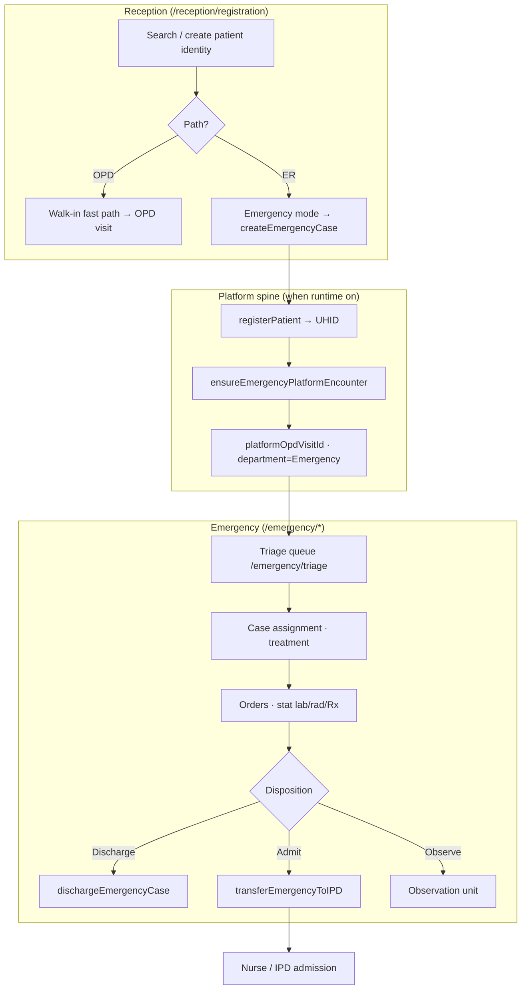
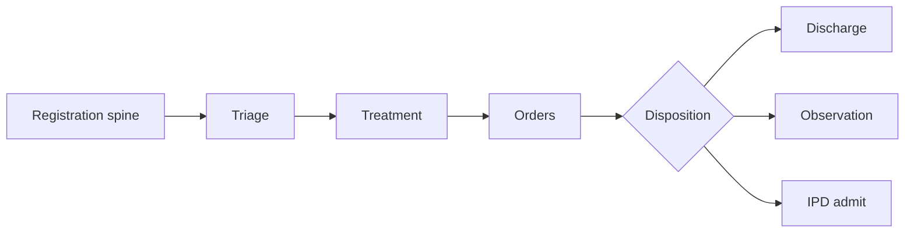
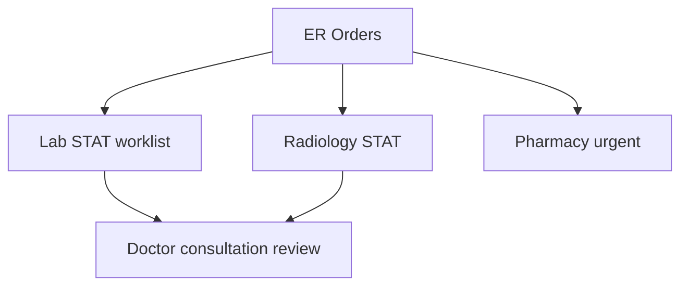
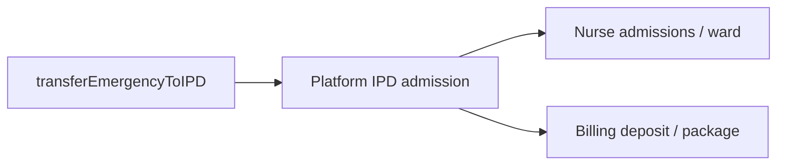

# Emergency Role Module — Product & Implementation Plan

**Last updated:** 2026-05-24  
**App:** `apps/hospital-os` · **Role key:** `emergency` · **Base path:** `/emergency`  
**Navigation source:** `apps/hospital-os/src/config/roleNavigation.ts` (`ROLE_TABS.emergency`)

This plan describes everything a **hospital emergency department (ER / A&E)** needs in a multi-specialty enterprise HMS (India: MLC medico-legal register, 108/ambulance intake, observation beds, ER→IPD direct admit, ESI/Manchester triage), mapped to what exists today (Live / C1-leaning / Preview per [MASTER_OPERATIONAL_CONNECTIVITY_MATRIX.md](../../MASTER_OPERATIONAL_CONNECTIVITY_MATRIX.md)) and what to build next. It does **not** specify a visual redesign — all new work must reuse `AppLayout`, role tabs, shadcn/ui, existing ER page patterns, `useEmergencyOperationalStream`, and `TraumaBayBoard`.

**Audit honesty:** Per [ENTERPRISE_AUDIT_REPORT.md](../../ENTERPRISE_AUDIT_REPORT.md) §4.14, Emergency is **C1-leaning** — among the strongest modules after OPD. ER board, triage, orders, observation, and **IPD transfer via `transferEmergencyToIPD`** work with SSE hydration. **There is no dedicated `EmergencyCase` domain entity** — the platform spine reuses **patient + OPD visit** (`ensureEmergencyPlatformEncounter` → `platformRegisterOpdPatient` with `department: 'Emergency'`). Cases/treatment/MLC/ambulance UI is **store-based (C2)**; structured triage scales, ambulance fleet model, and MLC register documents are **missing**. Reports charts are **Preview**.

**ER operations are core** — not a KPI dashboard. P0 Definition of Done (§10) requires that **every ER case is anchored to the registration spine** (patient identity + encounter) and that **Reception ↔ ER handoff** is a governed cross-module workflow — not parallel ad-hoc registration paths.

**UX note (product decision):** Emergency uses **page-local layouts** and **`TraumaBayBoard`** — **not** `WorkflowStepStrip` or `LabWorkflowStepStrip`. **Do not** reintroduce generic OPD `WorkflowStepStrip` on emergency, reception, doctor, or nurse routes.

---

## 1. Role purpose and personas

### Purpose

The emergency module is the **acute care front line** of the hospital: triage, case tracking, treatment workspace, stat orders, observation unit, medico-legal (MLC) cases, ambulance arrivals, disposition (discharge / admit / transfer), and ER operational reports. Emergency **owns the ER case timeline and triage queue**; it does **not** replace full reception registration for stable OPD walk-ins, own hospital revenue cycle, or operate fleet GPS dispatch (P2).

### Personas

| Persona | Typical duties | Primary screens |
|---------|----------------|-----------------|
| **ER physician** (overlap with Doctor role) | Assess, order, admit/discharge; may also use `/doctor/consultation` | Treatment, Orders, Cases |
| **Triage nurse** | ESI/Manchester scoring, acuity sort, assign bay | Triage, Dashboard |
| **ER registrar / clerk** | Identity capture, MLC flag, reception handoff intake | Dashboard, Cases — often shared with **Reception walk-in / ER desk** |
| **Ambulance desk** | Pre-arrival notification, crew handoff | Ambulance, Triage |
| **Observation unit nurse** | Extended monitoring, admit vs discharge decision | Observation |
| **ER charge nurse** | Board oversight, bed capacity, IPD bed request | Dashboard, Observation |

### Login context

`LoginPage` maps role `emergency` to `/emergency`. Clinical users with role `doctor` may cross-navigate to consultation from Orders — ER does not require a separate specialty picker at login.

### Overlap with Doctor role

ER physicians often **dual-hat** as `doctor` for EMR depth. Orders page links to **`/doctor/consultation/:id`** when platform patient spine exists. Full EMR charting remains in [DOCTOR_MODULE.md](./DOCTOR_MODULE.md); ER Treatment is a **lightweight acute workspace** until unified consultation shell (P1).

---

## 2. Screen and tab inventory

### 2.1 Current role tabs (`roleNavigation.ts`)

| Tab key | Label | Path | Page component | Connectivity / readiness (2026-05-24) |
|---------|-------|------|----------------|----------------------------------------|
| `dashboard` | Dashboard | `/emergency` | `EmergencyDashboard` | **C1-leaning** — live `emergencyCases` board; **`createEmergencyCase` quick register** (bypasses reception); SSE |
| `triage` | Triage | `/emergency/triage` | `EmergencyTriage` | **C1-leaning** — triage + **`transferEmergencyToIPD`**; SSE + IPD census poll |
| `cases` | Cases | `/emergency/cases` | `EmergencyCases` | **C2** — full case list from store; UHID + status spine visible |
| `treatment` | Treatment | `/emergency/treatment` | `EmergencyTreatment` | **C2** — treatment / observation / discharge on store cases |
| `orders` | Orders | `/emergency/orders` | `EmergencyOrders` | **C1-leaning** — platform worklists; Create Orders → Consultation |
| `observation` | Observation | `/emergency/observation` | `EmergencyObservation` | **C1-leaning** — observation beds + **IPD transfer**; SSE |
| `mlc` | MLC | `/emergency/mlc` | `EmergencyMLC` | **C2** — MLC-flagged cases; **`createEmergencyCase`** + platform register |
| `ambulance` | Ambulance | `/emergency/ambulance` | `EmergencyAmbulance` | **C2** — arrivals create ER cases; **no ambulance domain model** |
| `reports` | Reports | `/emergency/reports` | `EmergencyReports` | **C2/C4** — live KPI from store; weekly/wait charts **Preview** |

### 2.2 Routed in `App.tsx` (`EMERGENCY_PAGES`)

Static map — all nine paths above; no dynamic `:caseId` routes today.

| Path | Component | In role tabs | Notes |
|------|-----------|--------------|-------|
| `/emergency` | `EmergencyDashboard` | Yes | Command view; `TraumaBayBoard`; quick register CTA |
| `/emergency/triage` | `EmergencyTriage` | Yes | Primary triage queue |
| `/emergency/cases` | `EmergencyCases` | Yes | Searchable case registry |
| `/emergency/treatment` | `EmergencyTreatment` | Yes | Active treatment list |
| `/emergency/orders` | `EmergencyOrders` | Yes | Stat lab/rad/Rx handoffs |
| `/emergency/observation` | `EmergencyObservation` | Yes | Extended stay / admit decision |
| `/emergency/mlc` | `EmergencyMLC` | Yes | Medico-legal subset |
| `/emergency/ambulance` | `EmergencyAmbulance` | Yes | Ambulance arrival log |
| `/emergency/reports` | `EmergencyReports` | Yes | KPI + preview charts |

### 2.3 Operations shell — ER-specific chrome

| Component | Usage | Notes |
|-----------|-------|-------|
| `TraumaBayBoard` | Dashboard | Bay occupancy visualization |
| `useEmergencyOperationalStream` | All ER routes | SSE + 15s poll; `emergency.transition` / `opd.transition` deltas |
| `emergency-presenters` | Dashboard, triage | Stats, triage labels, status badges |
| Generic `WorkflowStepStrip` | **Not used** | Board + status badges provide journey context |

### 2.4 Cross-module routes (not ER tabs — coordination)

| Path | Owner | Emergency use |
|------|-------|---------------|
| `/reception/registration` | Reception | **Walk-in / ER desk** — `createEmergencyCase` from emergency mode |
| `/reception/checkin` | Reception | OPD check-in — **not** ER path |
| `/doctor/consultation/:id` | Doctor | Orders → consultation for stat workup |
| `/doctor/ipd/:id` | Doctor | Post-admit clinical chart |
| `/nurse/admissions`, `/nurse/ward` | Nurse | IPD handoff after `transferEmergencyToIPD` |
| `/billing-dept/*` | Billing | ER charges, deposit on admit |
| `/lab/*`, `/radiology/*` | Lab / Radiology | Stat orders from ER Orders |
| `/inventory/issue` | Inventory Manager | Crash cart / ER consumable issue |

---

## 3. ER operations as explicit core (target architecture)

### 3.1 Emergency domains (enterprise target)

| Domain | Target capability | Today (honest) |
|--------|-------------------|----------------|
| **Registration spine** | Patient UHID + OPD encounter `department=Emergency` | **`createEmergencyCase` → `ensureEmergencyPlatformEncounter`** when runtime on |
| **Triage** | ESI / Manchester structured score | **Free-text priority** on reception/ER forms — not persisted scale |
| **Case board** | Active cases by acuity, wait timers | **Store `emergencyCases`** + dashboard stats |
| **Treatment** | Bay assignment, physician, orders | **Store status transitions** |
| **Orders** | Stat lab/rad/pharmacy | **Platform worklists** + consult link |
| **Observation** | Extended monitoring beds | **Store + IPD transfer** |
| **MLC** | Police case, reporting authority, forms | **Flags on case** — no document registry |
| **Ambulance** | Dispatch, ETA, crew handoff | **UI creates case** — no fleet model |
| **Disposition** | Discharge / admit / transfer / LAMA | **`dischargeEmergencyCase`**, **`transferEmergencyToIPD`** |
| **ER→IPD admit** | Single admission with `opdVisitId` | **`transferEmergencyToIPD`** reuses platform IPD ✅ |
| **Disaster / mass casualty** | Surge mode, triage tags | **Missing (P2)** |
| **Poison line / protocols** | Order sets | **Missing (P2)** |

### 3.2 Platform spine — no separate ER domain module

There is **no** `EmergencyModule` in domain-api. The governed path is:

1. **Local:** `createEmergencyCase` in `hospitalStore` → `registerPatient` with `patientType: 'Emergency'`, `department: 'Emergency'`.
2. **Platform (when on):** `ensureEmergencyPlatformEncounter` in `emergency-runtime.ts` → `platformRegisterOpdPatient` with `department: 'Emergency'`, `actorRole: 'emergency'`.
3. **Encounter type:** OPD visit (`platformOpdVisitId`) — **not** a separate ER encounter table.
4. **IPD:** `transferEmergencyToIPD` → platform admission with existing `opdVisitId`, no duplicate admit.

```typescript
// apps/hospital-os/src/runtime/emergency-runtime.ts (summary)
// Emergency operations share the OPD registration + encounter gate when platform is on.
export function canUseEmergencyRuntime(): boolean {
  return canUseOpdRuntime();
}
```

### 3.3 Case status (store — `EmergencyCase`)

Typical flow: `triage-pending` → `triaged` → `in-treatment` → `under-observation` → discharged / admitted (via IPD transfer).

**Honesty:** Status is **local store state** — not synchronized to a domain ER lifecycle table (none exists).

---

## 4. Reception ↔ ER connection (P0 cross-module workflow)

This section is **mandatory** for enterprise HMS parity. Reception owns **identity and visit creation**; Emergency owns **triage-through-disposition**. Both must share **one patient + encounter spine**.

### 4.1 Personas and entry points

| Entry | Persona | Route | Mechanism today |
|-------|---------|-------|-----------------|
| **Reception ER registration** | Walk-in / emergency desk | `/reception/registration` → `mode=emergency` | **`createEmergencyCase(...)`** — button label “Register & Notify Emergency Dept” |
| **Reception walk-in fast path** | OPD front desk | `/reception/registration` → walk-in tab | **`startFrontDeskVisit`** — **OPD only**, not ER |
| **ER self-registration** | ER registrar | `/emergency` → “New Emergency Case” | **`createEmergencyCase`** with placeholder name → **`navigate('/emergency/triage')`** |
| **Ambulance arrival** | Ambulance desk | `/emergency/ambulance` | **`createEmergencyCase`** with `arrivalMode: 'Ambulance'` |
| **MLC intake** | ER / reception | `/emergency/mlc` or reception emergency mode | **`createEmergencyCase`** with `mlcRequired: true` |

See [RECEPTIONIST_MODULE.md](./RECEPTIONIST_MODULE.md) §1 personas (**Walk-in / emergency desk**) and §4.4 handoff row (**Emergency** — `createEmergencyCase` from registration).

### 4.2 Shared identifiers (handoff contract)

| Field | Source | Consumed by |
|-------|--------|-------------|
| `uhid` | `registerPatient` inside `createEmergencyCase` | ER triage queue, cases, orders |
| `emergencyCase.id` | Local `ER-{n}` | ER board, workflow events |
| `platformPatientId` | `ensureEmergencyPlatformEncounter` | Orders → consultation, IPD admit |
| `platformOpdVisitId` | Same encounter spine | Billing, lab/rad orders, IPD `opdVisitId` on admit |
| `patientType` | `'Emergency'` | Patient list ER badge on reception |
| `department` | `'Emergency'` | OPD visit metadata |
| `arrivalMode` | Walk-in / Ambulance / Referral | Ambulance board, reports |
| `mlcRequired` | Reception or ER form | MLC screen filter |

**P0 rule:** **An ER case cannot exist without patient identity from the registration spine** — either reception **`createEmergencyCase`** or ER **`createEmergencyCase`** (which internally calls `registerPatient`). Quick-register “Unidentified Emergency Walk-in” is allowed **only** as interim with mandatory merge/UHID upgrade before disposition (P0 gap: merge flow not enforced).

### 4.3 Reception “redirect to ER” vs ER self-registration

| Pattern | Intended behavior | Today (honest) |
|---------|-------------------|----------------|
| **Reception redirect** | After reception ER registration → deep link ER triage with case pre-selected | **`createEmergencyCase` then `setMode('list')`** — **no navigation to `/emergency/triage`** ❌ |
| **ER self-registration** | For ambulance direct-to-ER or reception bypass | Dashboard quick register → **navigates to triage** ✅ |
| **Walk-in OPD vs ER** | Desk must choose OPD fast path vs ER path | Walk-in tab uses **`startFrontDeskVisit` (OPD)**; separate emergency mode for ER ✅ |

**P0 gap:** Reception and ER use the **same store action** but **asymmetric UX** — ER redirects to triage; reception returns to patient list without ER queue handoff.

### 4.4 P0 workflow — Reception → ER → disposition



### 4.5 API / event spine

| Step | API / action | Module |
|------|--------------|--------|
| Patient create | `registerPatient` / `POST` patients via OPD runtime | Reception / store |
| ER case create | `createEmergencyCase` | `hospitalStore` |
| Platform encounter | `ensureEmergencyPlatformEncounter` → `platformRegisterOpdPatient` | `emergency-runtime.ts` |
| Metering / audit | `emergency.registration`, `emergency.register_encounter` | domain + kernel |
| Triage | `triageEmergencyCase` (store); re-calls encounter backfill if needed | store |
| SSE refresh | `useEmergencyOperationalStream` | all `/emergency/*` |
| IPD admit | `transferEmergencyToIPD` → platform IPD with `opdVisitId` | store + `ipd-runtime` |
| Orders | Platform worklists; consult at `/doctor/consultation/:platformOpdVisitId` | ER Orders |

**Domain models:** OPD visit + patient (domain-api). **No** `EmergencyCase` Prisma model — ER case id is **client store only** (P1: persist ER case metadata linked to `opdVisitId`).

### 4.6 What exists today vs gaps (explicit)

| Capability | Exists | Gap |
|------------|--------|-----|
| Shared `createEmergencyCase` from reception | ✅ | No post-register **redirect to `/emergency/triage?case=`** |
| Platform patient + OPD encounter | ✅ when runtime on | Failure toast only — case still exists locally without platform != blocked |
| ER quick register without reception | ✅ | **Bypasses reception desk** — acceptable for ambulance; should flag source |
| Walk-in OPD separate from ER | ✅ | Desk training / UI clarity only |
| Triage → IPD with `opdVisitId` | ✅ | — |
| Structured ESI/Manchester | ❌ | Free-text priority |
| Reception check-in for ER | ❌ | ER uses case create, not OPD queue |
| ER case without patient | ⚠️ | “Unidentified” quick register — needs merge P0 |
| Ambulance domain + 108 | ❌ | UI-only |
| MLC document register | ❌ | Flags only |
| `WorkflowStepStrip` on ER | ❌ (correct) | Do not add |

### 4.7 P0 handoff contract (target — for implementation)

**Reception → Emergency (required for P0 DoD):**

1. Reception **`/reception/registration`** emergency mode calls `createEmergencyCase` with full demographics.
2. On success, **navigate** (or open new tab) to **`/emergency/triage?uhid={uhid}&caseId={id}`** with case pre-selected.
3. Pass **`platformPatientId` / `platformOpdVisitId`** when encounter promise resolves (SSE or poll).
4. Emit workflow event **`reception.er_handoff`** with actor role `receptionist` (P1 audit).

**Emergency → Reception (read-only):**

- Reception patient list shows **`patientType === 'Emergency'`** ER badge (exists today).
- Reception **does not** triage or treat — only identity + ER redirect.

---

## 5. Feature breakdown by screen (P0 / P1 / P2)

### Dashboard (`/emergency`)

| Priority | Features |
|----------|----------|
| **P0** | Live board from `emergencyCases`; SSE refresh; triage summary; **`TraumaBayBoard`** |
| **P0 (gap)** | Distinguish cases by **`registrationSource`**: reception vs er-self vs ambulance |
| **P1** | Wait-time timers; deep links to triage/cases |
| **P2** | Disaster mode surge banner |

### Triage (`/emergency/triage`)

| Priority | Features |
|----------|----------|
| **P0** | Queue from store; **`triageEmergencyCase`**; **`transferEmergencyToIPD`** with bed/ward |
| **P0 (gap)** | Accept **`caseId` / `uhid` query params** from reception handoff |
| **P1** | Structured ESI/Manchester fields persisted |
| **P2** | Fast-track vs main ED track split |

### Cases (`/emergency/cases`)

| Priority | Features |
|----------|----------|
| **P0** | Searchable list; UHID, status, triage badge; platform spine indicator |
| **P1** | Filter by arrival mode, MLC, physician |
| **P2** | Export case log for audit |

### Treatment (`/emergency/treatment`)

| Priority | Features |
|----------|----------|
| **P1** | **`startEmergencyTreatment`**, bay assignment, physician lock |
| **P2** | Trauma bay vitals strip; procedure timer |

### Orders (`/emergency/orders`)

| Priority | Features |
|----------|----------|
| **P0** | Platform worklists when on; stat priority; link to **`/doctor/consultation`** |
| **P1** | ER order sets (chest pain, stroke, sepsis) |
| **P2** | Poison line protocol packs |

### Observation (`/emergency/observation`)

| Priority | Features |
|----------|----------|
| **P0** | Observation list; **`moveEmergencyToObservation`**; **IPD transfer** |
| **P1** | Max observation timer; bed pre-alert to reception/IPD |
| **P2** | Protocol-driven observation pathways |

### MLC (`/emergency/mlc`)

| Priority | Features |
|----------|----------|
| **P1** | MLC case registry; police case number; reporting authority persisted |
| **P2** | Generated MLC forms / document store |

### Ambulance (`/emergency/ambulance`)

| Priority | Features |
|----------|----------|
| **P1** | Pre-arrival case stub; crew handoff fields |
| **P2** | Fleet GPS, 108 API integration |

### Reports (`/emergency/reports`)

| Priority | Features |
|----------|----------|
| **P1** | Disposition breakdown from live store (discharge / admit / observe) |
| **P2** | TAT door-to-doctor; LWBS rate; export |

---

## 6. End-to-end workflows

### 6.1 Standard: register → triage → treat → dispose



### 6.2 Stat diagnostics from ER



Handoffs per [LAB_TECHNICIAN_MODULE.md](./LAB_TECHNICIAN_MODULE.md), [RADIOLOGIST_MODULE.md](./RADIOLOGIST_MODULE.md), [PHARMACIST_MODULE.md](./PHARMACIST_MODULE.md).

### 6.3 ER → IPD direct admit



**Platform spine:** Reuses active admission if present; sets **`opdVisitId`** on admit — see audit §6.3.

---

## 7. Cross-role handoffs

| From / To | Trigger | Data passed |
|-----------|---------|-------------|
| **Reception → Emergency** | ER registration mode | `uhid`, `emergencyCase.id`, demographics, `platformOpdVisitId` (P0 redirect) |
| **Emergency → Doctor** | Orders / consult | `platformOpdVisitId`, stat priority |
| **Emergency → Nurse** | IPD transfer | `platformAdmissionId`, ward/bed, nursing priority |
| **Emergency → Billing** | ER charges / admit deposit | Encounter id, admission id |
| **Emergency → Lab / Rad** | Stat orders | Order ids, priority STAT |
| **Emergency → Reception** | Identity correction / merge | `uhid`, duplicate warning |
| **Emergency → IPD** | Admit decision | `transferEmergencyToIPD` payload |
| **Ambulance → Emergency** | Arrival logged | `arrivalMode: Ambulance`, pre-alert fields (P1) |

---

## 8. Explicitly out of scope for Emergency

| Capability | Owner module |
|------------|--------------|
| Full ambulance GPS fleet management | **P2** — external EMS or integration |
| CRM, marketing | **CRM** — `/crm/*` |
| OPD appointment scheduling | **Reception / Scheduler** |
| Full hospital revenue cycle / GST | **Billing** — `/billing-dept/*` |
| Central inventory procurement | **Inventory Manager** — `/inventory/*` |
| HR rostering | **HR** — `/hr/*` |

ER may **trigger** charges and **request** stock — not own billing master or fleet telematics (P2).

---

## 9. Definition of Done — Emergency P0

P0 is **not** “nine ER tabs exist.” P0 is done when acute intake is **governed end-to-end** with **registration spine integrity**:

1. **Registration spine:** **ER case cannot exist without patient identity** from `registerPatient` / platform patient create — block orphan local cases when platform on fails (or queue for retry with visible state).
2. **Reception ↔ ER handoff:** Reception emergency registration **navigates to `/emergency/triage`** with case pre-selected (query params or store selector).
3. **Platform encounter:** `ensureEmergencyPlatformEncounter` succeeds or surfaces **`InlinePlatformError`** — case marked “pending sync.”
4. **Triage:** `triageEmergencyCase` updates queue; SSE refreshes board.
5. **IPD admit:** `transferEmergencyToIPD` with **`opdVisitId`** on platform admission — no duplicate IPD.
6. **Orders:** Stat orders reachable from ER with platform patient context.
7. **Source tracking:** Case records **`registrationSource`**: `reception` | `er-self` | `ambulance`.
8. **No** generic `WorkflowStepStrip` on ER or sibling clinical roles.
9. `pnpm --filter hospital-os typecheck` passes; route readiness honest (reports Preview until charts live).

**Not P0 (honest):** ESI/Manchester structured, ambulance domain, MLC documents, disaster mode, poison protocols — waves W3–W9.

---

## 10. Implementation waves

| Wave | Focus | Deliverables |
|------|-------|--------------|
| **W0** (done) | ER spine UX | Nine routes, `createEmergencyCase`, `ensureEmergencyPlatformEncounter`, SSE, IPD transfer |
| **W1** | **Reception ↔ ER P0 handoff** | Reception redirect to triage; `caseId`/`uhid` params; `registrationSource`; platform sync honesty |
| **W2** | **Registration spine enforcement** | Block/guard disposition without `platformPatientId` when runtime on; unidentified merge flow |
| **W3** | **Structured triage** | ESI or Manchester fields; fast-track lane |
| **W4** | **Treatment + observation platform metadata** | Persist bay, physician, timestamps on encounter or ER extension table |
| **W5** | **ER order sets** | Chest pain, stroke, sepsis bundles |
| **W6** | **MLC register v1** | Police case persistence, document upload |
| **W7** | **Ambulance pre-arrival** | Case stub before arrival; handoff checklist |
| **W8** | **Reports live** | Door-to-doctor TAT, disposition from transitions |
| **W9** | **Enterprise P2** | Mass casualty mode, 108 integration, poison protocols, trauma team activation |

**Recommended wave 1 implementation focus (next sprint):** **W1 — Reception ↔ ER P0 handoff** — wire reception emergency registration to **`/emergency/triage?caseId=&uhid=`**, add `registrationSource`, and document the handoff in both role modules (this plan + RECEPTIONIST cross-link).

---

## 11. API and domain dependencies

### 11.1 Runtime and store

| Layer | Usage in emergency module |
|-------|---------------------------|
| `hospitalStore` | `emergencyCases`, `createEmergencyCase`, `triageEmergencyCase`, `transferEmergencyToIPD`, … |
| `emergency-runtime.ts` | `canUseEmergencyRuntime`, `ensureEmergencyPlatformEncounter`, `fetchActivePlatformIpdAdmission` |
| `opd-runtime.ts` | `platformRegisterOpdPatient`, `platformGetActiveOpdVisit` |
| `ipd-runtime.ts` | Admission on ER → IPD transfer |
| `useEmergencyOperationalStream` | SSE on all ER routes |

### 11.2 Domain-api (representative)

| Domain | Endpoints / actions | Screens |
|--------|----------------------|---------|
| Patients | Create via OPD register path | All case create flows |
| OPD | Visit with `department: Emergency` | Encounter spine |
| IPD | Admit with `opdVisitId` | Triage, Observation transfer |
| Lab / Rad / Pharmacy | Worklists | Orders |
| **Emergency-specific** | **None** — store-only case id | Cases, board |

### 11.3 Kernel-api

Metering `emergency.registration`; audit `emergency.register_encounter`.

### 11.4 Hooks and shared components (reuse)

| Asset | Path |
|-------|------|
| `useEmergencyOperationalStream` | `@/hooks/useEmergencyOperationalStream.ts` |
| `TraumaBayBoard` | `@/components/emergency/TraumaBayBoard` |
| `emergency-presenters` | `@/lib/emergency/emergency-presenters.ts` |
| `InlinePlatformError` | `@/components/opd/InlinePlatformError` |
| `routeReadiness` | `@/config/routeReadiness.ts` |

---

## 12. UI theme constraints (no redesign)

All emergency work must match existing Hospital OS patterns:

- **Shell:** `AppLayout` with role tabs from `ROLE_TABS`.
- **Layout:** `motion.div` `space-y-6`; `text-2xl font-bold` headers; destructive accent for emergency CTAs.
- **Dashboard:** Preserve `TraumaBayBoard` + stat cards layout.
- **Components:** shadcn `Card`, `Button`, `Badge`; `sonner` toasts.
- **Realtime:** Keep **`useEmergencyOperationalStream`** on all ER pages.
- **Do not add** generic `WorkflowStepStrip` or `LabWorkflowStepStrip`.
- **Do not reintroduce** generic `WorkflowStepStrip` on reception/doctor/nurse.

---

## 13. Honesty checklist (audit alignment)

Per [ENTERPRISE_AUDIT_REPORT.md](../../ENTERPRISE_AUDIT_REPORT.md) §4.14, §6.3 and connectivity matrix Spine 5:

- Emergency is **C1-leaning** for triage/orders/observation/IPD — **cases/treatment/ambulance C2**.
- **No domain ER case entity** — platform uses **OPD visit as encounter**.
- **Reception ER handoff incomplete** — no triage redirect (P0 gap).
- **Quick register** can create minimally identified cases — merge not enforced.
- **Ambulance / MLC / disaster** — UI or flags only.
- **`routeReadiness` C1-leaning prefix `/emergency/`** — fair for core routes; reports overstated until W8.
- Production safety (auth, RLS, structured triage medico-legal) is **not** implied by this UI plan.

---

## Appendix A — Exhaustive feature backlog (P2 / future)

- **Triage:** ESI level 1–5, Manchester Triage System, pediatric triage
- **Trauma:** Team activation, massive transfusion protocol
- **Surge:** Mass casualty incident mode, triage tags, tent capacity
- **Ambulance:** 108 integration, GPS ETA, crew vitals handoff
- **MLC:** Police intimation forms, injury certificate, property register
- **Clinical:** ER-specific order sets, poison control protocols
- **Ops:** LWBS tracking, door-to-balloon for STEMI, sepsis bundle timer
- **India:** Ayushman ER packages, state trauma registry export

---

## Appendix B — File map (implementation reference)

| Concern | Location |
|---------|----------|
| Role tabs | `apps/hospital-os/src/config/roleNavigation.ts` |
| Routes | `apps/hospital-os/src/App.tsx` → `EMERGENCY_PAGES` |
| Readiness | `apps/hospital-os/src/config/routeReadiness.ts` |
| Pages | `apps/hospital-os/src/pages/emergency/*.tsx` |
| Reception ER mode | `apps/hospital-os/src/pages/reception/ReceptionRegistration.tsx` |
| Store actions | `apps/hospital-os/src/stores/hospitalStore.tsx` → `createEmergencyCase`, … |
| Emergency runtime | `apps/hospital-os/src/runtime/emergency-runtime.ts` |
| SSE hook | `apps/hospital-os/src/hooks/useEmergencyOperationalStream.ts` |
| Presenters | `apps/hospital-os/src/lib/emergency/emergency-presenters.ts` |
