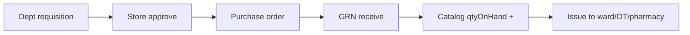
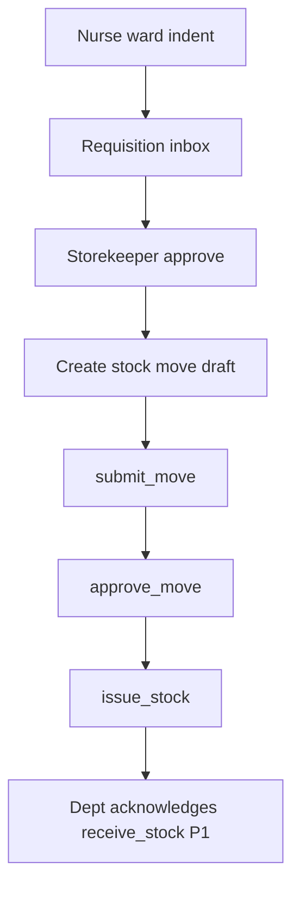
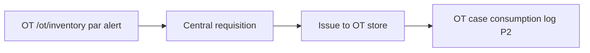
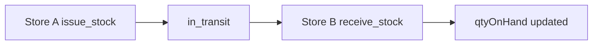

# Inventory Manager Role Module — Product & Implementation Plan

**Last updated:** 2026-05-24  
**App:** `apps/hospital-os` · **Role key:** `inventory_manager` · **Base path:** `/inventory`  
**Navigation source:** `apps/hospital-os/src/config/roleNavigation.ts` (`ROLE_TABS.inventory_manager`)

This plan describes everything a **hospital supply chain / central stores** workspace needs in a multi-specialty enterprise HMS (India: GST on procurement, batch/expiry, min-max reorder, inter-store indents, biomedical asset register, CSSD sterilization cycles), mapped to what exists today (Live / C1-leaning / Preview per [MASTER_OPERATIONAL_CONNECTIVITY_MATRIX.md](../../MASTER_OPERATIONAL_CONNECTIVITY_MATRIX.md)) and what to build next. It does **not** specify a visual redesign — all new work must reuse `AppLayout`, role tabs, shadcn/ui, `OperationsModulePage`, platform runtime hooks, and existing inventory page patterns.

**Audit honesty:** Per [ENTERPRISE_AUDIT_REPORT.md](../../ENTERPRISE_AUDIT_REPORT.md) §4.18, the **domain spine exists** — `InventoryCatalogItem` + `InventoryStockMove` lifecycle + transitions in `hospital-operations`, domain-api `InventoryModule` (`GET/POST /inventory/catalog`, `POST/GET /inventory/moves`, `POST /inventory/moves/:id/transition`). The **UI is split**: `/inventory/issue` and `/inventory/grn` call the platform stock-move runtime when enabled; **dashboard and catalog merge platform data with hardcoded demo fallbacks**; requisitions, procurement, distribution, adjustments, equipment, and reports are **local demo arrays** with no domain models for PO, supplier, or requisition entities. This is **not** a full SAP-class ERP — it is hospital operational inventory with Express / mid-market HMS.

**Supply chain operations are core** — not a KPI dashboard. P0 Definition of Done (§9) requires governed catalog → issue/GRN on **platform-linked stock moves** with honest empty states — not “can open `/inventory` with animated demo cards.”

**UX note (product decision):** Inventory uses **`OperationsModulePage`** with `module="inventory"` — **not** `WorkflowStepStrip` or `LabWorkflowStepStrip`. Issue uses a guided stepper; GRN uses worklist rows with lifecycle badges. **Do not** reintroduce generic OPD `WorkflowStepStrip` on inventory or other clinical roles.

---

## 1. Role purpose and personas

### Purpose

The inventory manager module is the **hospital supply chain and central stores layer**: item master (catalog), stock receipt and issue, goods receipt (GRN), department requisitions, purchase orders and supplier coordination, inter-location distribution, stock adjustments, fixed-asset / biomedical equipment registry, and operational reports. Inventory Manager **owns catalog truth and stock-move lifecycle** at the central store; it does **not** dispense medications (Pharmacist), run peri-operative case boards (OT Coordinator), register patients, or operate full hospital revenue cycle / SAP ERP.

### Personas

| Persona | Typical duties | Primary screens |
|---------|----------------|-----------------|
| **Store keeper** | Daily issue to wards/OT/ER, GRN receive, cycle counts | Issue, GRN, Distribution, Dashboard |
| **Procurement officer** | PO creation, supplier quotes, approval routing | Procurement, Requisitions |
| **CSSD supervisor** (P2) | Sterilization tray cycles, instrument set tracking | Equipment, Distribution — handoff from OT |
| **Pharmacy stock overlap officer** | Non-drug central catalog vs pharmacy batch stock boundary | Catalog, Reports — coordinate with `/pharmacy/inventory` |
| **OT consumables coordinator** | Implant/consumable indents from theatre | Requisitions, Issue — handoff from `/ot/inventory` |
| **Biomedical engineer** (P1) | Equipment PM schedule, breakdown tickets | Equipment |
| **Stores manager** | Min-max review, expiry write-offs, MIS | Dashboard, Adjustments, Reports |

### Login context

`LoginPage` maps role `inventory_manager` to `/inventory`. **Store/branch** comes from platform session (`x-branch-id` on domain-api calls).

### Pharmacy vs central inventory boundary

| Layer | Owner | Domain | Notes |
|-------|-------|--------|-------|
| **Central catalog** | Inventory Manager | `InventoryCatalogItem` | General consumables, OT supplies, lab reagents (non-formulary path) |
| **Pharmacy stock** | Pharmacist | `PharmacyStockItem` (batch/expiry/reservation) | Drug SKUs; pharmacy reads **`/inventory/catalog`** slice when runtime on per [PHARMACIST_MODULE.md](./PHARMACIST_MODULE.md) |
| **Issue to department** | Inventory Manager | `InventoryStockMove` lifecycle | `moveType: issue` → `issue_stock` transition decrements `qtyOnHand` on catalog |

Pharmacist **does not** own central PO/GRN for hospital-wide stores — procurement UI on `/inventory/procurement` is the target spine; pharmacy `/pharmacy/purchase` remains a **Preview handoff link** until requisition → PO is platform-backed.

---

## 2. Screen and tab inventory

### 2.1 Current role tabs (`roleNavigation.ts`)

| Tab key | Label | Path | Page component | Connectivity / readiness (2026-05-24) |
|---------|-------|------|----------------|----------------------------------------|
| `dashboard` | Dashboard | `/inventory` | `InventoryDashboard` | **C1-leaning (routeReadiness)** — **`useInventoryPlatformData` optional**; **`RECENT_MOVEMENTS_DEMO` + `STATS` fallback when platform off or empty** |
| `issue` | Stock issue | `/inventory/issue` | `InventoryIssue` | **C1-leaning** — full **`platformCreateStockMove` → submit → approve → issue_stock** chain when runtime on |
| `grn` | GRN receive | `/inventory/grn` | `InventoryGrn` | **C1-leaning** — **`platformInventoryTransition(receive_stock)`** on moves in `issued`/`in_transit` |
| `catalog` | Catalog | `/inventory/catalog` | `InventoryCatalog` | **Mixed** — platform catalog when on; **`ITEMS` demo grid fallback** |
| `stock-entry` | Stock Entry | `/inventory/stock-entry` | `InventoryStockEntry` | **Preview (C4)** — local demo entry forms; **not wired to `POST /inventory/moves`** |
| `distribution` | Distribution | `/inventory/distribution` | `InventoryDistribution` | **Preview (C4)** — local `DISTRIBUTIONS` demo list |
| `requisitions` | Requisitions | `/inventory/requisitions` | `InventoryRequisitions` | **Preview (C4)** — static `REQUISITIONS` array |
| `procurement` | Procurement | `/inventory/procurement` | `InventoryPurchaseOrders` | **Preview (C4)** — local PO/supplier demo tabs |
| `adjustments` | Adjustments | `/inventory/adjustments` | `InventoryAdjustments` | **Preview (C4)** — local adjustment cards |
| `equipment` | Equipment | `/inventory/equipment` | `InventoryEquipment` | **Preview (C4)** — `EQUIPMENT_LIST` demo |
| `reports` | Reports | `/inventory/reports` | `InventoryReports` | **Preview (C4)** — MIS-style demo charts |

### 2.2 Routed in `App.tsx` (`INVENTORY_PAGES`)

Static map — all eleven paths above; no dynamic `:moveId` routes today.

| Path | Component | In role tabs | Notes |
|------|-----------|--------------|-------|
| `/inventory` | `InventoryDashboard` | Yes | Command view; demo stats when platform empty |
| `/inventory/issue` | `InventoryIssue` | Yes | Primary operational console — guided issue wizard |
| `/inventory/grn` | `InventoryGrn` | Yes | GRN receive on platform moves |
| `/inventory/catalog` | `InventoryCatalog` | Yes | SKU master; demo fallback |
| `/inventory/stock-entry` | `InventoryStockEntry` | Yes | Manual receipt — not platform-backed |
| `/inventory/distribution` | `InventoryDistribution` | Yes | Department issue tracking — demo |
| `/inventory/requisitions` | `InventoryRequisitions` | Yes | Dept requests — demo |
| `/inventory/procurement` | `InventoryPurchaseOrders` | Yes | PO + suppliers — demo |
| `/inventory/adjustments` | `InventoryAdjustments` | Yes | Write-off UI — demo |
| `/inventory/equipment` | `InventoryEquipment` | Yes | Asset registry — demo |
| `/inventory/reports` | `InventoryReports` | Yes | Export cards — demo |

### 2.3 Operations shell — inventory-specific chrome

| Component | Usage | Notes |
|-----------|-------|-------|
| `OperationsModulePage` | All inventory routes | `module="inventory"`, `layout="list"` or dashboard grid |
| `OperationsWorklistRow` | GRN receivable list | State badge + next action CTA via `getInventoryMoveNextAction` |
| `useInventoryPlatformData` | Dashboard, Catalog, Issue, GRN | Catalog + moves fetch |
| Generic `WorkflowStepStrip` | **Not used** | Issue stepper is page-local |

### 2.4 Cross-module routes (not inventory tabs — coordination)

| Path | Owner | Inventory manager use |
|------|-------|----------------------|
| `/pharmacy/inventory` | Pharmacist | Pharmacy batch stock — **not** central issue; indent from pharmacy may create requisition P1 |
| `/pharmacy/drugs` | Pharmacist | Reads catalog slice from **`/inventory/catalog`** when runtime on |
| `/pharmacy/suppliers` | Pharmacist | Preview — PO path via **`/inventory/procurement`** |
| `/ot/inventory` | OT Coordinator | OT par levels — requisition → central issue P1 |
| `/nurse/ward` | Nurse | Ward stock consumption — requisition source P1 |
| `/admin/*` | Admin | Vendor contracts, approval chains — not store ops |

### 2.5 Removed / out of nav (product decisions)

| Item | Notes |
|------|--------|
| Generic `WorkflowStepStrip` on inventory routes | **Do not add** — use issue stepper + GRN worklist |
| Full SAP ERP (MM/FI) | **Out of scope** — hospital operational inventory only |
| Patient billing | **Billing** — charge on issue to patient is P2 consumable billing |

### 2.6 Planned screens (gaps — not in nav yet)

Grouped by enterprise supply-chain expectation. Priority in §4 and §10.

| Proposed path | Screen | Rationale |
|---------------|--------|-----------|
| `/inventory/vendors` | Vendor master | Supplier ledger, GSTIN, payment terms — **P1** |
| `/inventory/requisitions/inbox` | Department indent inbox | Nurse/OT/ER requisitions → approve → issue |
| `/inventory/transfers` | Inter-store transfer | Branch A → branch B `in_transit` → GRN |
| `/inventory/consignment` | Consignment stock | Implant/vendor-owned inventory — **P2** |
| `/inventory/batches` | Batch/expiry (non-pharmacy) | Lot tracking for consumables — **P1** |
| `/inventory/three-way-match` | PO ↔ GRN ↔ invoice | Finance reconciliation — **P2** |
| `/inventory/cssd` | Sterilization cycles | CSSD tray lifecycle — **P2** |
| `/inventory/min-max` | Reorder suggestions | Auto-indent from `reorderLevel` — **P1** |

---

## 3. Supply chain as explicit core (target architecture)

### 3.1 Inventory domains (enterprise target)

| Domain | Target capability | Today (honest) |
|--------|-------------------|----------------|
| **Catalog / item master** | SKU, category, unit, reorder level, unit cost | **`platformListInventoryCatalog`** + **`platformUpsertInventoryItem`**; UI demo fallback |
| **Stock issue** | Requisition → approve → issue to dept | **`InventoryIssue`** full transition chain when platform on |
| **GRN / receive** | Receive against move or PO | **`InventoryGrn`** `receive_stock` on platform moves |
| **Requisitions** | Dept indent → store approval | **Local demo only** — no domain model |
| **Procurement / PO** | Vendor, PO, approval, GRN link | **Local demo** — no `PurchaseOrder` entity in domain-api |
| **Distribution** | Track issued stock by department | **Local demo** |
| **Adjustments** | Damage, expiry, audit correction | **Local demo** — should use `moveType: adjustment` |
| **Equipment / assets** | Tag, PM schedule, breakdown | **Local demo** — no asset entity |
| **Reports** | Stock valuation, consumption, expiry | **Local demo** charts |
| **Batch/expiry** | Lot on catalog or move line | **Missing** (pharmacy has batch; central catalog does not) |
| **Inter-store transfer** | `dispatch_transfer` → `receive_stock` | Lifecycle exists; **no UI** |
| **Three-way match** | PO + GRN + supplier invoice | **Missing (P2)** |
| **Consignment / implants** | UDI, vendor-owned stock | **Missing (P2)** — OT implant trace |
| **CSSD sterilization** | Tray cycle log | **Missing (P2)** |

### 3.2 Platform lifecycle (`inventory-stock-move.ts`)

States: `draft` → `submitted` → `approved` → `issued` → (`in_transit`) → `received` | `cancelled`.

Actions: `submit_move`, `approve_move`, `issue_stock`, `dispatch_transfer`, `receive_stock`, `cancel_move`.

Roles on transitions include `storekeeper`, `nurse`, `pharmacist`, `admin`, `logistics`.

**Honesty:** `InventoryIssue` runs the full chain in one UX flow (auto-approve for demo convenience). Production should enforce **segregation of duties** — submitter ≠ approver (P1).

### 3.3 Where inventory UX lives

1. **Issue** (`/inventory/issue`) — primary operational console for daily store work.
2. **GRN** (`/inventory/grn`) — receive against in-transit/issued moves.
3. **Catalog** — item master maintenance.
4. **Requisitions** — department demand intake (target: platform-backed P1).
5. **Procurement** — PO pipeline (target: domain models P1).
6. **Dashboard** — supervisor snapshot when platform catalog/moves exist.

---

## 4. Feature breakdown by screen (P0 / P1 / P2)

### Dashboard (`/inventory`)

| Priority | Features |
|----------|----------|
| **P0 (gap)** | When `platformOn`: stats from **`useInventoryPlatformData` only** — no hardcoded `STATS` overlay; `InlinePlatformError` on load failure |
| **P1** | Low-stock alerts from `reorderLevel`; deep links to issue/requisitions |
| **P2** | Multi-store rollup; consignment value widget |

### Stock issue (`/inventory/issue`)

| Priority | Features |
|----------|----------|
| **P0** | Guided issue: select catalog SKU → qty → destination → **`platformCreateStockMove` + transitions**; `guardInventoryTransition`; toast on failure |
| **P0 (gap)** | Block issue when `qtyOnHand` insufficient — surface domain validation, not silent success |
| **P1** | Link issue to requisition id (`externalRef`); department picker from master |
| **P2** | Batch pick; barcode scan |

### GRN receive (`/inventory/grn`)

| Priority | Features |
|----------|----------|
| **P0** | List receivable moves (`issued`, `in_transit`); **`receive_stock`** transition |
| **P1** | PO reference on GRN; partial receive qty |
| **P2** | Three-way match status chip |

### Catalog (`/inventory/catalog`)

| Priority | Features |
|----------|----------|
| **P0** | List from platform; upsert SKU via **`platformUpsertInventoryItem`**; remove silent demo `ITEMS` when platform on |
| **P1** | Category filters; reorder level edit; unit cost |
| **P2** | HSN/GST code; vendor catalog import |

### Stock entry (`/inventory/stock-entry`)

| Priority | Features |
|----------|----------|
| **P0 (gap)** | Create **`moveType: receive`** draft → submit → receive — platform-backed opening stock |
| **P1** | Opening balance wizard; link to PO |
| **P2** | Batch/expiry on line |

### Distribution (`/inventory/distribution`)

| Priority | Features |
|----------|----------|
| **P1** | Read issued moves grouped by `toLocation`; filter by department |
| **P2** | Consumption analytics by cost center |

### Requisitions (`/inventory/requisitions`)

| Priority | Features |
|----------|----------|
| **P0 (gap)** | Replace demo `REQUISITIONS` with store-backed list or platform requisition entity (P1 domain) |
| **P1** | Nurse/OT ward indent → approve → auto-create issue move |
| **P2** | Budget cap per department |

### Procurement (`/inventory/procurement`)

| Priority | Features |
|----------|----------|
| **P0 (gap)** | Honest Preview banner until PO domain exists |
| **P1** | Vendor master; PO create/approve; link GRN to PO line |
| **P2** | Vendor portal; e-auction |

### Adjustments (`/inventory/adjustments`)

| Priority | Features |
|----------|----------|
| **P1** | Adjustment move type with reason code; approval |
| **P2** | Expiry auto-suggest from batch table |

### Equipment (`/inventory/equipment`)

| Priority | Features |
|----------|----------|
| **P1** | Asset tag, location, PM due date (local or domain P1) |
| **P2** | Breakdown ticket → biomedical workflow; AMCS contract |

### Reports (`/inventory/reports`)

| Priority | Features |
|----------|----------|
| **P1** | Stock valuation from catalog `qtyOnHand * unitCostCents`; move audit export |
| **P2** | ABC analysis; slow-moving; GST purchase register |

### Planned screens (§2.6)

See §2.6 — **Platform-backed catalog/issue/GRN honesty** is **P0**; PO/vendor/three-way match **P1–P2**.

---

## 5. Supply chain flow (requisition → PO → GRN → stock → issue)

### 5.1 Target procurement lifecycle

### 5.2 States today (platform — stock move only)

| State | UI surface today | Honest gap |
|-------|------------------|------------|
| `draft` → `issued` | Issue page | Works when platform on |
| `issued` → `received` | GRN page | Works for transfer receive |
| Requisition → PO | Requisitions, Procurement | **No domain model** |
| Opening stock | Stock entry | **Demo only** |

---

## 6. End-to-end workflows

### 6.1 Ward requisition → issue (target)

**Today:** Nurse has no platform requisition API — **demo requisitions only** on `/inventory/requisitions`.

### 6.2 OT consumable / implant indent

Handoff per [OT_COORDINATOR_MODULE.md](./OT_COORDINATOR_MODULE.md) §7 — OT inventory is slice only.

### 6.3 Pharmacy central catalog read

Pharmacist **`/pharmacy/drugs`** reads **`GET /inventory/catalog`** when runtime on — Inventory Manager owns SKU master; Pharmacist owns **`PharmacyStockItem`** batch dispense.

### 6.4 Inter-store transfer (P1)

Lifecycle actions exist in `inventory-stock-move.ts`; **no dedicated UI route** yet.

---

## 7. Cross-role handoffs

Aligned with [OT_COORDINATOR_MODULE.md](./OT_COORDINATOR_MODULE.md), [PHARMACIST_MODULE.md](./PHARMACIST_MODULE.md), [NURSE_MODULE.md](./NURSE_MODULE.md), and [BILLING_FINANCE_MODULE.md](./BILLING_FINANCE_MODULE.md).

| From / To | Trigger | Data passed |
|-----------|---------|-------------|
| **Nurse → Inventory** | Ward requisition | SKU, qty, ward, urgency |
| **OT → Inventory** | Consumable/implant need | Case id, preference card SKUs (P1) |
| **Pharmacy → Inventory** | Central procurement PO | Drug SKUs on catalog; GRN to pharmacy store |
| **Inventory → Pharmacy** | Inter-store transfer | Move id, batch (P1) |
| **Inventory → Billing** | Chargeable consumable issue to patient (P2) | SKU, qty, patient encounter |
| **Administrator → Inventory** | PO approval policy | Approval chain, vendor master |
| **Emergency → Inventory** | ER crash cart restock | Fast-track issue to Emergency Ward destination |

---

## 8. Explicitly out of scope for Inventory Manager

| Capability | Owner module |
|------------|--------------|
| Full SAP ERP (FI/CO/MM enterprise) | **External ERP** or P2 integration |
| Hospital patient billing / revenue cycle | **Billing** — `/billing-dept/*` |
| CRM, marketing | **CRM** — `/crm/*` |
| Pharmacy dispense / Schedule H register | **Pharmacist** — `/pharmacy/*` |
| OT scheduling, surgical case lifecycle | **OT Coordinator** — `/ot/*` |
| Patient registration | **Reception** — `/reception/*` |
| HR payroll | **HR** — `/hr/*` |

Inventory may **issue stock to departments** and capture **consumption references** — not operate clinical modules or full finance.

---

## 9. Definition of Done — Inventory Manager P0

P0 is **not** “eleven inventory tabs exist.” P0 is done when a storekeeper can run daily issue/receive on **platform runtime on** with **governed stock moves**:

1. **Catalog:** List and upsert SKUs via API; no silent demo catalog when platform on.
2. **Issue:** Create move → submit → approve → issue with domain validation; insufficient stock surfaces error.
3. **GRN:** Receive eligible moves via **`receive_stock`**; refresh catalog qty.
4. **Dashboard honesty:** KPIs from platform catalog/moves OR explicit Preview banner — no mixed demo overlay  without badge.
5. **Demo pages labeled:** Requisitions, procurement, distribution, adjustments, equipment, reports show **Preview** in `routeReadiness` until wired (W1 honesty).
6. **Errors:** `InlinePlatformError` when catalog/move load fails.
7. **Cross-role:** Issue destination includes OT, Emergency Ward, Pharmacy, General Ward (existing `DESTINATIONS` in Issue page).
8. **No** generic `WorkflowStepStrip` on inventory routes.
9. `pnpm --filter hospital-os typecheck` passes.

**Not P0 (honest):** PO/GRN three-way match, vendor master, batch/expiry on central catalog, CSSD, consignment — waves W3–W9.

---

## 10. Implementation waves

| Wave | Focus | Deliverables |
|------|-------|--------------|
| **W0** (done) | Inventory spine UX | Eleven routes, `useInventoryPlatformData`, Issue + GRN platform transitions, `OperationsModulePage` |
| **W1** | **Inventory P0 honesty** | Remove demo fallback on dashboard/catalog when platform on; Preview badges on demo-only pages; `InlinePlatformError` |
| **W2** | **Stock entry + adjustments platform** | Opening stock and adjustment moves via `/inventory/moves` |
| **W3** | **Requisition inbox v1** | Dept indent store list; approve → create issue move with `externalRef` |
| **W4** | **Vendor + PO domain** | Supplier master, PO entity, link GRN |
| **W5** | **Nurse/OT handoffs** | Ward + OT requisition CTAs; consumption by department reports |
| **W6** | **Batch/expiry + min-max** | Lot on move line; reorder suggestions |
| **W7** | **Inter-store transfer UI** | `/inventory/transfers` using `dispatch_transfer` |
| **W8** | **Equipment + PM** | Asset registry domain or persisted local with audit |
| **W9** | **Enterprise P2** | Three-way match, consignment, CSSD cycles, barcode, vendor portal |

**Recommended wave 1 implementation focus (next sprint):** **W1 — Inventory P0 honesty** — eliminate silent demo catalog/stats when platform is on, tighten `routeReadiness` for requisitions/procurement/equipment to Preview, and surface platform errors on dashboard/issue/GRN.

---

## 11. API and domain dependencies

### 11.1 Runtime and store

| Layer | Usage in inventory module |
|-------|---------------------------|
| `useInventoryPlatformData` | Catalog + moves from domain-api |
| `canUseInventoryRuntime()` | Session + `VITE_DOMAIN_API_URL` gate |
| `inventory-runtime.ts` | `platformListInventoryCatalog`, `platformCreateStockMove`, `platformInventoryTransition`, `platformUpsertInventoryItem` |
| `inventory-runtime-engine.ts` | `evaluateInventoryTransition`, allowed actions |
| `inventory-stock-move.ts` lifecycle | Authoritative state machine |
| `guardInventoryTransition` | `apps/hospital-os/src/operations/ot-inventory-dialysis-guards.ts` |
| `module-lifecycle-ui.ts` | `getInventoryMoveNextAction`, `INVENTORY_MOVE_STATE_LABELS` |

### 11.2 Domain-api (representative)

| Domain | Endpoints / actions | Screens |
|--------|----------------------|---------|
| Inventory | `GET/POST /inventory/catalog` | Catalog, Dashboard |
| Inventory | `POST /inventory/moves`, `GET /inventory/moves` | Issue, GRN, Dashboard |
| Inventory | `POST /inventory/moves/:id/transition` | Issue, GRN |
| Pharmacy | `PharmacyStockItem` (separate) | Boundary — not inventory issue |
| PO / Supplier | **Not implemented** | Procurement (P1) |

### 11.3 Kernel-api

Session tenant/branch; actor id on transitions for audit (**P1** show in UI).

### 11.4 Hooks and shared components (reuse)

| Asset | Path |
|-------|------|
| `OperationsModulePage` | `@/components/operations/OperationsModulePage` |
| `OperationsWorklistRow` | `@/components/operations/OperationsWorklistRow` |
| `useInventoryPlatformData` | `@/hooks/useInventoryPlatformData.ts` |
| `routeReadiness` | `@/config/routeReadiness.ts` |

---

## 12. UI theme constraints (no redesign)

All inventory work must match existing Hospital OS patterns:

- **Shell:** `AppLayout` with role tabs from `ROLE_TABS` / `getTabsForRole`.
- **Layout:** `OperationsModulePage` with `module="inventory"`; `text-2xl font-bold` headers on dashboard.
- **Issue:** Stepper wizard — preserve step UX in `InventoryIssue.tsx`.
- **GRN:** Worklist rows with lifecycle badges.
- **Components:** shadcn `Card`, `Button`, `Badge`, `Input`, `Select`; `sonner` toasts on transition failure.
- **Status:** Mark requisitions/procurement/equipment/reports **Preview** in `routeReadiness` until platform-backed (W1).
- **Errors:** `InlinePlatformError` when catalog/move load fails (W1).
- **Do not add** generic `WorkflowStepStrip` or `LabWorkflowStepStrip` to inventory routes.
- **Do not reintroduce** generic `WorkflowStepStrip` on reception/doctor/nurse.

---

## 13. Honesty checklist (audit alignment)

Per [ENTERPRISE_AUDIT_REPORT.md](../../ENTERPRISE_AUDIT_REPORT.md) §4.18 and connectivity matrix:

- Inventory **backend model + runtime** exist — **UI connectivity is partial** (Issue/GRN live-leaning; most routes demo).
- **`RECENT_MOVEMENTS_DEMO` / `STATS` / `ITEMS`** fallbacks mask empty platform state.
- **No PO, supplier, requisition domain models** — procurement is illustrative.
- **Pharmacy batch stock is separate** — central catalog has no batch/expiry yet.
- **`routeReadiness` marks all `/inventory/*` C1-leaning** — overstated for requisitions/procurement/equipment until W1; tighten badges.
- Production safety (auth, RLS, three-way match, tests) is **not** implied by this UI plan.

---

## Appendix A — Exhaustive feature backlog (P2 / future)

For roadmap completeness — not committed dates.

- **Vendor:** GSTIN validation, MSME flag, payment terms, ledger
- **PO:** Multi-level approval, partial GRN, rate contract
- **Batch:** FEFO pick, quarantine location, recall
- **Consignment:** Vendor-owned implant stock, settlement
- **CSSD:** Tray wash/sterilize/load log, biological indicator
- **Assets:** Depreciation, AMC, calibration certificates
- **Analytics:** Consumption vs budget, stock-out days, lead time
- **Interop:** GS1 barcode, vendor EDI
- **India:** e-Way bill hook, HSN-wise GST reports

---

## Appendix B — File map (implementation reference)

| Concern | Location |
|---------|----------|
| Role tabs | `apps/hospital-os/src/config/roleNavigation.ts` |
| Routes | `apps/hospital-os/src/App.tsx` → `INVENTORY_PAGES` |
| Readiness | `apps/hospital-os/src/config/routeReadiness.ts` |
| Pages | `apps/hospital-os/src/pages/inventory/*.tsx` |
| Inventory API client | `apps/hospital-os/src/runtime/inventory-runtime.ts` |
| Platform hook | `apps/hospital-os/src/hooks/useInventoryPlatformData.ts` |
| Guards | `apps/hospital-os/src/operations/ot-inventory-dialysis-guards.ts` |
| Lifecycle | `packages/hospital-operations/src/lifecycles/inventory-stock-move.ts` |
| Domain service | `services/domain-api/src/inventory/inventory-runtime.service.ts` |
