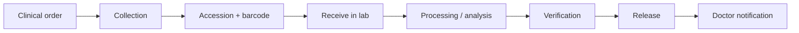
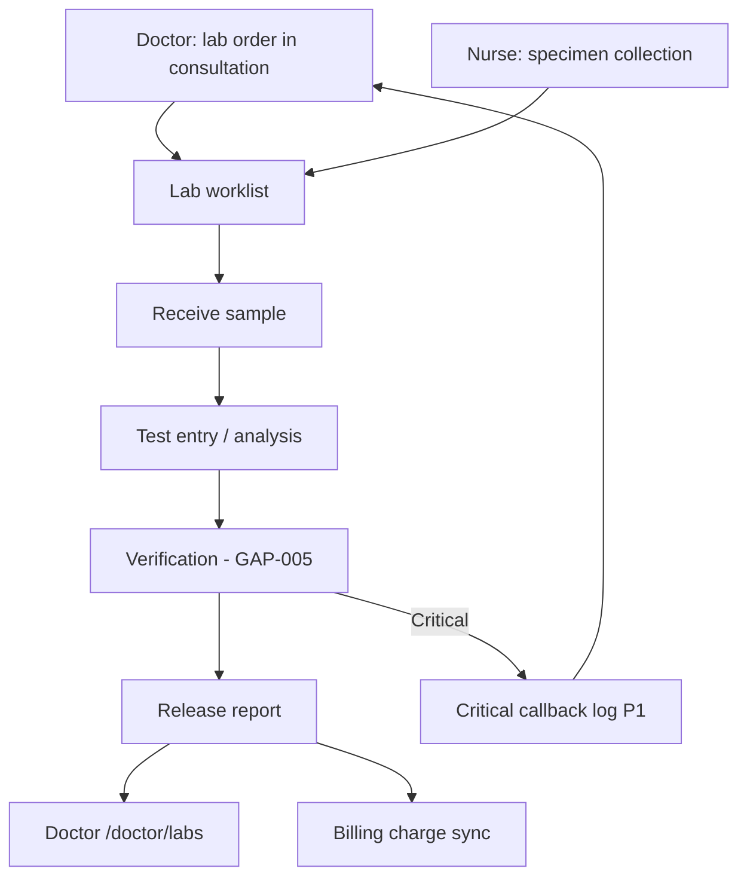
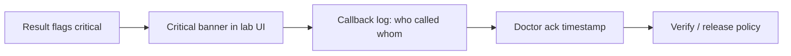

# Lab Technician Role Module — Product & Implementation Plan

**Last updated:** 2026-05-21  
**App:** `apps/hospital-os` · **Role key:** `lab_technician` · **Base path:** `/lab`  
**Navigation source:** `apps/hospital-os/src/config/roleNavigation.ts` (`ROLE_TABS.lab_technician`)

This plan describes everything a **hospital laboratory / LIS-oriented** workspace needs in a multi-specialty enterprise HMS, mapped to what exists today (Live / C1-leaning / Preview per [MASTER_OPERATIONAL_CONNECTIVITY_MATRIX.md](../../MASTER_OPERATIONAL_CONNECTIVITY_MATRIX.md)) and what to build next. It does **not** specify a visual redesign — all new work must reuse `AppLayout`, role tabs, shadcn/ui, `DepartmentWorklistTable`, **`LabWorkflowStepStrip`** (lab-specific journey chrome), platform runtime hooks, and existing lab page patterns.

**Audit honesty:** Per [ENTERPRISE_AUDIT_REPORT.md](../../ENTERPRISE_AUDIT_REPORT.md) §4.9, the lab spine is **real** (`LabDiagnosticOrder` lifecycle, branch worklist + SSE, GAP-005 verify/release UI gates) but this is **not a full LIMS**: `tests` is a free string, results are unstructured text in `LabOrder.results`, **no test catalog / LOINC / reference ranges**, no analyzer HL7/ASTM, no QC/calibration module, no accession numbering service, no structured panic/delta rules. This document plans the full enterprise lab workspace while labeling current vs target honestly.

**Laboratory operations are core** — not a MIS dashboard. P0 Definition of Done (§9) requires governed sample-to-report flow on **platform-linked** orders — not “can open `/lab` with demo KPIs.”

**UX exception (product decision):** **`LabWorkflowStepStrip`** (Sample → Verify → Report) stays on lab operational pages. Do **not** reintroduce generic `WorkflowStepStrip` (`frontDeskSpine` / `clinicalOpdSpine`) on lab routes — that pattern is reserved for reception OPD only; doctor/nurse/reception must remain without it.

---

## 1. Role purpose and personas

### Purpose

The lab technician module is the **diagnostic laboratory operations layer** of the hospital: order intake from clinical roles, specimen collection coordination, accession and barcode identity, bench processing and result entry, pathologist/section-head verification, governed report release, critical-value escalation, and handoffs to doctors, nurses, reception (identity), billing (charges), and external referral labs. Lab **owns the specimen chain and result artifact**; it does **not** prescribe, register patients, dispense drugs, read imaging, run CRM, or manage full hospital inventory.

### Personas

| Persona | Typical duties | Primary screens |
|---------|----------------|-----------------|
| **Bench technologist** | Receive samples, run analyzers (manual entry today), enter results, move stages | Worklist, Samples, Test Entry |
| **Phlebotomy / collection** | Collection lists, label print, reject/recollect | Samples (today); planned `/lab/phlebotomy` |
| **Section head / pathologist** | Verify results, release reports, critical review | Verification, Reports |
| **QC officer** | Control materials, Levey-Jennings, calibration | Planned `/lab/qc` (P2) |
| **Night / stat lab** | Emergency prioritization, TAT breach escalation | Dashboard, Worklist |
| **Referral lab coordinator** | Outsource send/receive, external report attach | Planned `/lab/referral` (P2) |
| **Lab supervisor** | TAT dashboard, pending verify, critical queue, section filters | Dashboard (target), Worklist |

### Login context

`LoginPage` maps role `lab_technician` to `/lab`. No department picker at login today — **section filters** (hematology, biochemistry, microbiology) are UI category strings on orders, not server-side lab section assignment (P1).

---

## 2. Screen and tab inventory

### 2.1 Current role tabs (`roleNavigation.ts`)

| Tab key | Label | Path | Page component | Connectivity / readiness (2026-05-21) |
|---------|-------|------|----------------|----------------------------------------|
| `dashboard` | Dashboard | `/lab` | `LabDashboard` | **Preview** — KPIs derived from `labOrders` in store; SSE sync via `useDepartmentWorklistSync` but `routeReadiness` excludes `/lab` from C1-leaning |
| `worklist` | Worklist | `/lab/worklist` | `LabWorklist` | **C1-leaning** — branch worklist + SSE; dialog with `LabWorkflowStepStrip`, `LabGovernedActions` |
| `samples` | Samples | `/lab/samples` | `LabSamples` | **C1-leaning** — receive/processing; sample tracking tabs |
| `entry` | Test Entry | `/lab/entry` | `LabEntry` | **C1-leaning** — result text entry; `LabWorkflowStepStrip` |
| `verification` | Verification | `/lab/verification` | `LabVerification` | **C1** (matrix) — GAP-005 verify/release tooltips; critical banner |
| `reports` | Reports | `/lab/reports` | `LabReports` | **C1** (matrix) — report draft + governed release |

### 2.2 Routed in `App.tsx` (`LAB_PAGES`)

Static map — all six paths above; no dynamic `:id` routes today.

| Path | Component | In role tabs | Notes |
|------|-----------|--------------|-------|
| `/lab` | `LabDashboard` | Yes | TAT-by-category is **percent reported**, not clock TAT |
| `/lab/worklist` | `LabWorklist` | Yes | Primary operational console; `DepartmentWorklistTable` |
| `/lab/samples` | `LabSamples` | Yes | Tracking + archived storage tab (local) |
| `/lab/entry` | `LabEntry` | Yes | Manual result summary → Awaiting Validation |
| `/lab/verification` | `LabVerification` | Yes | Pathologist queue |
| `/lab/reports` | `LabReports` | Yes | Validated/Reported; uses `canReleaseLabReport` |

### 2.3 `LabWorkflowStepStrip` usage (lab-specific — keep)

| Page | Mounted | Steps shown |
|------|---------|-------------|
| `LabWorklist` | Yes — order detail dialog | Sample → Verify → Report |
| `LabEntry` | Yes — per order card | Same |
| `LabVerification` | Yes — per validation card | Same |
| `LabDashboard` | No | Use dashboard CTAs to worklist |
| `LabSamples` | No | Sample status chips only |
| `LabReports` | No | Post-verify artifact focus |

Implementation: `apps/hospital-os/src/components/diagnostics/LabWorkflowStepStrip.tsx` — distinct from `components/opd/WorkflowStepStrip.tsx`.

### 2.4 Cross-module routes (not lab tabs — coordination)

| Path | Owner | Lab technician use |
|------|-------|-------------------|
| `/doctor/labs` | Doctor | Ordering physician **reviews** released results — not lab console |
| `/doctor/consultation/:id` | Doctor | Creates lab orders via `saveConsultation` → domain-api |
| `/nurse/tasks`, `/nurse/ward` | Nurse | Specimen collection tasks (handoff P1) |
| `/reception/registration` | Reception | Patient identity / UHID for label match |
| `/reception/flow` | Reception | `OperationalLabPanel` — order status read-only |
| `/billing-dept/*` | Billing | Lab charge lines from `amountCents` / sync flags |
| `/emergency/orders` | Emergency | Link to `/lab/worklist` for stat orders |

### 2.5 Removed / out of nav (product decisions)

| Item | Notes |
|------|--------|
| Generic `WorkflowStepStrip` on lab routes | **Do not add** — use `LabWorkflowStepStrip` only |
| `WorkflowStepStrip` on reception/doctor/nurse | **Do not reintroduce** on those roles (parent constraint) |

### 2.6 Planned screens (gaps — not in nav yet)

Grouped by enterprise LIMS expectation. Priority in §4 and §10.

| Proposed path | Screen | Rationale |
|---------------|--------|-----------|
| `/lab/orders` | Orders inbox (by source: OPD/IPD/ER) | Separate clinical intake from bench worklist |
| `/lab/phlebotomy` | Collection queue + label print | Phlebotomy persona; nursing coordination |
| `/lab/accession` | Accession desk + barcode print | Chain-of-custody start; reject reasons |
| `/lab/catalog` | Test catalog, panels, LOINC | **P1** — today `tests` is free text |
| `/lab/sections` | Section worklists (heme, chem, micro, histo) | Multi-specialty lab zoning |
| `/lab/critical` | Critical / panic callback log | Phone/read-back attestation P0 gap |
| `/lab/qc` | QC runs, Levey-Jennings | **P2** |
| `/lab/analyzers` | Instrument interfacing inbox | HL7/ASTM **P2** |
| `/lab/referral` | Outsource / referral tracking | External lab coordinator |
| `/lab/consumables` | Reagent low-stock → inventory request | **P2** — not full inventory |
| `/lab/amendments` | Corrected/amended results | Reason-coded amendments |
| `/lab/audit` | Result audit trail viewer | Per-result transition history |
| `/lab/billing-handoff` | Lab charge preview before release | Billing reconciliation chip |
| `/lab/tat` | TAT analytics & breach SLA | Real clock TAT vs SLA |
| `/lab/storage` | Sample storage locations | Freezer/rack positions |
| `/lab/histo` | Histopath / cytology | **P2** specialty |

---

## 3. Laboratory operations as explicit core (target architecture)

### 3.1 LIMS domains (enterprise target)

| Domain | Target capability | Today (honest) |
|--------|-------------------|----------------|
| **Test catalog** | LOINC, specimen, container, method, panels | **Missing** — `tests` string on order |
| **Order / worklist** | Branch queue, priority, section | **C1-leaning** — `useDepartmentWorklistSync('lab')` |
| **Sample identity** | Barcode, accession ID, chain of custody | `sampleId` / `sampleBarcode` fields; UI partial |
| **Collection** | Phlebotomy list, reject/recollect | Nurse/lab handoff informal |
| **Processing** | Analyzer feed + manual entry | **Text** `results` only |
| **Reference ranges** | Age/sex units, flags H/L/C | **Missing** |
| **Verification** | Dual sign-off, pathologist | GAP-005 gates + `LabGovernedActions` tooltips |
| **Release** | `publish_report` to clinician | Governed when `platformLabState` present |
| **Critical values** | Panic rules, callback log, doctor ack | Banner + `critical_review` state; **no callback log** |
| **QC** | Controls, calibration, Westgard | **Missing** (P2) |
| **Referral / outsource** | Send-out tracking | **Missing** (P2) |
| **Billing** | Test tariff, auto charge on release | `amountCents`, `syncBilling` on create — partial |
| **Interop** | HL7 ORU, FHIR DiagnosticReport | **Missing** (P2) |

### 3.2 Where lab UX lives

1. **Worklist** — primary day console (`DepartmentWorklistTable` + detail dialog).
2. **Samples + Accession (planned)** — physical sample chain.
3. **Test Entry** — result capture (structured target).
4. **Verification + Reports** — governed verify/release (GAP-005).
5. **Dashboard** — supervisor TAT/critical/verify queues (must become live P0).

---

## 4. Feature breakdown by screen (P0 / P1 / P2)

### Dashboard (`/lab`)

| Priority | Features |
|----------|----------|
| **P0 (gap)** | Live counts from **branch worklist** only: pending collect, in analysis, awaiting validation, critical pending, TAT breaches; CTAs to worklist/verification; `InlinePlatformError` on SSE failure |
| **P1** | Per-section breakdown; clock TAT vs SLA; night-lab stat lane |
| **P2** | Multi-branch rollup; analyzer downtime widget |

### Worklist (`/lab/worklist`)

| Priority | Features |
|----------|----------|
| **P0** | Filter/search; priority/category; open order dialog; receive sample → In Analysis; result entry; submit for validation; `LabWorkflowStepStrip` + `LabGovernedActions` with disabled tooltips |
| **P0** | Platform: `updateLabStage` → `platformApplyLabUiStage` when `platformLabOrderId` set |
| **P1** | Section tabs (heme/chem/micro); billing due chip per UHID; link to patient identity |
| **P2** | Batch receive; auto-assign to bench |

### Samples (`/lab/samples`)

| Priority | Features |
|----------|----------|
| **P0** | Active sample tracking; mark Received; start Processing; reject sample with reason (P0 gap — button exists conceptually, needs governed transition) |
| **P1** | Barcode scan input; collection time/ collector; nursing task link |
| **P2** | Storage location; transport chain |

### Test Entry (`/lab/entry`)

| Priority | Features |
|----------|----------|
| **P0** | Result summary required before validation; stage buttons; `LabWorkflowStepStrip` |
| **P0 (gap)** | **Structured results** (analyte rows) when catalog exists — today single text field |
| **P1** | Analyzer import queue (manual paste interim) |
| **P2** | Auto-validate numeric results against reference range |

### Verification (`/lab/verification`)

| Priority | Features |
|----------|----------|
| **P0** | Awaiting validation queue; `LabGovernedActions` verify/release; critical banner; validator name |
| **P0** | GAP-005: cannot verify without results; cannot release without verify — tooltips |
| **P1** | Secondary review for `critical_review`; delta check flags |
| **P2** | Digital pathologist sign-off PDF |

### Reports (`/lab/reports`)

| Priority | Features |
|----------|----------|
| **P0** | Report draft fields (specimen, method, results, interpretation); governed release |
| **P1** | Print/PDF template; amended report workflow |
| **P2** | NABL footer, QR verification |

### Planned: orders, phlebotomy, accession, catalog, critical, qc, referral

See §2.6 — **Test catalog** and **critical callback log** are **P0/P1** for enterprise parity; QC/analyzer **P2**.

---

## 5. Sample flow (identity, custody, TAT)

### 5.1 Target sample lifecycle

### 5.2 States today (UI + platform)

| UI field | Values | Platform tie-in |
|----------|--------|-----------------|
| `sampleStatus` | Ordered → Collected → Received → Processing → Analysis Complete | Local; merge from branch worklist |
| `stage` | Pending Analysis → In Analysis → Awaiting Validation → Validated → Reported | `platformApplyLabUiStage` + transitions |
| `platformLabState` | e.g. `awaiting_review`, `critical_review`, `approved` | Authoritative when runtime on |

### 5.3 Sample flow feature checklist

| Step | Lab action | Honest today |
|------|------------|--------------|
| Order | Doctor/ER/IPD creates test string | Platform order create via consultation |
| Collect | Nurse or phlebotomy | **No** dedicated phlebotomy route |
| Accession | Print barcode, assign sample ID | Fields exist; **no** print service |
| Receive | Mark received in lab | Worklist / Samples |
| Reject / recollect | Reason + new sample | **P1** — not governed end-to-end |
| Store | Rack/freezer location | **P2** |
| TAT | Order time → reported | Dashboard uses **% reported**, not minutes |

---

## 6. End-to-end workflows

### 6.1 Standard: order → collect → receive → process → verify → release → doctor

**Platform spine:** `POST /lab/orders` → branch worklist `GET /lab/branch/worklist` → transitions (`collect_sample`, `verify_results`, `publish_report`) → SSE `lab.transition` → doctor sees released state on consultation blockers / labs tab.

**UI spine:** Worklist dialog or Entry → Verification → Reports; **`LabWorkflowStepStrip`** on operational steps; **no** generic OPD `WorkflowStepStrip`.

### 6.2 Critical value workflow (target)

**Today:** `isCritical` / `critical_review` + `CriticalResultBanner`; **no** callback log entity or doctor attestation inbox (doctor module §2.6 `/doctor/critical` planned).

### 6.3 IPD / ER lab orders

Same worklist — orders carry `opdVisitId` / admission context when created from IPD/ER paths. No separate IPD lab UI today (P1 `/lab/orders` inbox by source).

---

## 7. Cross-role handoffs

Aligned with [DOCTOR_MODULE.md](./DOCTOR_MODULE.md), [NURSE_MODULE.md](./NURSE_MODULE.md), and [RECEPTIONIST_MODULE.md](./RECEPTIONIST_MODULE.md).

| From / To | Trigger | Data passed |
|-----------|---------|-------------|
| **Doctor → Lab** | Consultation lab lines | `tests`, priority, `encounterId`, `opdVisitId`, `amountCents` |
| **Nurse → Lab** | Specimen collection task | Sample id, collection time, patient UHID (P1) |
| **Reception → Lab** | Identity verification at collection | Demographics, UHID, allergies on label |
| **Lab → Doctor** | Report released | Result summary, critical flag → `/doctor/labs` |
| **Lab → Nurse** | Reject / recollect | Task to re-draw (P1) |
| **Lab → Billing** | Order create / release | Charge keys, invoice sync |
| **ER → Lab** | Emergency orders panel | Stat priority → worklist |
| **Lab → Referral lab** | Send-out | External accession, report PDF (P2) |
| **Lab → Inventory** | Consumable requisition | SKU qty alert (P2) |

---

## 8. Explicitly out of scope for Lab Technician

| Capability | Owner module |
|------------|--------------|
| Radiology orders, PACS, imaging reports | **Radiology** — `/radiology/*` |
| Pharmacy dispensing, formulary, MAR | **Pharmacy** — `/pharmacy/*` |
| Patient registration, walk-in, queue | **Reception** — `/reception/*` |
| Clinical prescribing, diagnosis, consult chart | **Doctor** — `/doctor/*` |
| Nursing care plans, vitals, MAR administration | **Nurse** — `/nurse/*` |
| CRM, drip campaigns, lead pipeline | **CRM** — `/crm/*` |
| Full inventory procurement, PO, GRN master | **Inventory** — `/inventory/*` (consumable **request** only P2) |
| HR payroll, staff master | **HR** — `/hr/*` |
| Tenant admin, fee catalogs | **Admin** — `/admin/*` |
| OT scheduling, surgeon preference cards | **OT** — `/ot` |

Lab may **view** patient demographics for identity match and **trigger** charges — not operate other roles’ consoles.

---

## 9. Definition of Done — Lab Technician P0

P0 is **not** “six lab tabs exist.” P0 is done when a bench tech + verifier can run a day on **platform runtime on** with **governed diagnostics path**:

1. **Worklist:** Branch worklist hydrates via SSE; platform-linked orders show `platformLabOrderId` / `platformLabState`.
2. **Sample receive:** Mark sample received and advance to analysis without bypassing stage order when platform state is present.
3. **Result entry:** Result text required before Awaiting Validation; cannot verify empty (GAP-005 UI).
4. **Verify:** `verify_results` path respected — disabled button shows tooltip reason.
5. **Release:** `publish_report` only from approved/validated platform state — disabled tooltip when blocked.
6. **Critical:** Critical orders show banner; release policy respects `critical_review` (secondary review message in tooltip).
7. **Doctor handoff:** Released orders appear on doctor labs slice as completed/released.
8. **Dashboard honesty:** KPI tiles from worklist truth OR labeled Preview — no silent demo-only counts without badge.
9. **Errors:** SSE / refresh failures surfaced (`InlinePlatformError` P0 gap on lab pages).
10. **LabWorkflowStepStrip** remains on worklist/entry/verification; generic `WorkflowStepStrip` not added.
11. `pnpm --filter hospital-os typecheck` passes; `routeReadiness` honest — Preview for dashboard until live KPIs.

---

## 10. Implementation waves

| Wave | Focus | Deliverables |
|------|-------|--------------|
| **W0** (done) | Lab spine UX | Six routes, branch SSE, `DepartmentWorklistTable`, GAP-005 tooltips, `LabWorkflowStepStrip`, `LabGovernedActions` |
| **W1** | **LIMS P0 honesty** | Live dashboard from branch worklist; `InlinePlatformError` on all lab pages; reject/recollect reason; critical callback log v1 |
| **W2** | **Test catalog P1** | `/lab/catalog` LOINC/specimen/panel; structured result entry rows |
| **W3** | **Accession + phlebotomy** | Barcode print, accession desk, nursing collection queue link |
| **W4** | **Reference ranges + flags** | Age/sex ranges; H/L/C flags; delta check on verify |
| **W5** | **Amendments + audit UI** | Corrected results; per-result transition viewer |
| **W6** | **Billing + TAT** | Charge preview handoff; real clock TAT SLA board |
| **W7** | **Referral + outsource** | Send-out tracking, external report attach |
| **W8** | **Analyzer interfacing P2** | HL7 ORU inbound queue, instrument status |
| **W9** | **QC + enterprise P2** | Levey-Jennings, NABL report templates, FHIR DiagnosticReport |

**Recommended wave 1 implementation focus (next sprint):** **W1 — LIMS P0 honesty** — branch-backed dashboard KPIs, platform error surfacing on every lab page, critical callback log stub with doctor read path, and governed reject/recollect — without redesigning shells or removing `LabWorkflowStepStrip`.

---

## 11. API and domain dependencies

### 11.1 Runtime and store

| Layer | Usage in lab module |
|-------|------------------------|
| `hospitalStore` (`HospitalProvider`) | `labOrders`, `updateLabStage`, `updateLabOrder`, `refreshDepartmentWorklistsFromPlatform` |
| `canUseLabRuntime()` | `isPlatformRuntimeEnabled()` + `VITE_DOMAIN_API_URL` + session |
| `useDepartmentWorklistSync('lab')` | Mount poll + SSE `lab.transition` / `platform.event` |
| `lab-runtime.ts` | `platformCreateLabOrder`, `platformLabTransition`, `platformApplyLabUiStage`, `platformListLabBranchWorklist`, `platformGetLiveLabState` |
| `lab-stage-guards.ts` | `getLabVerifyDisabledReason`, `getLabReleaseDisabledReason`, GAP-005 |
| `lifecycle-guards.ts` | `guardLabUiStage` server-aligned checks |
| `@adrine/hospital-operations` | `lab-runtime-engine.ts`, `guardLabUiStageAdvance`, `getRequiredLabActionForUiStage` |

### 11.2 Domain-api (representative)

| Domain | Endpoints / actions | Screens |
|--------|----------------------|---------|
| Lab | `POST /lab/orders`, `POST /lab/orders/:id/transition`, `POST /lab/orders/:id/ui-stage` | Worklist, Entry, Verification |
| Lab | `GET /lab/branch/worklist` | All lab pages via sync hook |
| Lab | `GET /lab/opd/:opdVisitId/live` | Consultation blockers, reception flow panel |
| Billing | Charge sync on order create | Consultation, billing handoff P1 |
| Patients | Read demographics for labels | Accession P1 |

### 11.3 Kernel-api

Session tenant/branch; actor id on transitions for audit (**P1** show in UI).

### 11.4 Hooks and shared components (reuse)

| Asset | Path |
|-------|------|
| `DepartmentWorklistTable` | `@/components/diagnostics/DepartmentWorklistTable` |
| `LabWorkflowStepStrip` | `@/components/diagnostics/LabWorkflowStepStrip` |
| `LabGovernedActions` | `@/components/diagnostics/LabGovernedActions` |
| `CriticalResultBanner` | `@/components/diagnostics/CriticalResultBanner` |
| `WorklistStatusChip` | `@/components/diagnostics/WorklistStatusChip` |
| `useDepartmentWorklistSync` | `@/hooks/useDepartmentWorklistSync` |
| `routeReadiness` | `@/config/routeReadiness.ts` |
| `OperationalLabPanel` | `@/components/operational/*` (reception flow) |

---

## 12. UI theme constraints (no redesign)

All lab work must match existing Hospital OS patterns:

- **Shell:** `AppLayout` with role tabs from `ROLE_TABS` / `getTabsForRole`.
- **Layout:** `space-y-6` page headers (`text-2xl font-bold tracking-tight` + muted subtitle).
- **Worklist:** `DepartmentWorklistTable` + dialog detail pattern on `LabWorklist`.
- **Journey chrome:** **`LabWorkflowStepStrip`** on worklist dialog, entry cards, verification cards — **do not remove** (lab-specific product decision).
- **Governed actions:** `LabGovernedActions` with tooltip disabled reasons (GAP-005) — replicate on any new verify/release surface.
- **Components:** shadcn `Card`, `Button`, `Badge`, `Input`, `Table`, `Tabs`; `sonner` toasts.
- **Status:** `routeReadiness` — `/lab` dashboard = Preview until live KPIs; worklist/entry/samples = Live (C1-leaning); verification/reports = Live when platform-backed.
- **Errors:** Add `InlinePlatformError` on lab list pages (W1) — no silent SSE drop.
- **Do not add** generic `WorkflowStepStrip` to lab routes.
- **Do not add** generic `WorkflowStepStrip` back to reception/doctor/nurse.

---

## 13. Honesty checklist (audit alignment)

Per [ENTERPRISE_AUDIT_REPORT.md](../../ENTERPRISE_AUDIT_REPORT.md) and connectivity matrix:

- Lab **worklist through release** are **C1-leaning / C1** when runtime on — **not** a full LIMS (§4.9 audit).
- **No test catalog, LOINC, reference ranges, analyzer, QC** — enterprise gap; plan waves W2/W8/W9.
- **`tests` and `results` are free text** — no structured analyte validation.
- **GAP-005** UI gates are **partial** — offline/local stage can diverge from platform; server enforcement remains staging hardening.
- **`/lab` dashboard** — matrix historically C1-leaning with W=N; **`routeReadiness` treats `/lab` as Preview** (KPI tiles local) — align badges honestly.
- **TAT on dashboard** is not real-time SLA — placeholder “% done” by category.
- Production safety (auth, RLS, HL7, NABL, tests) is **not** implied by this UI plan.

---

## Appendix A — Exhaustive feature backlog (P2 / future)

For roadmap completeness — not committed dates.

- **Catalog:** LOINC, CPT, panel reflex rules, culture profiles, histo blocks
- **Pre-analytics:** Order entry validation, duplicate test detection, ICD-linked indications
- **Collection:** Mobile phlebotomy rounds, tube type rules, pediatric micro-volume
- **Accession:** 2D barcode, well plate mapping, biobank consent
- **Processing:** Workcell automation, batch runs, reruns, dilution protocols
- **Results:** Structured numeric + qualitative, reflex add-ons, cumulative reporting
- **QC:** Westgard rules, EQAS, calibration certificates
- **Critical:** Escalation tiers, read-back scripts, LIS→doctor SMS with audit
- **Reporting:** Bilingual PDF, graph trends, AMR/CAP footers
- **Billing:** Panel pricing, insurance test exclusions, package bundles
- **Inventory:** Reagent lot, cold-chain, auto-reorder to stores
- **Referral:** SFTP to partner lab, HL7 outbound orders
- **Compliance:** NABL 112B, CAP checklists, data retention
- **Interop:** HL7v2 ORU/ORM, FHIR DiagnosticReport, analyzer ASTM
- **AI:** Result validation suggest (human verify only)
- **Analytics:** Turnaround by test/section, rejection rates, QC failures
- **India:** ABDM diagnostic records, Ayushman package test mapping

---

## Appendix B — File map (implementation reference)

| Concern | Location |
|---------|----------|
| Role tabs | `apps/hospital-os/src/config/roleNavigation.ts` |
| Routes | `apps/hospital-os/src/App.tsx` → `LAB_PAGES` |
| Readiness | `apps/hospital-os/src/config/routeReadiness.ts` |
| Pages | `apps/hospital-os/src/pages/lab/*.tsx` |
| Lab API client | `apps/hospital-os/src/runtime/lab-runtime.ts` |
| Stage guards | `apps/hospital-os/src/operations/lab-stage-guards.ts` |
| Governed engine | `packages/hospital-operations/src/engine/lab-runtime-engine.ts` |
| GAP registry | `packages/hospital-operations/src/analysis/gaps.ts` (GAP-005) |
| Domain service | `services/domain-api/src/lab/lab-runtime.service.ts` |
| Doctor orders | `apps/hospital-os/src/pages/doctor/DoctorLabs.tsx`, `ConsultationOrders.tsx` |
| Store actions | `apps/hospital-os/src/stores/hospitalStore.tsx` (`updateLabStage`, `LabOrder`) |
