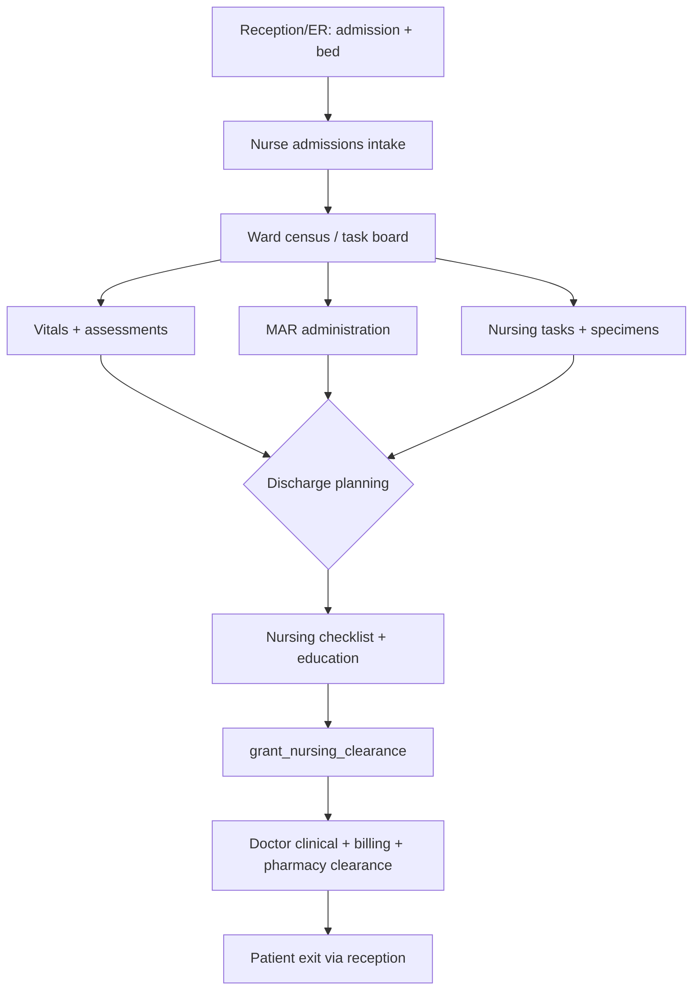
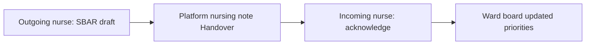
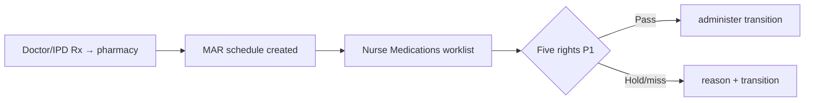

# Nurse Role Module — Product & Implementation Plan

**Last updated:** 2026-05-21  
**App:** `apps/hospital-os` · **Role key:** `nurse` · **Base path:** `/nurse`  
**Navigation source:** `apps/hospital-os/src/config/roleNavigation.ts` (`ROLE_TABS.nurse`)

This plan describes everything **inpatient and bedside nursing** needs in a multi-specialty enterprise HMS, mapped to what exists today (Live / C1-leaning / Preview per [MASTER_OPERATIONAL_CONNECTIVITY_MATRIX.md](../../MASTER_OPERATIONAL_CONNECTIVITY_MATRIX.md)) and what to build next. It does **not** specify a visual redesign — all new work must reuse `AppLayout`, role tabs, shadcn/ui, `PatientContextBar`, platform runtime hooks, and existing nurse page patterns.

**Audit honesty:** Per [ENTERPRISE_AUDIT_REPORT.md](../../ENTERPRISE_AUDIT_REPORT.md), nursing has **domain models and transitions** (`NursingTask`, `NursingVitalRound`, `NursingNote`, `MedicationSchedule` / MAR) but the **UI is uneven**: MAR administer/hold is real when runtime is on; **dashboard and shift overview remain demo-first**; no barcode five-rights eMAR, no structured assessments (Braden, fall risk), no SBAR handover artifact, no care-plan entity. This document plans the full nurse workspace while labeling current vs target honestly.

**Bedside nursing is core** — not a KPI dashboard. P0 Definition of Done (§9) requires vitals capture, MAR administration, ward census, and discharge nursing clearance on platform-linked admissions — not “can open `/nurse`.”

---

## 1. Role purpose and personas

### Purpose

The nurse module is the **operational bedside layer** for hospitalized patients: ward census and acuity, nursing tasks, vitals and assessments, medication administration (MAR/eMAR), intake/output and wound care documentation, nursing notes and shift handoff, specimen-collection coordination, doctor-order acknowledgment, and **nursing discharge clearance** in the unified discharge orchestration (GAP-012). Nurses **execute and document care**; they do **not** prescribe, register patients, run revenue cycle, procure stock, or own ER triage boards.

### Personas

| Persona | Typical duties | Primary screens |
|---------|----------------|-----------------|
| **Ward nurse (staff nurse)** | Shift assignment, vitals, MAR, tasks, nursing notes | Ward, Vitals, Medications, Tasks |
| **Charge nurse** | Census, acuity board, task assignment, handoff oversight | Task Board, Ward, Dashboard (target) |
| **ICU nurse** | Hourly vitals, infusion, early warning, critical alerts | Vitals, Medications, Ward (ICU filter) — ICU flowsheet P2 |
| **OPD / procedure nurse** | Pre-procedure vitals, recovery monitoring | Vitals (OPD slice P1), ER observation coordination P2 |
| **Medication nurse** | MAR due list, controlled substances, PRN | Medications |
| **Admission / intake nurse** | Receive IPD from reception/ER, initial assessment, bed confirm | Admissions, Ward |
| **Discharge nurse** | Education checklist, nursing clearance, handoff to desk | Discharge |

### Login context

Nurse users select **role = nurse** at login (no department picker like doctor). Ward scope today is **UI filter + local roster names** — not server-side nurse–ward assignment (P1).

---

## 2. Screen and tab inventory

### 2.1 Current role tabs (`roleNavigation.ts`)

| Tab key | Label | Path | Page component | Connectivity / readiness (2026-05-21) |
|---------|-------|------|----------------|----------------------------------------|
| `dashboard` | Dashboard | `/nurse` | `NurseDashboard` | **Preview** — demo STATS/ALERTS/MY_PATIENTS; IPD census strip C1-leaning when runtime on |
| `task-board` | Task Board | `/nurse/task-board` | `NurseTaskBoard` | **C1-leaning** — merges local tasks + platform pending counts per admission |
| `ward` | My Ward | `/nurse/ward` | `NurseWard` | **C1-leaning** — census, transfer (`initiate_transfer` when platform), links to vitals chart/notes |
| `admissions` | Admissions | `/nurse/admissions` | `NurseAdmissions` | **C1-leaning** — admission list; rounds often **local** `addNursingRound` (not platform vitals API) |
| `tasks` | Tasks | `/nurse/tasks` | `NurseTasks` | **C1-leaning** — platform nursing tasks + governed complete path; local inpatient orders slice |
| `medications` | Medications | `/nurse/medications` | `NurseMedications` | **C1-leaning** — MAR from domain-api; `platformMarTransition` (administer/hold/miss) |
| `vitals` | Vitals | `/nurse/vitals` | `NurseVitals` | **C1-leaning** — `platformRecordVitals` when admission linked; else local round |
| `discharge` | Discharge | `/nurse/discharge` | `NurseDischarge` | **C1-leaning** — checklist + **`OperationalDischargePanel`** / `grant_nursing_clearance` |
| `reports` | Reports | `/nurse/reports` | `NurseReports` | **Preview** — shift report shell; `platformGetNurseReport` when runtime on |

### 2.2 Dynamic routes (not in role tabs)

| Path | Component | Guard / notes |
|------|-----------|---------------|
| `/nurse/vitals/chart/:admissionId` | `NurseVitalsChart` | Trend chart from `GET /nursing/vitals/admission/:id` — C1-leaning |
| `/nurse/notes/:admissionId` | `NurseNotesEditor` | `POST /nursing/notes`, types include Handover — C1-leaning; **not** structured SBAR |

### 2.3 Routed in `App.tsx` (`NURSE_PAGES` + dynamic)

Static map in `App.tsx` lines 244–253; dynamic routes 519–534. **No** `/nurse/flow` hub (unlike reception `/reception/flow`). IPD spine step `nursing` points to `/nurse/ward` (`ipdSpine` in `@adrine/hospital-operations`).

### 2.4 Cross-module entry points (coordination, not nurse-owned)

| Path | Access | Nurse use |
|------|--------|-----------|
| `/reception/ipd`, `/reception/beds` | Reception | Admission intent + bed — nurse **receives** handoff |
| `/doctor/ipd/:patientId` | Doctor | Orders, clinical clearance — nurse reads status |
| `/lab/samples` | Lab | Specimen collection tasks often originate as nursing tasks P1 |
| `/pharmacy/prescriptions` | Pharmacy | Rx fulfillment before discharge checklist “meds explained” |
| `/emergency/observation` | Emergency | Observation nursing slice — coordination only P2 |
| `/billing-dept/ipd-billing` | Billing | Billing clearance — read via discharge panel |

### 2.5 Removed / out of nav (product decisions)

| Item | Notes |
|------|--------|
| `WorkflowStepStrip` on nurse routes | **Do not reintroduce** — use ward board, task board, and `PatientContextBar` on single-patient views (parent constraint). |
| Dedicated `/nurse/flow` | Not shipped; optional P1 “Nursing command” tab (see §2.6). |

### 2.6 Planned screens (gaps — not in nav yet)

Grouped by enterprise HMS expectation. Priority in §4 and §10.

| Proposed path | Screen | Rationale |
|---------------|--------|-----------|
| `/nurse/shift` | Shift overview & handoff (SBAR) | Replace demo dashboard; structured outgoing/incoming |
| `/nurse/assessments` | Nursing assessments | Head-to-toe, Braden, Glasgow, fall risk, pain |
| `/nurse/care-plan` | Care plan & diagnoses | NANDA-style goals/interventions P1 |
| `/nurse/io` | Intake / output & fluid balance | Daily weights, urine output |
| `/nurse/wounds` | Wound care & dressing schedule | Photo + staging P1 |
| `/nurse/infusion` | IV therapy / infusion pump | Rate, line, compatibility P1 |
| `/nurse/orders` | Doctor order nursing verify | Acknowledge / clarify / refuse with reason |
| `/nurse/specimens` | Lab specimen collection queue | Tie nursing task → lab sample |
| `/nurse/consumables` | Ward stock request | Requisition to inventory — not full inventory module |
| `/nurse/incidents` | Incident / near-miss | Risk management P2 |
| `/nurse/infection` | Infection control bundles | CLABSI/CAUTI checklists P2 |
| `/nurse/education` | Patient education library | Link to discharge education |
| `/nurse/er-board` | ER observation nursing slice | Census from ER observation P2 |
| `/nurse/ot` | OT day-case nursing | Pre/post op checklist P2 |
| `/nurse/telemetry` | Device feeds | SpO2/ECG monitor ingest P2 |
| `/nurse/opd-station` | OPD vitals / injection room | Lightweight OPD nursing P1 |

---

## 3. Bedside nursing as explicit core (target architecture)

### 3.1 Bedside domains (enterprise target)

| Domain | Target capability | Today (honest) |
|--------|-------------------|----------------|
| **Vitals** | Scheduled rounds, trends, early warning (NEWS2/MEWS) | Capture + chart API; **no** due schedule engine; no NEWS2 |
| **Assessments** | Structured forms, scores, reassessment intervals | **Missing** — pain score only on vitals form |
| **Nursing notes** | SOAP/SBAR, templates, cosign | Free-text `noteType` + body on platform |
| **Care plan** | Diagnoses, goals, interventions | **Missing** |
| **MAR / eMAR** | Five rights, barcode, PRN, witness controlled | Governed transitions; **no** barcode; witness P1 |
| **I/O & wounds** | Balance, dressing protocol | **Missing** |
| **Handoff** | SBAR per shift, read receipt | Notes type “Handover” only |
| **Tasks** | By acuity, from orders + protocols | Platform tasks + local demo tasks on board |
| **Discharge nursing** | Education + clearance + med reconciliation view | Checklist local; panel **live** for clearance |

### 3.2 Where bedside UX lives

1. **Ward + Task Board** — who is on the unit, what is due (extend with acuity).
2. **Vitals + Chart + Notes** — per-admission bedside charting (deep links from ward).
3. **Medications** — shift-wide MAR worklist.
4. **Discharge** — exit nursing gate in orchestration.

---

## 4. Feature breakdown by screen (P0 / P1 / P2)

### Dashboard (`/nurse`)

| Priority | Features |
|----------|----------|
| **P0 (gap)** | Replace demo STATS/ALERTS with **live** data: platform census, pending MAR count, overdue vitals, open tasks — CTAs to ward/vitals/meds |
| **P1** | Shift timer, nurse assignment, charge-nurse ward selector |
| **P2** | NEWS2 aggregate alerts; device alarm inbox |

### Task Board (`/nurse/task-board`)

| Priority | Features |
|----------|----------|
| **P0** | Per-patient row: bed, acuity proxy (vitals abnormal), pending platform tasks, pending meds, link to vitals/notes |
| **P1** | Assign/reassign nurse; sort by acuity; export CSV (exists) → scheduled report |
| **P2** | Real-time SSE refresh; whiteboard TV mode |

### My Ward (`/nurse/ward`)

| Priority | Features |
|----------|----------|
| **P0** | Active census; ward filter; **platform transfer** when linked; `PatientContextBar`; deep links to `/nurse/vitals/chart/:id`, `/nurse/notes/:id` |
| **P1** | Bed map visual; expected discharges; infection watchlist → assessment link |
| **P2** | Housekeeping status column (from beds API) |

### Admissions (`/nurse/admissions`)

| Priority | Features |
|----------|----------|
| **P0** | List platform-linked admissions; intake checklist (ID band, allergy verify, fall risk screen) |
| **P0 (gap)** | Initial vitals via **`platformRecordVitals`** not only `addNursingRound` |
| **P1** | Receive handoff from reception/ER with admission id; assign primary nurse |
| **P2** | Pre-admission testing queue |

### Tasks (`/nurse/tasks`)

| Priority | Features |
|----------|----------|
| **P0** | List platform nursing tasks; governed `acknowledge_task` → `complete_task`; create task on admission |
| **P1** | Specimen collection task type → lab handoff; IV/site care tasks |
| **P2** | Protocol-driven task generation from care plan |

### Medications — MAR (`/nurse/medications`)

| Priority | Features |
|----------|----------|
| **P0** | Load MAR schedules per active platform admission; **administer** / **hold** / miss with reason; status filters |
| **P1** | PRN with indication; missed-dose analytics; **witness** for controlled substances (`ControlledDrugPolicy`); barcode scan five-rights |
| **P2** | Infusion MAR; smart pump integration; allergy banner from patient record |

### Vitals (`/nurse/vitals`, `/nurse/vitals/chart/:admissionId`)

| Priority | Features |
|----------|----------|
| **P0** | Record vitals to platform; list rounds; trend chart per admission |
| **P1** | Vitals due schedule; NEWS2/MEWS score display; pediatric percentiles |
| **P2** | Device import; early warning escalation to doctor inbox |

### Nursing notes (`/nurse/notes/:admissionId`)

| Priority | Features |
|----------|----------|
| **P0** | Create/list notes on platform; note types including Handover |
| **P1** | SBAR template sections; link note to shift handoff record |
| **P2** | Voice note; cosign for students |

### Discharge (`/nurse/discharge`)

| Priority | Features |
|----------|----------|
| **P0** | Nursing checklist (vitals, meds explained, education, docs); **`OperationalDischargePanel`** — `grant_nursing_clearance`; block local discharged until platform `discharged` |
| **P1** | Patient education structured capture; handoff summary to reception/billing |
| **P2** | Med reconciliation nursing section (read pharmacy + doctor Rx) |

### Reports (`/nurse/reports`)

| Priority | Features |
|----------|----------|
| **P1** | Shift summary from `platformGetNurseReport` (vitals, notes, MAR audit) |
| **P2** | Unit KPI exports; incident rollup |

### Planned screens (§2.6)

Assessments, care plan, I/O, wounds, infusion, order verify, consumables — see §2.6; most **P1** for enterprise IPD parity; infection/telemetry **P2**.

---

## 5. Ward & IPD operations

| Area | Nurse owns | Coordinates with |
|------|------------|------------------|
| Census | Ward board, bed assignment confirm | Reception beds, IPD runtime |
| Transfers | Ward/bed change, handoff note | Doctor order, housekeeping P2 |
| Admissions workflow | Intake assessment, allergy band | Reception IPD, ER transfer |
| Bed requests | Request transfer (UI partially via `initiate_transfer`) | Reception bed board |
| Doctor rounds | Document vitals; flag abnormal | Doctor IPD profile |

**Today:** `useClinicalPlatformListSync({ ipd: true })` on ward/tasks/discharge; `refreshPlatformIpdSnapshots` polls admission state.

---

## 6. End-to-end workflows

### 6.1 IPD: admission → ward → bedside → discharge

**Platform spine:** `admission` active → `/nursing/vitals`, `/nursing/tasks`, `/mar/...` → discharge orchestration nursing gate → `discharged`.

**UI spine:** Ward/Task Board → per-patient Vitals/MAR/Notes — **no** `WorkflowStepStrip`.

### 6.2 Shift handoff (target)

**Today:** Handover is a **note type** only — no acknowledge workflow (P1).

### 6.3 MAR administration (current)

---

## 7. Cross-role handoffs

Aligned with [RECEPTIONIST_MODULE.md](./RECEPTIONIST_MODULE.md) and [DOCTOR_MODULE.md](./DOCTOR_MODULE.md).

| From / To | Trigger | Data passed |
|-----------|---------|-------------|
| **Reception → Nurse** | IPD admission + bed assigned | `platformAdmissionId`, ward/bed, UHID |
| **ER → Nurse** | `transferEmergencyToIPD` | Admission id, triage summary (read) |
| **Doctor → Nurse** | Orders, admission recommend | Order lines, care plan text (P1 structured) |
| **Nurse → Doctor** | Abnormal vitals, task escalation | Vitals series, nursing note (P1 inbox) |
| **Nurse → Lab** | Specimen collection task | Sample id, collection time P1 |
| **Nurse → Pharmacy** | MAR administered / not given | MAR state; discharge “meds explained” |
| **Nurse → Billing** | Nursing clearance granted | Discharge orchestration state |
| **Nurse → Reception** | Discharge-ready patient | Checklist complete; departure coordination |
| **Pharmacy → Nurse** | Dispensed Rx | MAR rows appear on `/nurse/medications` |
| **Nurse → Inventory** | Ward consumable requisition | SKU qty — not procurement P2 |

---

## 8. Explicitly out of scope for Nurse

| Capability | Owner module |
|------------|--------------|
| Patient registration, OPD queue, walk-in | **Reception** — `/reception/*` |
| Prescribing, diagnosis, clinical clearance | **Doctor** — `/doctor/*` |
| LIMS accession, result verification | **Lab** — `/lab/*` |
| Dispensing stock, formulary admin | **Pharmacy** — `/pharmacy/*` |
| Invoicing, GST, TPA, insurance desk | **Billing** — `/billing-dept/*` |
| CRM campaigns, lead pipeline | **CRM** — `/crm/*` |
| PO, GRN, catalog master | **Inventory** — `/inventory/*` |
| OT slot scheduling, surgeon preference cards | **OT coordinator** — `/ot` |
| ER triage board, MLC legal lead | **Emergency** — `/emergency/*` |
| HR payroll, shift roster master | **HR** — `/hr/*` |
| Radiology reporting / PACS | **Radiology** — `/radiology/*` |
| Tenant admin, fee sharing | **Admin** — `/admin/*` |

Nurse may **request** consumables and **view** order/discharge status — not operate other roles’ consoles.

---

## 9. Definition of Done — Nurse P0

P0 is **not** “nurse routes exist.” P0 is done when a ward nurse can run an inpatient shift on **platform runtime on** with **minimum bedside ops**:

1. **Census:** See active platform-linked admissions on Ward (and task board), not only demo patients on Dashboard.
2. **Vitals:** Record at least one vitals round per patient via **`platformRecordVitals`** (or documented fallback policy when offline).
3. **MAR:** Administer or document hold/miss for due doses via **`platformMarTransition`** on platform schedules.
4. **Tasks:** Complete at least one nursing task through governed platform transitions (`acknowledge_task` → `complete_task`).
5. **Notes:** Save a nursing note (progress or handover) via **`platformCreateNursingNote`** for an admission.
6. **Discharge:** Complete nursing checklist and **`grant_nursing_clearance`** via `OperationalDischargePanel`; local `discharged` blocked until platform allows.
7. **Dashboard honesty:** Demo KPI tiles removed or clearly labeled; live counts drive CTAs (W1).
8. **Handoffs:** Documented receive path from reception IPD (admission id visible on ward row).
9. **No** `WorkflowStepStrip` re-added to nurse routes.
10. `pnpm --filter hospital-os typecheck` passes; `routeReadiness` honest — Preview only for dashboard/reports until live data.

---

## 10. Implementation waves

| Wave | Focus | Deliverables |
|------|-------|--------------|
| **W0** (done) | IPD nursing spine UX | Ward, tasks, vitals API, MAR transitions, discharge panel, notes/chart routes — see backlog |
| **W1** | **Bedside P0 honesty** | Dashboard live KPIs; admissions intake uses platform vitals; task board acuity; `InlinePlatformError` on all platform lists |
| **W2** | **Assessments + due engine** | `/nurse/assessments` (Braden, fall, pain); vitals due schedule; NEWS2 P1 |
| **W3** | **eMAR P1** | Barcode five-rights; PRN flow; controlled-drug witness UI |
| **W4** | **Handoff + care plan** | SBAR shift handoff; care plan v1; doctor order nursing ack |
| **W5** | **Discharge depth** | Education structured; med reconciliation read-only strip; reception handoff card |
| **W6** | **I/O, wounds, infusion** | Fluid balance; wound care; IV therapy chart |
| **W7** | **Specimens + consumables** | Lab collection queue; inventory requisition handoff |
| **W8** | **ER/OT nursing slices** | Observation board; day-case checklist |
| **W9** | **Enterprise P2** | Incidents, infection bundles, telemetry, nurse mobile, tele-ICU |

**Recommended wave 1 implementation focus (next sprint):** **W1 — Bedside P0 honesty** — replace demo dashboard data with platform-derived census/task/MAR/vitals counts, wire admissions intake to `platformRecordVitals`, and surface platform errors on ward/tasks/medications — without redesigning shells.

---

## 11. API and domain dependencies

### 11.1 Runtime and store

| Layer | Usage in nurse module |
|-------|------------------------|
| `hospitalStore` (`HospitalProvider`) | Admissions, `nursingRounds`, `admissionTasks`, `inpatientCareOrders`, local discharge checklist |
| `canUseNursingRuntime()` / `canUseMarRuntime()` | Gated on `canUseIpdRuntime()` + `VITE_DOMAIN_API_URL` |
| `useClinicalPlatformListSync` | Ward, tasks, discharge — IPD list refresh |
| `refreshPlatformIpdSnapshots` | Ward, admissions, task board census |
| `nursing-runtime.ts` | Tasks, vitals, notes, nurse report |
| `mar-runtime.ts` | MAR schedules, transitions, audit |
| `discharge-runtime.ts` | `OperationalDischargePanel`, `grant_nursing_clearance` |
| `ipd-runtime.ts` | Census, `platformIpdTransition` (transfer) |

### 11.2 Domain-api (representative)

| Domain | Endpoints / actions | Screens |
|--------|----------------------|---------|
| Nursing | `POST /nursing/vitals`, `GET .../vitals/admission/:id` | Vitals, Vitals chart |
| Nursing | `POST /nursing/tasks`, `POST .../tasks/:id/transition` | Tasks, Task board |
| Nursing | `POST /nursing/notes`, `GET .../notes/admission/:id` | Notes editor |
| Nursing | `GET /nursing/reports/admission/:id` | Reports |
| MAR | `GET /mar/admission/:id/schedules`, `POST .../schedules/:id/transition` | Medications |
| IPD | Admissions branch active, transfer actions | Ward, Admissions |
| Discharge | Orchestration transitions | Discharge panel |
| Beds | `GET /beds` (read via reception handoff) | — |

### 11.3 Kernel-api

Session tenant/branch; actor id on vitals/MAR/task transitions for audit (**P1** show in UI).

### 11.4 Hooks and shared components (reuse)

| Asset | Path |
|-------|------|
| `PatientContextBar` | `@/components/shared/PatientContextBar`, `@/components/clinical/PatientContextBar` |
| `OperationalDischargePanel` | `@/components/operations/OperationalDischargePanel` |
| `PlatformConnectivityStrip` | `@/components/PlatformConnectivityStrip` |
| `NursePageHeader`, clinical table states | `@/components/clinical/ClinicalTableStates` |
| `InlinePlatformError` | `@/components/shared/InlinePlatformError` |
| `routeReadiness` | `@/config/routeReadiness.ts` |
| MAR validation | `@adrine/hospital-operations` `MarValidationContext` |
| IPD spine | `packages/hospital-operations/src/journeys/spines.ts` (`ipdSpine`) |

---

## 12. UI theme constraints (no redesign)

All nurse work must match existing Hospital OS patterns:

- **Shell:** `AppLayout` with role tabs from `ROLE_TABS` / `getTabsForRole`.
- **Layout:** `space-y-6` page headers (`text-2xl font-bold tracking-tight` + muted subtitle) or `NursePageHeader`.
- **Components:** shadcn `Card`, `Button`, `Badge`, `Input`, `Table`, `Tabs`; `sonner` toasts.
- **Status:** `routeReadiness` — dashboard/reports = Preview; vitals/MAR/tasks/ward/discharge = Live (C1-leaning) when platform-backed.
- **Patient context:** `PatientContextBar` on ward highlight, discharge selected patient, notes/vitals chart.
- **Errors:** Platform alerts + toast on transition failure; no silent MAR/vitals drop.
- **Do not add** `WorkflowStepStrip` to nurse routes (product decision).
- **Deep links:** Keep `/nurse/vitals/chart/:admissionId` and `/nurse/notes/:admissionId` pattern for bedside drill-down.

---

## 13. Honesty checklist (audit alignment)

Per [ENTERPRISE_AUDIT_REPORT.md](../../ENTERPRISE_AUDIT_REPORT.md) and connectivity matrix:

- Nurse **MAR + vitals + tasks** APIs are **real** when runtime on — **dashboard/reports are not production bedside tools** today.
- **Matrix summary** historically said “vitals shell Preview” — **incorrect for API-backed vitals page**; honest split: Preview dashboard/reports, C1-leaning vitals/MAR/tasks/ward/discharge.
- **C8 blockers** on task-board/ward in appendix = operational blocker surfacing still weak vs doctor `ConsultationBlockerStrip`.
- **No barcode eMAR**, **no structured assessments**, **no care plan** — enterprise gap §4.15 audit.
- **Admissions** vitals often still use local `addNursingRound` — P0 gap.
- Production safety (auth, RLS, nurse mobile, tests) is **not** implied by this UI plan.

---

## Appendix A — Exhaustive feature backlog (P2 / future)

For roadmap completeness — not committed dates.

- **Acuity:** Triage acuity integration from ER; surgical priority
- **Scheduling:** Nurse–patient assignment optimization; float pool
- **Clinical:** Care pathways (stroke, sepsis); restraint documentation
- **Medication:** IV compatibility checker; high-alert double-check
- **Nutrition:** NPO status, feeding tubes, blood sugar protocol
- **Respiratory:** Oxygen weaning, nebulizer, suctioning flowsheets
- **Pediatrics:** Growth, pain faces scale, family presence
- **Maternity:** Partogram nursing slice (specialty module P2)
- **Psych:** Observation levels, aggression scale
- **Quality:** CMS indicators, pressure injury reporting
- **Interop:** HL7 vitals from monitors; FHIR Observation
- **AI:** Handoff summary draft with nurse sign-off only
- **Mobile:** Bedside barcode scanning, offline vitals queue
- **Analytics:** Nurse-sensitive quality metrics (falls, med errors)
- **India:** Ayushman package nursing bundles; vernacular education leaflets

---

## Appendix B — File map (implementation reference)

| Concern | Location |
|---------|----------|
| Role tabs | `apps/hospital-os/src/config/roleNavigation.ts` |
| Routes | `apps/hospital-os/src/App.tsx` → `NURSE_PAGES` + chart/notes dynamic |
| Readiness | `apps/hospital-os/src/config/routeReadiness.ts` |
| Pages | `apps/hospital-os/src/pages/nurse/*.tsx` |
| Nursing API client | `apps/hospital-os/src/runtime/nursing-runtime.ts` |
| MAR API client | `apps/hospital-os/src/runtime/mar-runtime.ts` |
| MAR validation rules | `packages/hospital-operations/src/mar/mar-validation.ts` |
| IPD spine | `packages/hospital-operations/src/journeys/spines.ts` |
| Discharge panel | `apps/hospital-os/src/components/operations/OperationalDischargePanel.tsx` |
