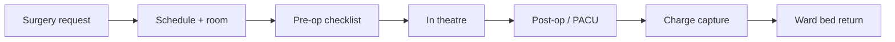
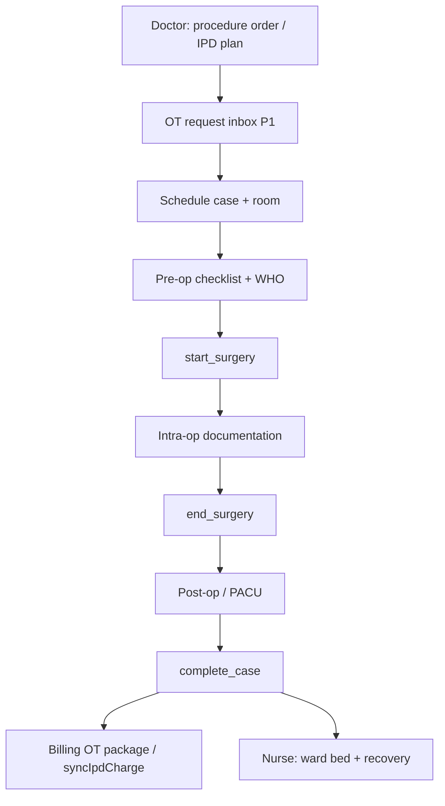
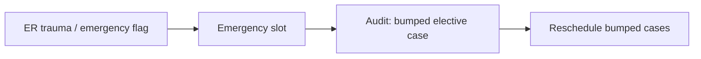

# OT Coordinator Role Module — Product & Implementation Plan

**Last updated:** 2026-05-24  
**App:** `apps/hospital-os` · **Role key:** `ot_coordinator` · **Base path:** `/ot`  
**Navigation source:** `apps/hospital-os/src/config/roleNavigation.ts` (`ROLE_TABS.ot_coordinator`)

This plan describes everything a **hospital operating theatre / peri-operative** workspace needs in a multi-specialty enterprise HMS, mapped to what exists today (Live / C1-leaning / Preview per [MASTER_OPERATIONAL_CONNECTIVITY_MATRIX.md](../../MASTER_OPERATIONAL_CONNECTIVITY_MATRIX.md)) and what to build next. It does **not** specify a visual redesign — all new work must reuse `AppLayout`, role tabs, shadcn/ui, `OperationsModulePage`, `OtPlatformStrip`, platform runtime hooks, and existing OT page patterns.

**Audit honesty:** Per [ENTERPRISE_AUDIT_REPORT.md](../../ENTERPRISE_AUDIT_REPORT.md) §4.12, the OT spine is **real** (`OtRoom` + `OtCase` lifecycle + transitions, `ot-runtime`, IPD `syncIpdCharge` on complete) but the **UI is split**: `/ot/board` and `/ot/schedule` can call platform APIs when runtime is on, while **dashboard, pre-op, intra-op, post-op, inventory, reports, and analytics largely use hardcoded demo arrays** with demo fallback when platform worklist is empty. This is **not** a full peri-operative suite: no block scheduling with conflict detection, no implant traceability, WHO checklist not persisted, no anesthesia EMR, no CSSD linkage, utilization analytics are illustrative. This document plans the full enterprise OT coordinator workspace while labeling current vs target honestly.

**Peri-operative operations are core** — not a MIS dashboard. P0 Definition of Done (§9) requires governed request → schedule → pre-op → in-room → post-op → charge capture on **platform-linked** cases — not “can open `/ot` with animated demo cards.”

**UX note (product decision):** OT uses **`OperationsModulePage`** + **`OtPlatformStrip`** for platform connectivity — **not** `WorkflowStepStrip` or `LabWorkflowStepStrip`. Board columns (`scheduled` → `preop` → `in theatre` → `done`) provide journey context. **Do not** reintroduce generic OPD `WorkflowStepStrip` on OT or other clinical roles.

---

## 1. Role purpose and personas

### Purpose

The OT coordinator module is the **peri-operative operations layer** of the hospital: surgical case scheduling, room and team assignment, pre-operative checklist coordination, intra-operative status tracking, post-operative PACU handoff, OT-specific consumable/imprint requests (not full hospital inventory), charge capture handoff, and analytics for utilization. OT coordinator **owns the surgical case timeline and room board**; it does **not** author clinical orders (doctor), administer ward nursing care (nurse), run full anesthesia EMR (P2), manage HR rosters, or operate enterprise inventory procurement (Inventory Manager).

### Personas

| Persona | Typical duties | Primary screens |
|---------|----------------|-----------------|
| **OT scheduler** | Block schedule, room assignment, conflict resolution, emergency bump | Schedule, Board, Rooms |
| **Scrub nurse coordinator** | Team roster, instrument sets, intra-op milestones | Teams, Intraoperative, Board |
| **Anesthesia coordinator** (P2) | Clearance, start/stop times, PACU handoff | Pre-Op, Post-Op |
| **Day-case lead** | Fast-track pre/post, same-day discharge coordination | Pre-Op, Post-Op, Dashboard |
| **OT manager** | Utilization, turnaround, infection surveillance (P2), reports | Analytics, Reports, Dashboard |

### Login context

`LoginPage` maps role `ot_coordinator` to `/ot`. No surgical specialty picker at login — **room filters** and surgeon names are free text / demo lists today (P1: platform surgeon master link).

---

## 2. Screen and tab inventory

### 2.1 Current role tabs (`roleNavigation.ts`)

| Tab key | Label | Path | Page component | Connectivity / readiness (2026-05-24) |
|---------|-------|------|----------------|----------------------------------------|
| `dashboard` | Dashboard | `/ot` | `OTDashboard` | **C1-leaning (routeReadiness)** — **`useOtPlatformData` optional**; **hardcoded `LIVE_OT_STATUS`, stats, upcoming list when demo** |
| `board` | Today board | `/ot/board` | `OTBoard` | **C1-leaning** — kanban columns; **`platformOtTransition`** when platform on; **`DEMO_CASES` fallback** |
| `schedule` | Schedule | `/ot/schedule` | `OTSchedule` | **Mixed** — **`platformCreateOtCase`** + local `SURGERIES` demo grid |
| `rooms` | OT Rooms | `/ot/rooms` | `OTRooms` | **C1-leaning** — reads `platformListOtRooms` when on; local layout fallback |
| `teams` | Teams | `/ot/teams` | `OTTeams` | **Preview-leaning** — local team roster demo |
| `preop` | Pre-Op | `/ot/preop` | `OTPreOp` | **Preview (C4)** — local `CASES` checklist; **not wired to `OtCase` transitions** |
| `intraop` | Intraoperative | `/ot/intraop` | `OTIntraOp` | **Preview (C4)** — local `LIVE_SURGERIES` vitals/steps demo |
| `postop` | Post-Op | `/ot/postop` | `OTPostOp` | **Preview (C4)** — local recovery list demo |
| `inventory` | Inventory | `/ot/inventory` | `OTInventory` | **Preview (C4)** — local OT stock demo; **not** `/inventory/*` runtime |
| `reports` | Reports | `/ot/reports` | `OTReports` | **Preview (C4)** — MIS-style summaries |
| `analytics` | Analytics | `/ot/analytics` | `OTAnalytics` | **Preview (C4)** — utilization charts demo |

### 2.2 Routed in `App.tsx` (`OT_PAGES`)

Static map — all eleven paths above; no dynamic `:caseId` routes today.

| Path | Component | In role tabs | Notes |
|------|-----------|--------------|-------|
| `/ot` | `OTDashboard` | Yes | Command view; demo room cards dominate without platform cases |
| `/ot/board` | `OTBoard` | Yes | Primary operational console; column drag via state transitions |
| `/ot/schedule` | `OTSchedule` | Yes | Day grid + create-case dialog |
| `/ot/rooms` | `OTRooms` | Yes | Room status board |
| `/ot/teams` | `OTTeams` | Yes | Surgeon / scrub / anesthesia roster (local) |
| `/ot/preop` | `OTPreOp` | Yes | WHO-inspired checklist UI — local state only |
| `/ot/intraop` | `OTIntraOp` | Yes | Live surgery steps, vitals, implants (local) |
| `/ot/postop` | `OTPostOp` | Yes | PACU / recovery handoff (local) |
| `/ot/inventory` | `OTInventory` | Yes | OT par level — handoff to Inventory Manager P2 |
| `/ot/reports` | `OTReports` | Yes | Case log exports (demo) |
| `/ot/analytics` | `OTAnalytics` | Yes | Turnaround / utilization (demo) |

### 2.3 Operations shell — OT-specific chrome

| Component | Usage | Notes |
|-----------|-------|-------|
| `OperationsModulePage` | Board, Schedule, PreOp, IntraOp, Inventory, etc. | `module="ot"` |
| `OtPlatformStrip` | Dashboard + board connectivity | Shows case/room counts or “Demo data” |
| `OperationsWorklistRow` | Board, Schedule rows | State badge + next action CTA |
| `IpdAdmissionPicker` | Schedule create-case | Links case to `ipdAdmissionId` |
| Generic `WorkflowStepStrip` | **Not used** | Board columns replace journey strip |

### 2.4 Cross-module routes (not OT tabs — coordination)

| Path | Owner | OT coordinator use |
|------|-------|-------------------|
| `/doctor/consultation/:id` | Doctor | Surgical order / procedure request (planned `/doctor/ot`) |
| `/doctor/ipd/:id` | Doctor | IPD admission context for elective cases |
| `/nurse/admissions`, `/nurse/ward` | Nurse | Ward prep, pre-op vitals, bed return after PACU |
| `/billing-dept/ipd-billing` | Billing | OT package charges, `syncIpdCharge` on case complete |
| `/inventory/*` | Inventory Manager | Implant/consumable master, GRN — OT inventory is slice only |
| `/emergency/*` | Emergency | Emergency OT bump / trauma line |
| `/radiology/reports` | Radiology | Pre-op imaging status on checklist (P1) |
| `/admin/*` | Admin | Surgeon fee sharing — not OT scheduling |

### 2.5 Removed / out of nav (product decisions)

| Item | Notes |
|------|--------|
| Generic `WorkflowStepStrip` on OT routes | **Do not add** — use board + lifecycle badges |
| Full anesthesia EMR | **P2** — start/stop times captured on OT case metadata first |
| HR master roster | **HR** — OT teams reference staff ids P1 |

### 2.6 Planned screens (gaps — not in nav yet)

Grouped by enterprise peri-op expectation. Priority in §4 and §10.

| Proposed path | Screen | Rationale |
|---------------|--------|-----------|
| `/ot/requests` | Surgery request inbox | Doctor → OT intake queue |
| `/ot/blocks` | Surgeon block schedule | Recurring blocks, preference cards |
| `/ot/preference-cards` | Surgeon preference cards | Instruments, implants, positioning |
| `/ot/implants` | Implant tracking | Batch/UDI traceability — **P2** |
| `/ot/who-checklist` | WHO surgical safety (persisted) | Sign-in, time-out, sign-out audit |
| `/ot/anesthesia` | Anesthesia record slice | Start/stop, ASA class — **P2** |
| `/ot/pacu` | PACU board | Handoff from post-op to ward |
| `/ot/cssd` | Sterilization tray tracking | CSSD coordination — **P2** |
| `/ot/infection` | SSI surveillance | Infection registry — **P2** |
| `/ot/emergency-bump` | Emergency OT logic | Bump elective with audit trail |
| `/ot/charges` | OT charge capture preview | Billing handoff before complete |

---

## 3. Peri-operative operations as explicit core (target architecture)

### 3.1 OT domains (enterprise target)

| Domain | Target capability | Today (honest) |
|--------|-------------------|----------------|
| **Case scheduling** | Block schedule, conflict detection, surgeon preference | Demo grid + **`platformCreateOtCase`** partial |
| **Room management** | `OtRoom` state machine, turnover/cleaning | **`platformListOtRooms`** on Rooms; dashboard demo cards |
| **Team assignment** | Surgeon, assistant, scrub, circulator, anesthesia | Local arrays on Teams page |
| **Pre-op checklist** | Consent, labs, imaging, fasting, site marking, WHO | **Local** toggles on PreOp — not `complete_preop` context |
| **Intra-op** | Procedure steps, implants, blood loss, anesthesia times | **Local demo** on IntraOp |
| **Post-op / PACU** | Recovery vitals, handoff to ward, bed request | **Local demo** on PostOp |
| **Lifecycle** | `scheduled` → … → `completed` | **`platformOtTransition`** on Board when platform on |
| **Billing** | OT package charge on complete | Domain **`syncIpdCharge`** — UI handoff thin |
| **Inventory** | Implant/consumable issue to case | Local OT inventory — not inventory runtime |
| **Analytics** | Utilization, on-time start, turnover minutes | Demo charts |
| **Safety** | WHO checklist persisted, time-out attestation | UI only — **not persisted** |
| **CSSD / implants** | Tray + UDI trace | **Missing** (P2) |

### 3.2 Platform lifecycle (`ot-case.ts`)

States: `scheduled` → `confirmed` → `preop_ready` → `in_progress` → `postop_recovery` → `completed` | `cancelled`.

Actions: `confirm_case`, `complete_preop`, `start_surgery`, `end_surgery`, `complete_case`, `cancel_case`.

**Honesty:** `guardOtTransition` + `getOtNextAction` exist on Board, but PreOp/IntraOp/PostOp pages **do not** feed validation context into transitions — checklist completion is mocked (`preopChecklistComplete: true` in board handler).

### 3.3 Where OT UX lives

1. **Today board** (`/ot/board`) — primary operational console (kanban + transitions).
2. **Schedule** — case creation and day grid.
3. **Pre-Op / Intra-Op / Post-Op** — must become platform-backed case detail tabs (target).
4. **Dashboard** — supervisor snapshot when platform cases exist.
5. **Analytics** — utilization after real timestamps captured.

---

## 4. Feature breakdown by screen (P0 / P1 / P2)

### Dashboard (`/ot`)

| Priority | Features |
|----------|----------|
| **P0 (gap)** | When `platformOn`: room/case counts from **`useOtPlatformData` only** — no hardcoded `LIVE_OT_STATUS` overlay; `InlinePlatformError` on load failure |
| **P1** | On-time start %, emergency count, turnover alerts; deep links to board/schedule |
| **P2** | Multi-site rollup; infection flag widget |

### Today board (`/ot/board`)

| Priority | Features |
|----------|----------|
| **P0** | Kanban by lifecycle state; search; **`platformOtTransition`** with `guardOtTransition`; remove silent **`DEMO_CASES`** fallback when platform on (show empty + error instead) |
| **P0** | `OtPlatformStrip` + refresh after transition |
| **P1** | Emergency bump column; drag-drop with audit; IPD badge per case |
| **P2** | TV display mode for charge nurse |

### Schedule (`/ot/schedule`)

| Priority | Features |
|----------|----------|
| **P0** | Create case via **`platformCreateOtCase`** (patient, procedure, surgeon, room, time, priority); list today's platform cases |
| **P0 (gap)** | Replace demo `SURGERIES` grid as source of truth when platform on |
| **P1** | Block scheduling; conflict warnings; surgeon preference card apply |
| **P2** | Recurring blocks; waiting list bump |

### OT Rooms (`/ot/rooms`)

| Priority | Features |
|----------|----------|
| **P0** | Room list from **`platformListOtRooms`**; state badges (available, occupied, reserved, cleaning) |
| **P1** | Turnover timer; housekeeping handoff status |
| **P2** | Maintenance block |

### Teams (`/ot/teams`)

| Priority | Features |
|----------|----------|
| **P1** | Assign team to case; link to HR staff ids |
| **P2** | Credential expiry warnings |

### Pre-Op (`/ot/preop`)

| Priority | Features |
|----------|----------|
| **P0 (gap)** | Load cases in `scheduled`/`confirmed` from platform; persist checklist → **`complete_preop`** transition |
| **P1** | WHO sign-in/time-out UI; radiology/lab result chips; anesthesia clearance flag |
| **P2** | Surgeon preference card checklist auto-fill |

### Intraoperative (`/ot/intraop`)

| Priority | Features |
|----------|----------|
| **P0 (gap)** | Cases in `in_progress` from platform; **`start_surgery` / `end_surgery`** actions |
| **P1** | Procedure step timer; implant capture (batch); blood loss field |
| **P2** | Anesthesia record integration; device vitals feed |

### Post-Op (`/ot/postop`)

| Priority | Features |
|----------|----------|
| **P0 (gap)** | Cases in `postop_recovery`; **`complete_case`** with post-op handoff validation |
| **P1** | PACU vitals; ward bed request → nurse; billing charge preview |
| **P2** | SSI risk documentation |

### OT Inventory (`/ot/inventory`)

| Priority | Features |
|----------|----------|
| **P1** | Issue consumable/implant to case id; low-stock alert → inventory requisition |
| **P2** | UDI implant registry; CSSD tray status |

### Reports (`/ot/reports`) & Analytics (`/ot/analytics`)

| Priority | Features |
|----------|----------|
| **P1** | Case log from platform transitions; on-time start, duration, cancellation reasons |
| **P2** | Utilization heatmap; surgeon/room productivity; SSI rates |

### Planned screens (§2.6)

See §2.6 — **Platform-backed pre/intra/post-op** and **honest dashboard** are **P0**; implants/CSSD/anesthesia **P2**.

---

## 5. Peri-operative flow (request → bed return)

### 5.1 Target case lifecycle

### 5.2 States today (platform)

| State | UI surface today | Honest gap |
|-------|------------------|------------|
| `scheduled` / `confirmed` | Board, Schedule (partial) | PreOp not synced |
| `preop_ready` | Board column | Checklist mocked |
| `in_progress` | Board, IntraOp demo | IntraOp not platform-backed |
| `postop_recovery` | Board | PostOp demo only |
| `completed` | Board done column | Billing sync domain-side; UI chip thin |

---

## 6. End-to-end workflows

### 6.1 Standard: request → schedule → pre-op → in-room → post-op → charge → bed return

**Platform spine:** `POST /ot/cases` → `GET /ot/branch/worklist` + `GET /ot/rooms` → transitions (`confirm_case`, `complete_preop`, `start_surgery`, `end_surgery`, `complete_case`) → IPD charge sync on complete.

**UI spine:** Schedule → Board → PreOp → IntraOp → PostOp; **`OperationsModulePage`** + **`OtPlatformStrip`**; **no** generic `WorkflowStepStrip`.

### 6.2 Emergency OT bump

**Today:** Priority enum on create-case; **no** governed bump workflow (P1).

### 6.3 Implant / consumable trace (P2)

Case → implant UDI capture on IntraOp → inventory issue → billing implant line → regulatory trace export.

---

## 7. Cross-role handoffs

Aligned with [DOCTOR_MODULE.md](./DOCTOR_MODULE.md), [NURSE_MODULE.md](./NURSE_MODULE.md), [BILLING_FINANCE_MODULE.md](./BILLING_FINANCE_MODULE.md), and [RADIOLOGIST_MODULE.md](./RADIOLOGIST_MODULE.md).

| From / To | Trigger | Data passed |
|-----------|---------|-------------|
| **Doctor → OT** | Procedure request / IPD surgical plan | Procedure name, surgeon, priority, admission id |
| **OT → Nurse** | Pre-op ready / post-op complete | Checklist status, PACU vitals, bed request |
| **Nurse → OT** | Ward prep complete | Pre-op vitals, NPO confirmed |
| **Radiology → OT** | Pre-op imaging done | Report link on checklist (P1) |
| **Lab → OT** | Pre-op labs | Result flags on checklist (P1) |
| **OT → Billing** | Case complete | OT package charge key, `syncIpdCharge` |
| **OT → Inventory** | Implant/consumable used | SKU, qty, case id (P2) |
| **ER → OT** | Emergency surgery | Trauma priority, bump audit |
| **Anesthesia → OT** (P2) | Clearance / record | ASA class, start/stop times |

---

## 8. Explicitly out of scope for OT Coordinator

| Capability | Owner module |
|------------|--------------|
| Full anesthesia EMR / ventilator flowsheets | **P2** — separate module or deep IntraOp integration |
| HR roster master, payroll, leave | **HR** — `/hr/*` |
| General hospital inventory procurement, PO, GRN | **Inventory Manager** — `/inventory/*` |
| Clinical prescribing, consultation chart | **Doctor** — `/doctor/*` |
| Ward nursing care, MAR | **Nurse** — `/nurse/*` |
| Patient registration, OPD queue | **Reception** — `/reception/*` |
| CRM, marketing | **CRM** — `/crm/*` |
| LIMS / radiology reporting | **Lab / Radiology** |
| Tenant admin | **Admin** — `/admin/*` |

OT may **request** stock and **capture** implants against a case — not operate enterprise inventory or HR masters.

---

## 9. Definition of Done — OT Coordinator P0

P0 is **not** “ten OT tabs exist.” P0 is done when a coordinator can run today's surgical list on **platform runtime on** with **governed case lifecycle**:

1. **Schedule:** Create case via API; appears on board worklist with platform id.
2. **Board:** No silent demo fallback when platform on — empty state + error if worklist fails.
3. **Pre-op:** Checklist persisted; **`complete_preop`** blocked until required items checked (consent, patient identified).
4. **In-room:** **`start_surgery`** / **`end_surgery`** from platform-backed intra-op view (minimal fields).
5. **Post-op:** **`complete_case`** with post-op handoff flag; case moves to completed column.
6. **Rooms:** Room states from **`platformListOtRooms`** on dashboard and rooms page.
7. **Billing handoff:** Completed case triggers visible charge sync indicator (billing dept can reconcile).
8. **Dashboard honesty:** KPIs from platform cases/rooms OR explicit Preview banner — no mixed demo overlay.
9. **Errors:** `InlinePlatformError` / failed transition toasts — no silent local-only success.
10. **No** generic `WorkflowStepStrip` on OT or other roles.
11. `pnpm --filter hospital-os typecheck` passes; route readiness honest for demo-only pages (PreOp/IntraOp/PostOp until wired).

---

## 10. Implementation waves

| Wave | Focus | Deliverables |
|------|-------|--------------|
| **W0** (done) | OT spine UX | Eleven routes, `useOtPlatformData`, Board transitions, `OperationsModulePage`, `OtPlatformStrip`, `platformCreateOtCase` |
| **W1** | **OT P0 honesty** | Remove demo fallback on board/dashboard when platform on; platform-backed PreOp → `complete_preop`; `InlinePlatformError`; honest Preview badges on demo pages |
| **W2** | **Intra/post-op platform bind** | IntraOp + PostOp read live cases; `start_surgery` / `end_surgery` / `complete_case` |
| **W3** | **Scheduling v1** | Block grid conflicts; surgery request inbox from doctor; preference cards read-only |
| **W4** | **WHO checklist persisted** | Sign-in, time-out, sign-out audit trail on case |
| **W5** | **Teams + charge preview** | Team assignment to case; OT charge preview before complete |
| **W6** | **Analytics live** | Utilization, on-time start, turnover from transition timestamps |
| **W7** | **Emergency bump + PACU** | Bump audit; PACU board; nurse bed request handoff |
| **W8** | **Implant + OT inventory bridge** | Case-linked issue; requisition to Inventory Manager |
| **W9** | **Enterprise P2** | CSSD trays, anesthesia slice, SSI surveillance, surgeon block optimization |

**Recommended wave 1 implementation focus (next sprint):** **W1 — OT P0 honesty** — eliminate silent `DEMO_CASES` / hardcoded dashboard when platform is on, wire PreOp checklist to `complete_preop`, and surface platform errors on board/schedule/dashboard.

---

## 11. API and domain dependencies

### 11.1 Runtime and store

| Layer | Usage in OT module |
|-------|---------------------|
| `useOtPlatformData` | Cases + rooms from domain-api |
| `canUseOtRuntime()` | Session + `VITE_DOMAIN_API_URL` gate |
| `ot-runtime.ts` | `platformListOtWorklist`, `platformListOtRooms`, `platformCreateOtCase`, `platformOtTransition`, `platformListOtCasesForAdmission` |
| `ot-runtime-engine.ts` | `evaluateOtTransition`, allowed actions |
| `ot-case.ts` lifecycle | Authoritative state machine |
| `guardOtTransition` | `apps/hospital-os/src/operations/ot-inventory-dialysis-guards.ts` |
| `module-lifecycle-ui.ts` | `getOtNextAction`, `OT_STATE_LABELS`, badges |

### 11.2 Domain-api (representative)

| Domain | Endpoints / actions | Screens |
|--------|----------------------|---------|
| OT | `POST /ot/cases`, `POST /ot/cases/:id/transition` | Board, Schedule, PreOp–PostOp |
| OT | `GET /ot/branch/worklist`, `GET /ot/rooms` | Board, Dashboard, Rooms |
| OT | `GET /ot/admission/:id/cases` | IPD profile handoff P1 |
| IPD / Billing | `syncIpdCharge` on complete | Billing reconciliation |
| Patients | Demographics for case create | Schedule |

### 11.3 Kernel-api

Session tenant/branch; actor id on transitions for audit (**P1** show in UI).

### 11.4 Hooks and shared components (reuse)

| Asset | Path |
|-------|------|
| `OperationsModulePage` | `@/components/operations/OperationsModulePage` |
| `OtPlatformStrip` | `@/components/operations/OtPlatformStrip` |
| `OperationsWorklistRow` | `@/components/operations/OperationsWorklistRow` |
| `IpdAdmissionPicker` | `@/components/operations/IpdAdmissionPicker` |
| `useOtPlatformData` | `@/hooks/useOtPlatformData` |
| `mapOtCaseToRoomCard`, `mapOtCaseToScheduleRow` | `@/lib/ot/ot-presenters` |
| `routeReadiness` | `@/config/routeReadiness.ts` |

---

## 12. UI theme constraints (no redesign)

All OT work must match existing Hospital OS patterns:

- **Shell:** `AppLayout` with role tabs from `ROLE_TABS` / `getTabsForRole`.
- **Layout:** `OperationsModulePage` with `motion` stagger on dashboard/board; `text-2xl font-bold` headers.
- **Connectivity:** `OtPlatformStrip` on dashboard and board; extend to schedule when platform-backed (W1).
- **Board:** Kanban columns per lifecycle state — preserve column config in `OTBoard.tsx`.
- **Components:** shadcn `Card`, `Button`, `Badge`, `Input`, `Dialog`; `sonner` toasts on transition failure.
- **Status:** Mark PreOp/IntraOp/PostOp/Inventory/Reports/Analytics **Preview** in `routeReadiness` until platform-backed (W1–W2 honesty).
- **Errors:** `InlinePlatformError` when worklist load fails (W1).
- **Do not add** generic `WorkflowStepStrip` or `LabWorkflowStepStrip` to OT routes.
- **Do not reintroduce** generic `WorkflowStepStrip` on reception/doctor/nurse.

---

## 13. Honesty checklist (audit alignment)

Per [ENTERPRISE_AUDIT_REPORT.md](../../ENTERPRISE_AUDIT_REPORT.md) and connectivity matrix:

- OT **backend model + runtime** exist — **UI connectivity is partial** (§4.12 audit; matrix now C1-leaning for routes but many pages demo-heavy).
- **`DEMO_CASES` fallback** on Board when platform worklist empty — masks connectivity failures.
- **Dashboard `LIVE_OT_STATUS`** is hardcoded — not enterprise-safe.
- **PreOp WHO checklist** is visual only — not persisted to `complete_preop` validation.
- **No implant trace, CSSD, anesthesia EMR, block scheduling** — waves W7–W9.
- **`routeReadiness` marks all `/ot/*` Live (C1-leaning)** — overstated for PreOp/IntraOp/PostOp until W1–W2; tighten badges.
- Production safety (auth, RLS, implant registries, tests) is **not** implied by this UI plan.

---

## Appendix A — Exhaustive feature backlog (P2 / future)

For roadmap completeness — not committed dates.

- **Scheduling:** Surgeon blocks, multi-procedure days, equipment constraints
- **Preference cards:** Position, drapes, instrument sets, default implants
- **Safety:** WHO checklist regulatory export, fire risk, count sheets
- **Anesthesia:** ASA documentation, regional blocks, PACU scoring (Aldrete)
- **Intra-op:** Photo documentation, frozen section requests, blood product admin
- **Implants:** UDI, recall lookup, consignment tracking
- **CSSD:** Tray lifecycle, sterilization log link
- **Infection:** SSI surveillance, antibiogram tie-in
- **Billing:** Package vs itemized, implant pass-through, surgeon fee share
- **Analytics:** First-case on-time, turnover, room idle, cost per case minute
- **Interop:** HL7 SIU, FHIR Procedure, device integration
- **India:** Ayushman surgical package mapping, implant registry compliance

---

## Appendix B — File map (implementation reference)

| Concern | Location |
|---------|----------|
| Role tabs | `apps/hospital-os/src/config/roleNavigation.ts` |
| Routes | `apps/hospital-os/src/App.tsx` → `OT_PAGES` |
| Readiness | `apps/hospital-os/src/config/routeReadiness.ts` |
| Pages | `apps/hospital-os/src/pages/ot/*.tsx` |
| OT API client | `apps/hospital-os/src/runtime/ot-runtime.ts` |
| Platform hook | `apps/hospital-os/src/hooks/useOtPlatformData.ts` |
| Guards | `apps/hospital-os/src/operations/ot-inventory-dialysis-guards.ts` |
| Governed engine | `packages/hospital-operations/src/engine/ot-runtime-engine.ts` |
| Lifecycle | `packages/hospital-operations/src/lifecycles/ot-case.ts` |
| Domain service | `services/domain-api/src/ot/ot-runtime.service.ts` |
| Presenters | `apps/hospital-os/src/lib/ot/ot-presenters.ts` |
| Lifecycle UI | `apps/hospital-os/src/lib/operations/module-lifecycle-ui.ts` |
