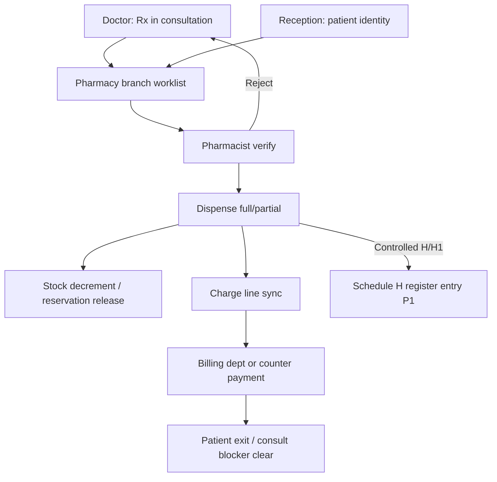
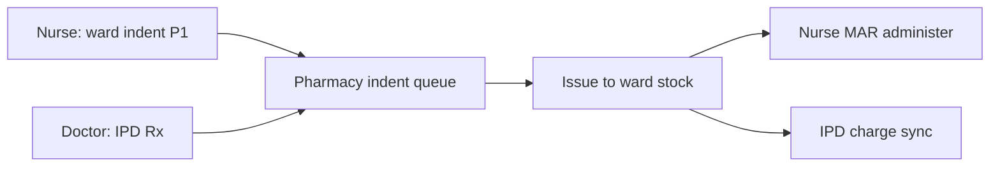
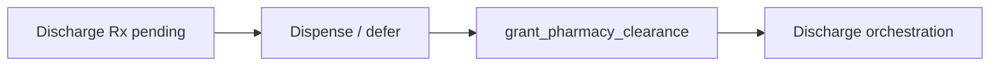

# Pharmacist Role Module — Product & Implementation Plan

**Last updated:** 2026-05-24  
**App:** `apps/hospital-os` · **Role key:** `pharmacist` · **Base path:** `/pharmacy`  
**Navigation source:** `apps/hospital-os/src/config/roleNavigation.ts` (`ROLE_TABS.pharmacist`)

This plan describes everything a **hospital pharmacy** needs in a multi-specialty enterprise HMS (India: Schedule H/H1/X, GST on pharma, generic substitution, IPD indent), mapped to what exists today (Live / C1-leaning / Preview per [MASTER_OPERATIONAL_CONNECTIVITY_MATRIX.md](../../MASTER_OPERATIONAL_CONNECTIVITY_MATRIX.md)) and what to build next. It does **not** specify a visual redesign — all new work must reuse `AppLayout`, role tabs, shadcn/ui, `DepartmentWorklistTable`, platform runtime hooks, and existing pharmacy page patterns.

**Audit honesty:** Per [ENTERPRISE_AUDIT_REPORT.md](../../ENTERPRISE_AUDIT_REPORT.md) §4.8, the **domain spine is deep** — `PharmacyFulfillment` lifecycle, `PharmacyStockItem` with batch/expiry/reservation, `pharmacy-runtime.service` (644 LOC), controlled-drug flags, dispense → billing charge. The **UI is uneven**: prescriptions/inventory are **C1-leaning** when platform runtime is on; dashboard, Schedule H, procurement, and billing sub-routes are **demo-first Preview**. There is **no formulary entity**, **no drug–drug interaction engine**, **no barcode dispense**, and **no narcotics register** beyond static Schedule H screens.

**Pharmacy operations are core** — not a KPI dashboard. P0 Definition of Done (§9) requires governed Rx verify → dispense → stock decrement → charge handoff on **platform-linked** fulfillments — not “can open `/pharmacy` with static tiles.”

**UX note (product decision):** There is **no** `PharmacyWorkflowStepStrip` in the codebase (unlike lab’s `LabWorkflowStepStrip`). Do **not** add generic `WorkflowStepStrip` (`frontDeskSpine` / `clinicalOpdSpine`) to pharmacy routes. Use `DepartmentWorklistTable`, status chips, and dialog tabs (Verify / Dispense) on prescriptions instead.

---

## 1. Role purpose and personas

### Purpose

The pharmacist module is the **medication fulfillment and pharmacy supply layer** of the hospital: e-prescription intake from clinical roles, verification and dispensing (OPD counter + IPD ward), drug master/formulary alignment, batch-level inventory, controlled-substance compliance (Schedule H/H1), purchase and supplier coordination, returns and expiry management, and handoffs to billing (charge capture), nursing (ward stock / MAR prerequisites), inventory (central procurement), and discharge orchestration (pharmacy clearance). Pharmacists **own dispensing truth and stock at the pharmacy store**; they do **not** prescribe, register patients, run full hospital revenue cycle, or own HR payroll.

### Personas

| Persona | Typical duties | Primary screens |
|---------|----------------|-----------------|
| **Retail / OPD pharmacist** | Verify Rx, counsel, dispense, collect payment or handoff to billing | Prescriptions, Billing (counter), Drugs |
| **IPD pharmacy officer** | Ward indents, discharge Rx, IPD clearance panel | Prescriptions (IPD strip), Inventory |
| **Controlled drugs officer** | Schedule H register, witness dispense, narcotics audit | Schedule H, Prescriptions (controlled flag) |
| **Purchase / procurement manager** | PO, supplier quotes, GRN alignment | Purchase Orders, Suppliers → Inventory procurement |
| **Clinical pharmacist** (P1) | Interaction review, formulary adherence, generic substitution | Prescriptions (verify), Drugs/formulary |
| **Pharmacy supervisor** | Pending queue, low stock, expiry, TAT | Dashboard (target live), Reports |

### Login context

`LoginPage` maps role `pharmacist` to `/pharmacy`. No department picker at login — **store/branch** comes from platform session (`branchId` on fulfillments and stock).

### SaaS context

Hospitals pay Adrine a **fixed subscription** (kernel-api metering/entitlements). The pharmacy module manages **the hospital’s patient medication operations and charges** — not Adrine platform billing.

---

## 2. Screen and tab inventory

### 2.1 Current role tabs (`roleNavigation.ts`)

| Tab key | Label | Path | Page component | Connectivity / readiness (2026-05-24) |
|---------|-------|------|----------------|----------------------------------------|
| `dashboard` | Dashboard | `/pharmacy` | `PharmacyDashboard` | **Preview (C3/C4)** — static demo KPIs; no `useDepartmentWorklistSync` |
| `prescriptions` | Prescriptions | `/pharmacy/prescriptions` | `PharmacyPrescriptions` | **C1-leaning** — branch worklist SSE; verify/dispense → platform |
| `inventory` | Inventory | `/pharmacy/inventory` | `PharmacyInventory` | **C1-leaning** — `platformListPharmacyStock` when authoritative |
| `drugs` | Drugs | `/pharmacy/drugs` | `PharmacyDrugs` | **C2/C3** — inventory catalog slice when runtime on; demo formulary offline |
| `reports` | Reports | `/pharmacy/reports` | `PharmacyReports` | **C1-leaning** — dispensing rows from store + SSE; charts partly local |
| `billing` | Billing | `/pharmacy/billing` | `PharmacyBilling` | **Preview (C3)** — local invoices/walk-in; not dept billing spine |
| `suppliers` | Suppliers | `/pharmacy/suppliers` | `PharmacySuppliers` | **Preview (C3/C4)** — static list; PO via `/inventory/procurement` |
| `purchase` | Purchase Orders | `/pharmacy/purchase` | `PharmacyPurchase` | **Preview (C3/C4)** — local demo until procurement APIs |
| `schedule-h` | Schedule H | `/pharmacy/schedule-h` | `PharmacyScheduleH` | **Preview (C3)** — illustrative register; not platform transitions |
| `queries` | Queries | `/pharmacy/queries` | `PharmacyQueries` | **Preview (C4)** — doctor/pharmacy Q&A shell |

### 2.2 Routed in `App.tsx` (`PHARMACY_PAGES`)

All ten paths above — static map only; **no** dynamic `:id` routes today.

| Path | Component | In role tabs | Notes |
|------|-----------|--------------|-------|
| `/pharmacy` | `PharmacyDashboard` | Yes | Demo stats table — P0 gap |
| `/pharmacy/prescriptions` | `PharmacyPrescriptions` | Yes | Primary operational console; `DepartmentWorklistTable` |
| `/pharmacy/inventory` | `PharmacyInventory` | Yes | Batch/expiry tabs; platform stock merge |
| `/pharmacy/drugs` | `PharmacyDrugs` | Yes | Formulary read; links to Inventory catalog |
| `/pharmacy/reports` | `PharmacyReports` | Yes | Dispensing + stock reports |
| `/pharmacy/billing` | `PharmacyBilling` | Yes | Counter billing — separate from `/billing-dept/*` |
| `/pharmacy/suppliers` | `PharmacySuppliers` | Yes | Preview banner |
| `/pharmacy/purchase` | `PharmacyPurchase` | Yes | Preview banner |
| `/pharmacy/schedule-h` | `PharmacyScheduleH` | Yes | Static Schedule H/H1 demo |
| `/pharmacy/queries` | `PharmacyQueries` | Yes | Preview |

### 2.3 Cross-module routes (coordination, not pharmacist-owned)

| Path | Owner | Pharmacist use |
|------|-------|----------------|
| `/doctor/consultation/:id` | Doctor | Creates Rx → pharmacy fulfillments |
| `/nurse/medications` | Nurse | MAR after Rx dispensed to ward |
| `/billing-dept/invoices` | Billing | Consolidated invoice; pharmacy charges as lines |
| `/reception/registration` | Reception | Patient identity / UHID for counter dispense |
| `/reception/flow` | Reception | `OperationalPharmacyPanel` — order status read-only |
| `/inventory/procurement` | Inventory | Central PO/GRN when pharmacy purchase is deferred |

### 2.4 Removed / out of nav (product decisions)

| Item | Notes |
|------|--------|
| Generic `WorkflowStepStrip` on pharmacy routes | **Do not add** — no lab-style pharmacy strip exists; use worklist + dialog |
| `WorkflowStepStrip` on reception/doctor/nurse | **Do not reintroduce** (parent constraint) |

### 2.5 Planned screens (gaps — not in nav yet)

Grouped by enterprise HMS expectation. Priority in §4 and §10.

| Proposed path | Screen | Rationale |
|---------------|--------|-----------|
| `/pharmacy/formulary` | Hospital formulary & substitution rules | Generic/brand mapping, dept restrictions |
| `/pharmacy/indent` | IPD ward indent / floor stock | Nurse request → pharmacy issue |
| `/pharmacy/returns` | Returns & credit notes | Patient return, ward return to store |
| `/pharmacy/expiry` | Expiry quarantine & destruction log | NABH/compliance |
| `/pharmacy/narcotics` | Narcotics register (witnessed) | Schedule X/H1 ledger beyond demo Schedule H |
| `/pharmacy/barcode` | Barcode scan dispense | Five-rights at counter |
| `/pharmacy/counseling` | Patient counseling notes | Education + language |
| `/pharmacy/refills` | Refill management & chronic Rx | Repeat OPD medication |
| `/pharmacy/compounding` | Compounding / IV admixture | **P2** — sterile prep |
| `/pharmacy/cold-chain` | Cold chain monitoring | **P2** — vaccine/biologics |
| `/pharmacy/interactions` | Interaction & allergy check UI | **P2** — CDS overlay on verify |
| `/pharmacy/audit` | Dispense audit trail viewer | Per-fulfillment transitions |

---

## 3. Pharmacy operations as explicit core (target architecture)

### 3.1 Pharmacy domains (enterprise target)

| Domain | Target capability | Today (honest) |
|--------|-------------------|----------------|
| **Rx intake** | Doctor/ER/IPD orders → fulfillment queue | **C1-leaning** — branch worklist merge |
| **Verification** | Pharmacist verify, interaction check, substitution | UI status → `platformApplyRxUiStatus`; **no** CDS |
| **Dispensing** | Full/partial dispense, batch pick, label | **C1-leaning** — `platformDispensePrescription` |
| **Stock** | Batch, expiry, reservation, FEFO | **C1-leaning** — `PharmacyStockItem`; UI merge |
| **Formulary** | Approved drugs, strengths, routes | Demo + inventory catalog filter |
| **Controlled drugs** | Schedule H/H1/X, witness, register | Static Schedule H page; platform `isControlled` flag |
| **Billing handoff** | Charge on dispense, GST rate | `postServiceCharge` / sync when platform on — partial |
| **Returns** | Return to stock, credit | **Missing** |
| **Procurement** | PO → GRN → stock | Preview pages; Inventory module owns GRN |
| **IPD indent** | Ward requisition | **Missing** |
| **Discharge pharmacy** | Clearance when Rx fulfilled | **Live** — `OperationalDischargePanel` on prescriptions |
| **Counseling / refills** | Notes, repeat Rx | **Missing** (P1/P2) |

### 3.2 Where pharmacy UX lives

1. **Prescriptions** — primary day console (`DepartmentWorklistTable` + verify/dispense dialog).
2. **Inventory + Drugs** — stock truth and formulary read.
3. **Schedule H / Narcotics (planned)** — compliance officer workflows.
4. **Reports + Dashboard** — supervisor queues (dashboard must become live P0).

---

## 4. Feature breakdown by screen (P0 / P1 / P2)

### Dashboard (`/pharmacy`)

| Priority | Features |
|----------|----------|
| **P0 (gap)** | Replace static stats with **live** branch worklist counts: pending verify, ready to dispense, low stock, near-expiry from platform stock |
| **P1** | CTAs to prescriptions/inventory; controlled-drug dispense count today |
| **P2** | Multi-store rollup; revenue at pharmacy counter |

### Prescriptions (`/pharmacy/prescriptions`)

| Priority | Features |
|----------|----------|
| **P0** | Branch worklist via `useDepartmentWorklistSync('pharmacy')`; verify → dispense dialog; `platformDispensePrescription` / `platformApplyRxUiStatus`; partial dispense quantities |
| **P0** | IPD discharge strip: `OperationalDischargePanel` + `grant_pharmacy_clearance` when Rx fulfilled |
| **P0 (gap)** | `InlinePlatformError` on SSE failure; disable dispense when platform state blocks transition (tooltip reason) |
| **P1** | Patient identity chip (UHID, allergies from patient record); generic substitution toggle with audit |
| **P1** | Reject/cancel Rx with reason; link to doctor query |
| **P1** | India Schedule H/H1 flags on line items; witness for controlled dispense |
| **P2** | Barcode scan dispense; drug–drug interaction banner; counseling note capture |
| **P2** | Refill queue; compounding orders |

### Inventory (`/pharmacy/inventory`)

| Priority | Features |
|----------|----------|
| **P0** | Platform stock list with batch/expiry/reserved qty; low-stock and expiry tabs |
| **P1** | FEFO pick hint on dispense; stock adjustment request → inventory manager |
| **P1** | Near-expiry transfer / return workflow |
| **P2** | Cold-chain SKU flag; multi-location (main store + ward floor stock) |

### Drugs (`/pharmacy/drugs`)

| Priority | Features |
|----------|----------|
| **P0** | Honest Preview banner when offline; catalog from `/inventory/catalog` when runtime on |
| **P1** | Formulary v1: active/inactive, therapeutic class, allowed substitutes |
| **P1** | Link to charge master / HSN-GST for pharma (billing alignment) |
| **P2** | External drug database (India brands/generics) |

### Reports (`/pharmacy/reports`)

| Priority | Features |
|----------|----------|
| **P0** | Dispensing log from store/platform fulfillments (not fabricated rows) |
| **P1** | Schedule H monthly export; consumption by department |
| **P2** | ABC/VED analysis; slow-moving stock |

### Billing (`/pharmacy/billing`)

| Priority | Features |
|----------|----------|
| **P0 (gap)** | Clarify scope: **counter settlement** for dispensed Rx — sync to `BillingSyncService` when platform on |
| **P1** | Walk-in OTC invoice with inventory decrement; receipt print |
| **P1** | Handoff indicator to `/billing-dept/invoices` for consolidated billing |
| **P2** | UPI/card terminal hooks |

### Suppliers (`/pharmacy/suppliers`) & Purchase (`/pharmacy/purchase`)

| Priority | Features |
|----------|----------|
| **P1** | Deep-link to `/inventory/procurement` with pharmacy filter |
| **P1** | PO create from low-stock alerts (platform-backed) |
| **P2** | Supplier ledger, rate contract, GST on purchase |

### Schedule H (`/pharmacy/schedule-h`)

| Priority | Features |
|----------|----------|
| **P1** | Bind register to **platform** controlled dispense transitions (not static arrays) |
| **P1** | Export for regulatory inspection; doctor/patient/d qty ledger |
| **P2** | Schedule X workflow; dual witness signature |

### Queries (`/pharmacy/queries`)

| Priority | Features |
|----------|----------|
| **P2** | Async doctor–pharmacist clarification on Rx — not P0 |

### Planned screens (§2.5)

**Formulary**, **IPD indent**, and **returns** are **P1** for enterprise parity; **barcode**, **interactions**, **compounding**, **cold chain** are **P2**.

---

## 5. End-to-end workflows

### 5.1 OPD: Rx received → verify → dispense → bill → stock decrement

**Platform spine:** Doctor creates fulfillment → `GET /pharmacy/branch/worklist` + SSE → `verify` / `dispense_full` / `dispense_partial` transitions → stock reservation update → billing charge key → OPD `ConsultationBlockerStrip` pharmacy fulfillment state.

**UI spine:** `/pharmacy/prescriptions` worklist → dialog Verify/Dispense tabs; **no** generic `WorkflowStepStrip`.

### 5.2 IPD: indent → dispense to ward → MAR

**Today:** IPD Rx appears on same prescriptions worklist; **dedicated indent UI is missing** (P1).

### 5.3 Discharge: pharmacy clearance

**Today:** `PharmacyPrescriptions` renders `OperationalDischargePanel` for IPD targets when `canUseDischargeRuntime()` — **C1-leaning** per matrix GAP-012.

---

## 6. Cross-role handoffs

Aligned with [DOCTOR_MODULE.md](./DOCTOR_MODULE.md), [NURSE_MODULE.md](./NURSE_MODULE.md), [RECEPTIONIST_MODULE.md](./RECEPTIONIST_MODULE.md), and [LAB_TECHNICIAN_MODULE.md](./LAB_TECHNICIAN_MODULE.md).

| From / To | Trigger | Data passed |
|-----------|---------|-------------|
| **Doctor → Pharmacy** | Consultation Rx lines | Med names, dose, qty, schedule flags, `encounterId`, `opdVisitId` |
| **ER → Pharmacy** | Emergency orders | Stat priority → worklist |
| **Reception → Pharmacy** | Identity at counter | UHID, demographics, allergy banner (P1) |
| **Pharmacy → Billing** | Dispense complete | Charge lines, invoice id, GST/HSN (P1) |
| **Pharmacy → Nurse** | IPD issue / discharge meds | Fulfillment id, ward location |
| **Nurse → Pharmacy** | Ward indent, return unused | SKU, qty (P1) |
| **Pharmacy → Inventory Manager** | Low stock, PO | Requisition / link to procurement |
| **Lab/Rad → Pharmacy** | — | **No direct** — parallel diagnostic fulfillment |
| **Pharmacy → Discharge** | Rx fulfilled | `grant_pharmacy_clearance` context |
| **Billing dept → Pharmacy** | Credit/refund on Rx line | Adjustment id (P1) |

---

## 7. Explicitly out of scope for Pharmacist

| Capability | Owner module |
|------------|--------------|
| Clinical prescribing, diagnosis, consult chart | **Doctor** — `/doctor/*` |
| MAR administration, nursing tasks | **Nurse** — `/nurse/*` |
| Patient registration, OPD queue | **Reception** — `/reception/*` |
| Full revenue cycle, TPA desk, GST e-invoice | **Billing** — `/billing-dept/*` (pharmacy **counter** slice only) |
| Central warehouse GRN, asset equipment | **Inventory** — `/inventory/*` (pharmacy links, does not replace) |
| LIMS sample chain | **Lab** — `/lab/*` |
| CRM, marketing | **CRM** — `/crm/*` |
| HR payroll | **HR** — `/hr/*` |
| Adrine SaaS subscription billing | **Kernel** — platform admin (not hospital patient billing) |
| Telemedicine Rx validity rules across states | **Doctor + Scheduler** — policy P2 |

Pharmacists may **verify identity** and **capture charges** at the counter — not operate other roles’ full consoles.

---

## 8. Definition of Done — Pharmacist P0

P0 is **not** “ten pharmacy tabs exist.” P0 is done when a pharmacist can run an OPD+IPD dispense day on **platform runtime on** with **governed fulfillment path**:

1. **Worklist:** Prescriptions hydrate from branch worklist + SSE; rows show `platformFulfillmentId` when linked.
2. **Verify:** Status transition to Verified calls platform when fulfillment id present — not local-only silently.
3. **Dispense:** Partial/full dispense calls `platformDispensePrescription`; stock reservations reflect dispensed qty.
4. **Blockers:** Cannot dispense when platform transition rejects — show error/toast, not silent local merge.
5. **Billing:** Dispense triggers charge sync path (or explicit handoff chip to billing dept) — consult pharmacy blocker clears on doctor side when fulfilled.
6. **IPD discharge:** Pharmacy clearance panel grants clearance only when Rx fulfilled or formally deferred per policy.
7. **Inventory:** Stock view reads platform list when authoritative — badge honest when local fallback.
8. **Dashboard honesty:** KPI tiles from worklist/stock OR labeled Preview — no silent demo counts without badge.
9. **Errors:** SSE / refresh failures surfaced (`InlinePlatformError` P0 gap on pharmacy pages).
10. **No** generic `WorkflowStepStrip` on pharmacy routes.
11. `pnpm --filter hospital-os typecheck` passes; `routeReadiness` honest — Preview for dashboard, Schedule H, purchase, suppliers, queries, pharmacy billing until platform-backed.

---

## 9. Implementation waves

| Wave | Focus | Deliverables |
|------|-------|--------------|
| **W0** (done) | Pharmacy spine UX | Prescriptions worklist, inventory platform read, dispense runtime, discharge panel on Rx page |
| **W1** | **Pharmacy P0 honesty** | Live dashboard from branch worklist; `InlinePlatformError` on all pharmacy pages; governed transition tooltips; charge sync visibility |
| **W2** | **Formulary + Drugs P1** | `/pharmacy/formulary` or extend Drugs; generic substitution audit; HSN/GST on lines |
| **W3** | **Schedule H + controlled** | Platform-backed narcotics register; witness dispense; export |
| **W4** | **IPD indent + returns** | Ward indent queue; return to stock; floor stock locations |
| **W5** | **Procurement handoff** | PO from low-stock; supplier sync with inventory procurement |
| **W6** | **Counter billing + receipts** | Pharmacy billing → `BillingSyncService`; receipt print; billing dept handoff |
| **W7** | **Counseling + refills P1** | Counseling notes; chronic refill management |
| **W8** | **Barcode dispense P2** | Scan-to-dispense; label print |
| **W9** | **Enterprise P2** | Drug interactions CDS, compounding, cold chain, multi-store rollup |

**Recommended wave 1 implementation focus (next sprint):** **W1 — Pharmacy P0 honesty** — branch-backed dashboard KPIs, platform error surfacing on every pharmacy page, dispense gate tooltips matching domain transitions, and explicit charge-sync feedback — without adding `WorkflowStepStrip` or redesigning shells.

---

## 10. API and domain dependencies

### 10.1 Runtime and store

| Layer | Usage in pharmacy module |
|-------|---------------------------|
| `hospitalStore` (`HospitalProvider`) | `prescriptions`, `pharmacyInventory`, `dispensePrescription`, `updatePrescriptionStatus`, `postServiceCharge` |
| `useDepartmentWorklistSync('pharmacy')` | Prescriptions list SSE refresh |
| `canUsePharmacyRuntime()` / `pharmacy-runtime.ts` | Gate API calls |
| `platformDispensePrescription`, `platformApplyRxUiStatus`, `platformListPharmacyStock` | Dispense + stock |
| `fetchMappedPharmacyBranchWorklist` | `platform-store-bridge` → store prescriptions |
| `canUseDischargeRuntime()` | IPD clearance panels |
| `isPlatformAuthoritative()` | Stock merge behavior |
| `useConsultationBlockers` (doctor) | Reads pharmacy fulfillment for OPD exit |

### 10.2 Domain-api (representative)

| Domain | Endpoints / actions | Screens |
|--------|----------------------|---------|
| Pharmacy | `/pharmacy/branch/worklist`, fulfillments, dispense, transitions | Prescriptions |
| Pharmacy stock | Stock list, reservation, controlled flag | Inventory, dispense |
| OPD / EMR | Rx create from consultation | Doctor → worklist |
| Billing | Charge on dispense, idempotent lines | Prescriptions, Pharmacy billing |
| Discharge | `grant_pharmacy_clearance` | Prescriptions IPD strip |
| Inventory catalog | SKU master (shared) | Drugs |

### 10.3 Kernel-api

Session tenant/branch; actor id for dispense audit (**P1** show pharmacist name on Schedule H export).

### 10.4 Hooks and shared components (reuse)

| Asset | Path |
|-------|------|
| `DepartmentWorklistTable` | `@/components/diagnostics/DepartmentWorklistTable` |
| `WorklistStatusChip` | `@/components/diagnostics/WorklistStatusChip` |
| `DiagnosticsPreviewBanner` | `@/components/diagnostics/DiagnosticsPreviewBanner` |
| `OperationalDischargePanel` | `@/components/operational/*` |
| `InlinePlatformError` | `@/components/opd/InlinePlatformError` (add to pharmacy P0) |
| `pharmacy-runtime.ts` | `apps/hospital-os/src/runtime/pharmacy-runtime.ts` |
| Lifecycle reference | `packages/hospital-operations/src/lifecycles/pharmacy-fulfillment.ts` |

---

## 11. UI theme constraints (no redesign)

All pharmacy work must match existing Hospital OS patterns:

- **Shell:** `AppLayout` with role tabs from `ROLE_TABS` / `getTabsForRole`.
- **Layout:** `motion.div` `space-y-6` headers (`text-2xl font-bold tracking-tight` + muted subtitle).
- **Worklist:** `DepartmentWorklistTable` on prescriptions (and drugs/suppliers where used) — same pattern as lab worklist.
- **Components:** shadcn `Card`, `Button`, `Badge`, `Input`, `Dialog`, `Tabs`; `sonner` toasts.
- **Status:** `routeReadiness` — prescriptions/inventory/reports = Live (C1-leaning) only when platform-backed; dashboard/Schedule H/purchase = Preview.
- **Errors:** Platform failures must not fail silently on dispense — toast + inline error (target P0).
- **Do not add** generic `WorkflowStepStrip` to pharmacy routes.
- **Do not add** lab-only `LabWorkflowStepStrip` to pharmacy — no pharmacy equivalent exists unless product adds `PharmacyFulfillmentStepStrip` later as a dedicated component (out of scope W1).

---

## 12. Honesty checklist (audit alignment)

Per [ENTERPRISE_AUDIT_REPORT.md](../../ENTERPRISE_AUDIT_REPORT.md) and connectivity matrix:

- Pharmacy **prescriptions + inventory** are **C1-leaning**, not full C1 — local store merge still occurs on some paths.
- **Dashboard**, **Schedule H**, **purchase**, **suppliers**, **queries**, **pharmacy billing** are **Preview/demo** — risk of looking production-complete.
- **Formulary, interactions, barcode, narcotics register** are **not started** in platform UI despite deep backend lifecycle.
- **Drug master** partially delegated to **Inventory catalog** — not a dedicated pharmacy formulary.
- Production safety (auth, RLS, tests) is **not** implied by this UI plan.
- Matrix row `/pharmacy/prescriptions` IPD discharge strip and **`grant_pharmacy_clearance`** are **live** when discharge runtime on (GAP-012).

---

## Appendix A — Exhaustive feature backlog (P2 / future)

- **Clinical decision support:** drug–drug, drug–allergy, dose range, duplicate therapy
- **e-Prescription:** FHIR MedicationRequest, ABHA-linked Rx
- **IV admixture / compounding:** batch prep, beyond-use dating
- **Cold chain:** 2–8°C monitoring, vaccine stock
- **340B / corporate tie-up pricing** (enterprise)
- **Patient counseling:** multi-language leaflets, video links
- **Home delivery / e-pharmacy dispatch** (integration)
- **Fridge/narcotic cabinet IoT** (P2)
- **Audit:** immutable dispense log export for NABH
- **Multi-store:** branch transfer, central purchase distribution
- **Insurance:** formulary tier, copay on pharma lines
- **Mobile:** queue-only pharmacist phone layout

---

## Appendix B — File map (implementation reference)

| Concern | Location |
|---------|----------|
| Role tabs | `apps/hospital-os/src/config/roleNavigation.ts` |
| Routes | `apps/hospital-os/src/App.tsx` → `PHARMACY_PAGES` |
| Readiness | `apps/hospital-os/src/config/routeReadiness.ts` |
| Pages | `apps/hospital-os/src/pages/pharmacy/*.tsx` |
| Runtime | `apps/hospital-os/src/runtime/pharmacy-runtime.ts` |
| Store bridge | `apps/hospital-os/src/runtime/platform-store-bridge.ts` |
| Domain service | `services/domain-api/src/pharmacy/pharmacy-runtime.service.ts` |
| Lifecycle | `packages/hospital-operations/src/lifecycles/pharmacy-fulfillment.ts` |
