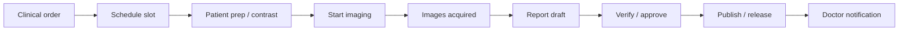
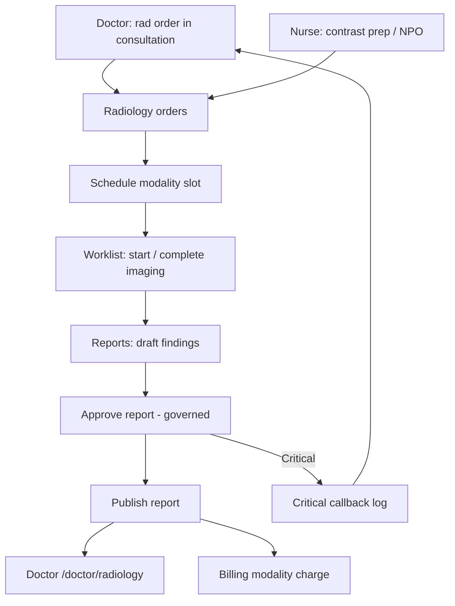
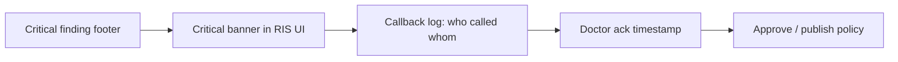

# Radiologist Role Module — Product & Implementation Plan

**Last updated:** 2026-05-24  
**App:** `apps/hospital-os` · **Role key:** `radiologist` · **Base path:** `/radiology`  
**Navigation source:** `apps/hospital-os/src/config/roleNavigation.ts` (`ROLE_TABS.radiologist`)

This plan describes everything a **hospital radiology / RIS-oriented** workspace needs in a multi-specialty enterprise HMS, mapped to what exists today (Live / C1-leaning / Preview per [MASTER_OPERATIONAL_CONNECTIVITY_MATRIX.md](../../MASTER_OPERATIONAL_CONNECTIVITY_MATRIX.md)) and what to build next. It does **not** specify a visual redesign — all new work must reuse `AppLayout`, role tabs, shadcn/ui, `DepartmentWorklistTable`, platform runtime hooks, and existing radiology page patterns.

**Audit honesty:** Per [ENTERPRISE_AUDIT_REPORT.md](../../ENTERPRISE_AUDIT_REPORT.md) §4.10, the radiology spine is **real** (`RadiologyStudyOrder` lifecycle + transitions, branch worklist + SSE, `radiology-runtime` ~340 LOC) but this is **not a full RIS-PACS**: no DICOM storage/viewer, no modality worklist (DICOM MWL), report body is unstructured JSON/text, **no radiologist sign-off governance UI** equivalent to lab GAP-005, scheduling slot fields are **local**, no dose tracking, no teleradiology queue. This document plans the full enterprise radiology workspace while labeling current vs target honestly.

**RIS operations are core** — not a MIS dashboard. P0 Definition of Done (§9) requires governed order → schedule → perform → report → verify → release on **platform-linked** studies — not “can open `/radiology` with demo KPIs.”

**UX note (product decision):** There is **no** `RadiologyWorkflowStepStrip` today (unlike lab’s `LabWorkflowStepStrip`). Radiology pages use status chips and table/dialog patterns only. **Do not** mount generic `WorkflowStepStrip` (`frontDeskSpine` / `clinicalOpdSpine`) on radiology routes — that pattern is out of scope for radiologist (and must not return to reception/doctor/nurse). **P1:** introduce a radiology-specific step strip (Schedule → Acquire → Report → Release) mirroring lab’s pattern — not generic OPD chrome.

---

## 1. Role purpose and personas

### Purpose

The radiologist module is the **diagnostic imaging operations layer** of the hospital: clinical order intake, modality scheduling, technologist worklists, image acquisition metadata (not full PACS in P0), structured reporting, verification, critical findings escalation, peer review (P2), and handoffs to doctors, nurses, billing, ER/OT. Radiology **owns the imaging study chain and report artifact**; it does **not** prescribe, register patients, dispense drugs, run LIMS bench work, operate CRM, or replace a vendor PACS in P0.

### Personas

| Persona | Typical duties | Primary screens |
|---------|----------------|-----------------|
| **Reporting radiologist** | Read worklist, draft/sign reports, critical callbacks, addenda | Worklist, Reports |
| **Duty radiologist / on-call** | Stat reads, ER/ICU priors, after-hours release | Dashboard, Worklist |
| **Modality technologist** | Schedule slots, start/complete imaging, contrast prep, dose sheet (P2) | Orders, Worklist |
| **RIS admin / section lead** | Procedure catalog, equipment AE titles, SLA/TAT, room assignment | Settings, Dashboard |
| **Teleradiology reader** (P2) | Remote queue, SLA clock, site routing | Planned `/radiology/telerad` |

### Login context

`LoginPage` maps role `radiologist` to `/radiology`. No sub-specialty picker at login today — **modality filters** (CT/MR/US/X-ray/Mammo) are UI strings on orders, not server-side section assignment (P1).

---

## 2. Screen and tab inventory

### 2.1 Current role tabs (`roleNavigation.ts`)

| Tab key | Label | Path | Page component | Connectivity / readiness (2026-05-24) |
|---------|-------|------|----------------|----------------------------------------|
| `dashboard` | Dashboard | `/radiology` | `RadiologyDashboard` | **C1-leaning (matrix)** — store + SSE; **`routeReadiness` does not badge Live** (not in C1 set — honesty gap) |
| `orders` | Orders | `/radiology/orders` | `RadiologyOrders` | **C1-leaning** — branch worklist sync; **scheduling fields local** |
| `worklist` | Worklist | `/radiology/worklist` | `RadiologyWorklist` | **C1-leaning** — `DepartmentWorklistTable` + modality tabs |
| `reports` | Reports | `/radiology/reports` | `RadiologyReports` | **C1-leaning** — report draft UI; **no governed verify/release** like lab GAP-005 |
| `settings` | Settings | `/radiology/settings` | `RadiologySettings` | **Preview (C3/C4)** — local equipment + procedure catalog demo |

### 2.2 Routed in `App.tsx` (`RADIOLOGY_PAGES`)

Static map — all five paths above; no dynamic `:id` routes today.

| Path | Component | In role tabs | Notes |
|------|-----------|--------------|-------|
| `/radiology` | `RadiologyDashboard` | Yes | KPIs from `radiologyOrders` store; SSE via `useDepartmentWorklistSync` |
| `/radiology/orders` | `RadiologyOrders` | Yes | Schedule dialog — date/time/technician **local** until slot API |
| `/radiology/worklist` | `RadiologyWorklist` | Yes | Primary operational console; status advance via `updateRadiologyOrder` |
| `/radiology/reports` | `RadiologyReports` | Yes | Findings/impression/recommendation text; critical flag local |
| `/radiology/settings` | `RadiologySettings` | Yes | Equipment AE titles, procedure tariffs — **not platform-backed** |

### 2.3 Journey chrome — no rad-specific strip yet

| Page | `LabWorkflowStepStrip` | Generic `WorkflowStepStrip` | Today |
|------|------------------------|------------------------------|-------|
| All `/radiology/*` | **No** (lab-only component) | **No** | Status chips + dialog CTAs only |
| Target P1 | — | — | Add `RadiologyWorkflowStepStrip` (Schedule → Acquire → Report → Release) on worklist dialog + reports |

Implementation reference (lab pattern): `apps/hospital-os/src/components/diagnostics/LabWorkflowStepStrip.tsx` — radiology equivalent **does not exist yet**.

### 2.4 Cross-module routes (not radiologist tabs — coordination)

| Path | Owner | Radiologist use |
|------|-------|-----------------|
| `/doctor/radiology` | Doctor | Ordering physician **reviews** released reports — not RIS console |
| `/doctor/consultation/:id` | Doctor | Creates radiology orders via `saveConsultation` → domain-api |
| `/nurse/tasks`, `/nurse/ward` | Nurse | Contrast prep, NPO, transport (handoff P1) |
| `/reception/flow` | Reception | `OperationalRadiologyPanel` — live rad state read-only |
| `/billing-dept/*` | Billing | Modality charge lines from `amountCents` / sync flags |
| `/emergency/orders` | Emergency | Stat imaging → radiology worklist priority bump |
| `/ot/preop` | OT coordinator | Pre-op imaging checklist read (local demo today) |

### 2.5 Removed / out of nav (product decisions)

| Item | Notes |
|------|--------|
| Generic `WorkflowStepStrip` on radiology routes | **Do not add** |
| `WorkflowStepStrip` on reception/doctor/nurse | **Do not reintroduce** (parent constraint) |
| Full PACS viewer in Hospital OS P0 | **Out of scope** — integrate P2 (Orthanc/dcm4chee bridge) |

### 2.6 Planned screens (gaps — not in nav yet)

Grouped by enterprise RIS expectation. Priority in §4 and §10.

| Proposed path | Screen | Rationale |
|---------------|--------|-----------|
| `/radiology/schedule` | Modality slot board | CT/MR/US room calendar; conflict detection |
| `/radiology/modality/:modality` | Modality worklists | CT, MR, US, X-ray, Mammo lanes |
| `/radiology/critical` | Critical findings callback log | Phone/read-back attestation P0 gap |
| `/radiology/templates` | Structured report templates | Body-region macros, normal variants |
| `/radiology/peer-review` | Peer review queue | Second read, discrepancy scoring — **P2** |
| `/radiology/telerad` | Teleradiology routing | Site queue, SLA clock — **P2** |
| `/radiology/dose` | Radiation dose registry | CTDI/DLP, cumulative dose — **P2** |
| `/radiology/pacs` | Study viewer / DICOM link | Orthanc embed — **P2** |
| `/radiology/amendments` | Addendum / corrected reports | Reason-coded amendments |
| `/radiology/tat` | TAT / SLA analytics | Stat vs routine breach board |
| `/radiology/contrast` | Contrast administration log | Allergy cross-check with patient record |

---

## 3. RIS operations as explicit core (target architecture)

### 3.1 RIS domains (enterprise target)

| Domain | Target capability | Today (honest) |
|--------|-------------------|----------------|
| **Study catalog** | Procedure codes, body region, contrast/radiation flags, prep | **Preview** — local array in Settings only |
| **Order / worklist** | Branch queue, priority, modality section | **C1-leaning** — `useDepartmentWorklistSync('radiology')` |
| **Scheduling** | Slot templates, room/equipment, bump rules | **Local** date/time/technician on Orders page |
| **Acquisition metadata** | Technologist, contrast, technique, series count | Partial fields on Reports; **no DICOM MWL** |
| **Image linking** | Study UID, PACS URL | **Missing** (P2) |
| **Structured reporting** | Findings / impression / recommendation templates | Free-text fields in UI + JSON blob on platform |
| **Verification / sign-off** | Radiologist approve → publish with role gate | **Missing UI** — UI status map via `platformApplyRadiologyUiStatus` only |
| **Critical findings** | Flag, callback log, doctor ack before release | `critical` boolean; **no callback log** |
| **Contrast safety** | Allergy check, creatinine gate | **P1** — nurse/doctor handoff informal |
| **Dose tracking** | CTDI, DLP, cumulative | **Missing** (P2) |
| **Billing** | Modality tariff, auto charge on publish | `amountCents`, `syncBilling` on create — partial |
| **Teleradiology** | Remote queue, site-logo routing | **Missing** (P2) |
| **Interop** | DICOM, HL7 ORU, FHIR ImagingStudy | **Missing** (P2) |

### 3.2 Platform lifecycle vs UI status (mapping gap)

Authoritative states (`radiology-order.ts`): `ordered` → `scheduled` → `imaging_in_progress` → `awaiting_review` → (`critical_review`) → `approved` → `published` → `completed`.

UI status strings today: `Ordered` | `Scheduled` | `In Progress` | `Completed` | `Reported`.

**Honesty:** `updateRadiologyOrder` calls `platformApplyRadiologyUiStatus` on status patch — **not** full `platformRadiologyTransition` with validation context for every step. Governed transitions exist in domain-api but hospital-os does not yet expose `RadGovernedActions` + disabled tooltips like lab GAP-005.

### 3.3 Where RIS UX lives

1. **Worklist** — primary day console (`DepartmentWorklistTable` + modality filter).
2. **Orders** — scheduling desk + order detail.
3. **Reports** — structured report authoring + governed release (target).
4. **Dashboard** — supervisor TAT/critical/modality queues (must align badges with truth).
5. **Settings** — procedure/equipment master (must become platform-backed P1).

---

## 4. Feature breakdown by screen (P0 / P1 / P2)

### Dashboard (`/radiology`)

| Priority | Features |
|----------|----------|
| **P0 (gap)** | Live counts from **branch worklist** only: waiting/scheduled, in progress, awaiting report, critical active; CTAs to worklist/reports; `InlinePlatformError` on SSE failure; add `/radiology` to `routeReadiness` Live set when honest |
| **P1** | Per-modality breakdown; clock TAT vs SLA; stat lane; link to critical queue |
| **P2** | Multi-branch rollup; equipment downtime widget; dose alerts |

### Orders (`/radiology/orders`)

| Priority | Features |
|----------|----------|
| **P0** | Filter/search; schedule slot (date/time/room/tech); mark scheduled; handoff from doctor orders visible; platform-linked orders show `platformRadiologyOrderId` |
| **P0 (gap)** | Persist schedule to platform via `schedule_study` transition — not local-only fields |
| **P1** | Contrast required flag → nurse prep task; creatinine/lab result chip; billing estimate |
| **P2** | DICOM MWL export; recurring follow-up studies |

### Worklist (`/radiology/worklist`)

| Priority | Features |
|----------|----------|
| **P0** | Modality tabs (CT/MR/US/X-ray); priority; start imaging / complete imaging actions; `DepartmentWorklistTable`; platform sync on status change |
| **P0 (gap)** | `RadGovernedActions` with disabled tooltips (mirror lab GAP-005); `RadiologyWorkflowStepStrip` in detail dialog |
| **P1** | Technologist assignment; patient identity barcode; contrast administered log |
| **P2** | PACS “open study” deep link when study UID present |

### Reports (`/radiology/reports`)

| Priority | Features |
|----------|----------|
| **P0** | Report draft: clinical history, technique, findings, impression, recommendation; critical flag; radiologist name |
| **P0 (gap)** | Governed **approve_report** → **publish_report** path — cannot release without findings + impression |
| **P1** | Structured templates by body region; comparison priors field; PDF print |
| **P1** | Critical callback log before publish when `critical_review` |
| **P2** | Addendum/corrected report workflow; voice dictation; peer review second sign-off |

### Settings (`/radiology/settings`)

| Priority | Features |
|----------|----------|
| **P1** | Platform-backed procedure catalog + equipment AE titles |
| **P2** | Maintenance calendar; dose protocol library; telerad site routing |

### Planned screens (§2.6)

See §2.6 — **Critical callback log**, **governed verify/release**, and **platform scheduling** are **P0/P1** for enterprise parity; PACS/telerad/dose **P2**.

---

## 5. Imaging study flow (schedule → acquire → report)

### 5.1 Target study lifecycle

### 5.2 States today (UI + platform)

| UI `status` | Platform state (target map) | Platform tie-in today |
|-------------|----------------------------|------------------------|
| Ordered | `ordered` | Order create via consultation |
| Scheduled | `scheduled` | **Local** schedule fields |
| In Progress | `imaging_in_progress` | `platformApplyRadiologyUiStatus` |
| Completed | `awaiting_review` | UI label mismatch — honesty gap |
| Reported | `published` / `completed` | Local report fields + ui-status |

---

## 6. End-to-end workflows

### 6.1 Standard: order → schedule → perform → report → verify → release → doctor

**Platform spine:** `POST /radiology/orders` → branch worklist `GET /radiology/branch/worklist` → transitions (`schedule_study`, `start_imaging`, `complete_imaging`, `approve_report`, `publish_report`) → SSE `radiology.transition` → doctor sees released state on consultation blockers / radiology tab.

**UI spine:** Orders → Worklist → Reports; **no** generic OPD `WorkflowStepStrip`; target **`RadiologyWorkflowStepStrip`** on operational steps (P1).

### 6.2 Critical finding workflow (target)

**Today:** `critical` boolean + `OperationalRadiologyPanel` blockers; **no** callback log entity or doctor attestation inbox (doctor module `/doctor/critical` planned).

### 6.3 ER / stat reads

ER orders with Emergency priority → worklist sort bump → duty radiologist queue. **P1:** explicit stat SLA timer on dashboard.

### 6.4 IPD / OT imaging

Same worklist — orders may carry admission context. OT pre-op imaging checklist reads report status (today local on `/ot/preop`).

---

## 7. Cross-role handoffs

Aligned with [DOCTOR_MODULE.md](./DOCTOR_MODULE.md), [NURSE_MODULE.md](./NURSE_MODULE.md), [LAB_TECHNICIAN_MODULE.md](./LAB_TECHNICIAN_MODULE.md), and [BILLING_FINANCE_MODULE.md](./BILLING_FINANCE_MODULE.md).

| From / To | Trigger | Data passed |
|-----------|---------|-------------|
| **Doctor → Radiology** | Consultation rad lines | `study`, `modality`, priority, `encounterId`, `opdVisitId`, `amountCents` |
| **Nurse → Radiology** | Contrast prep, transport, NPO | Patient UHID, allergy list, creatinine result (P1) |
| **Reception → Radiology** | Identity at modality desk | Demographics, UHID |
| **Radiology → Doctor** | Report published | Report text, critical flag → `/doctor/radiology` |
| **Radiology → Nurse** | Contrast reaction / prep fail | Task to ward (P1) |
| **Radiology → Billing** | Order create / publish | Modality charge keys, invoice sync |
| **ER → Radiology** | Emergency imaging order | Stat priority → worklist |
| **Radiology → OT** | Pre-op imaging complete | Report link on OT pre-op checklist (P1) |
| **Radiology → PACS** (P2) | Images acquired | Study UID, viewer URL |

---

## 8. Explicitly out of scope for Radiologist

| Capability | Owner module |
|------------|--------------|
| Full PACS vendor replacement / long-term archive | **P2 integration** — Orthanc/dcm4chee bridge |
| LIMS sample accession, lab verification | **Lab** — `/lab/*` |
| Pharmacy dispensing, formulary | **Pharmacy** — `/pharmacy/*` |
| Patient registration, walk-in, queue | **Reception** — `/reception/*` |
| Clinical prescribing, diagnosis | **Doctor** — `/doctor/*` |
| Nursing care plans, MAR | **Nurse** — `/nurse/*` |
| CRM, drip campaigns | **CRM** — `/crm/*` |
| Full hospital inventory procurement | **Inventory** — `/inventory/*` |
| OT slot scheduling (coordinator console) | **OT coordinator** — `/ot/*` |
| Tenant admin, fee catalogs (master) | **Admin** — `/admin/*` |

Radiology may **view** patient demographics for identity match and **trigger** modality charges — not operate other roles’ consoles.

---

## 9. Definition of Done — Radiologist P0

P0 is **not** “five radiology tabs exist.” P0 is done when a technologist + reporting radiologist can run a day on **platform runtime on** with **governed RIS path**:

1. **Worklist:** Branch worklist hydrates via SSE; platform-linked orders show `platformRadiologyOrderId` / platform state.
2. **Schedule:** Slot assignment persists via `schedule_study` — not local-only date/time.
3. **Perform:** Start/complete imaging respects stage order when platform state present (`start_imaging`, `complete_imaging`).
4. **Report:** Findings + impression required before approve; governed disabled tooltips when blocked.
5. **Verify / release:** `approve_report` → `publish_report` path respected — mirror lab GAP-005 UX.
6. **Critical:** Critical studies show banner; publish policy respects `critical_review` / ack requirement.
7. **Doctor handoff:** Published reports appear on doctor radiology slice as released.
8. **Dashboard honesty:** KPI tiles from worklist truth OR labeled Preview — add `/radiology` to Live badge when backed.
9. **Errors:** SSE / refresh failures surfaced (`InlinePlatformError` on all rad pages — P0 gap).
10. **No** generic `WorkflowStepStrip` on radiology or other clinical roles.
11. `pnpm --filter hospital-os typecheck` passes; `routeReadiness` honest — Settings = Preview.

---

## 10. Implementation waves

| Wave | Focus | Deliverables |
|------|-------|--------------|
| **W0** (done) | RIS spine UX | Five routes, branch SSE, `DepartmentWorklistTable`, `updateRadiologyOrder` + ui-status sync, `OperationalRadiologyPanel` |
| **W1** | **RIS P0 honesty** | Live dashboard + `InlinePlatformError`; `RadGovernedActions` + GAP-style tooltips; platform scheduling transitions; critical callback log v1 |
| **W2** | **RadiologyWorkflowStepStrip + templates** | Step strip on worklist/reports; structured report templates by modality/body region |
| **W3** | **Modality boards + contrast safety** | `/radiology/schedule`; nurse contrast prep task link; allergy/creatinine chips |
| **W4** | **Verify/sign-off + amendments** | Radiologist digital sign; addendum workflow; PDF report |
| **W5** | **TAT / SLA + catalog** | Real clock TAT board; platform procedure catalog (Settings → API) |
| **W6** | **Billing handoff + stat lane** | Modality charge preview; ER stat SLA dashboard |
| **W7** | **Peer review** (P2 start) | Second-read queue, discrepancy log |
| **W8** | **PACS bridge P2** | DICOM study UID link; Orthanc viewer embed |
| **W9** | **Enterprise P2** | Teleradiology routing, dose registry, FHIR ImagingStudy, AI assist (human sign-off) |

**Recommended wave 1 implementation focus (next sprint):** **W1 — RIS P0 honesty** — governed transitions UI (`RadGovernedActions`), platform-backed scheduling, critical callback stub, `InlinePlatformError` on every radiology page, and honest dashboard/`routeReadiness` badges — without generic `WorkflowStepStrip`.

---

## 11. API and domain dependencies

### 11.1 Runtime and store

| Layer | Usage in radiology module |
|-------|---------------------------|
| `hospitalStore` | `radiologyOrders`, `updateRadiologyOrder`, `refreshDepartmentWorklistsFromPlatform` |
| `canUseRadiologyRuntime()` | `isPlatformRuntimeEnabled()` + `VITE_DOMAIN_API_URL` + session |
| `useDepartmentWorklistSync('radiology')` | Mount poll + SSE `radiology.transition` |
| `radiology-runtime.ts` | `platformCreateRadiologyOrder`, `platformRadiologyTransition`, `platformApplyRadiologyUiStatus`, `platformListRadiologyBranchWorklist`, `platformGetLiveRadiologyState` |
| `radiology-runtime-engine.ts` | `evaluateRadiologyTransition`, `listAllowedRadiologyActions` |
| `radiology-order.ts` lifecycle | Authoritative state machine |
| `opd-radiology-dependencies.ts` | OPD exit blockers for pending rad |

### 11.2 Domain-api (representative)

| Domain | Endpoints / actions | Screens |
|--------|----------------------|---------|
| Radiology | `POST /radiology/orders`, `POST /radiology/orders/:id/transition`, `POST /radiology/orders/:id/ui-status` | Worklist, Orders, Reports |
| Radiology | `GET /radiology/branch/worklist` | All rad pages via sync hook |
| Radiology | `GET /radiology/opd/:opdVisitId/live` | Consultation blockers, reception flow panel |
| Billing | Charge sync on order create / publish | Consultation, billing handoff P1 |
| Patients | Read demographics, allergies | Contrast safety P1 |

### 11.3 Kernel-api

Session tenant/branch; actor id on report sign and transitions for audit (**P1** show in UI).

### 11.4 Hooks and shared components (reuse)

| Asset | Path |
|-------|------|
| `DepartmentWorklistTable` | `@/components/diagnostics/DepartmentWorklistTable` |
| `WorklistStatusChip` | `@/components/diagnostics/WorklistStatusChip` |
| `CriticalResultBanner` | `@/components/diagnostics/CriticalResultBanner` (reuse pattern) |
| `OperationalRadiologyPanel` | `@/components/operations/OperationalRadiologyPanel` |
| `useDepartmentWorklistSync` | `@/hooks/useDepartmentWorklistSync` |
| `routeReadiness` | `@/config/routeReadiness.ts` |
| `ConsultationBlockerStrip` | `@/components/opd/ConsultationBlockerStrip` (doctor) |
| Target P1 | `@/components/diagnostics/RadiologyWorkflowStepStrip.tsx` (**new**) |
| Target P1 | `@/components/diagnostics/RadGovernedActions.tsx` (**new**) |

---

## 12. UI theme constraints (no redesign)

All radiology work must match existing Hospital OS patterns:

- **Shell:** `AppLayout` with role tabs from `ROLE_TABS` / `getTabsForRole`.
- **Layout:** `space-y-6` page headers (`text-2xl font-bold tracking-tight` + muted subtitle).
- **Worklist:** `DepartmentWorklistTable` + dialog detail pattern on `RadiologyWorklist` (same as lab).
- **Journey chrome:** **No** generic `WorkflowStepStrip`; **no** `LabWorkflowStepStrip` on rad routes; add **`RadiologyWorkflowStepStrip`** P1 only.
- **Components:** shadcn `Card`, `Button`, `Badge`, `Input`, `Table`, `Tabs`; `sonner` toasts.
- **Status:** `routeReadiness` — orders/worklist/reports = Live (C1-leaning); settings = Preview; dashboard badge gap documented W1.
- **Errors:** Add `InlinePlatformError` on radiology list pages (W1) — no silent SSE drop.
- **Do not add** generic `WorkflowStepStrip` to radiology, reception, doctor, or nurse routes.

---

## 13. Honesty checklist (audit alignment)

Per [ENTERPRISE_AUDIT_REPORT.md](../../ENTERPRISE_AUDIT_REPORT.md) and connectivity matrix:

- Radiology **worklist through reports** are **C1-leaning** when runtime on — **not** a full RIS-PACS (§4.10 audit).
- **No DICOM/PACS, MWL, dose tracking, telerad** — enterprise gap; plan waves W8/W9.
- **Report body is unstructured** — no template engine or sign-off governance UI yet.
- **Scheduling fields local** — `platformApplyRadiologyUiStatus` used instead of full transition chain for many actions.
- **`/radiology` dashboard** — matrix C1-leaning but **`routeReadiness` omits `/radiology` from Live set** — align in W1.
- **`/radiology/settings`** — C3 Preview; equipment/procedures are seeded demo arrays.
- Production safety (auth, RLS, DICOM, telerad SLA, tests) is **not** implied by this UI plan.

---

## Appendix A — Exhaustive feature backlog (P2 / future)

For roadmap completeness — not committed dates.

- **Catalog:** CPT/modality codes, contrast protocols, hanging protocols
- **Scheduling:** Block templates, equipment maintenance holds, emergency bump
- **Acquisition:** DICOM MPPS, dose structured report, CD/film tracking
- **Reporting:** Bilingual PDF, key images, comparison priors auto-fetch
- **Critical:** Escalation tiers, read-back scripts, SMS with audit
- **Quality:** Peer review, discrepancy rates, ACR metrics
- **Billing:** Modality packages, insurance exclusions, dual energy surcharges
- **Interop:** HL7 ORU, FHIR ImagingStudy, WADO-RS viewer
- **Telerad:** Multi-site routing, SLA penalties, subspecialty rules
- **AI:** CAD marks (human verify only), report draft suggest
- **Analytics:** Utilization by modality, reject/repeat rates, contrast usage
- **India:** ABDM diagnostic records, radiation regulatory dose export

---

## Appendix B — File map (implementation reference)

| Concern | Location |
|---------|----------|
| Role tabs | `apps/hospital-os/src/config/roleNavigation.ts` |
| Routes | `apps/hospital-os/src/App.tsx` → `RADIOLOGY_PAGES` |
| Readiness | `apps/hospital-os/src/config/routeReadiness.ts` |
| Pages | `apps/hospital-os/src/pages/radiology/*.tsx` |
| Rad API client | `apps/hospital-os/src/runtime/radiology-runtime.ts` |
| Governed engine | `packages/hospital-operations/src/engine/radiology-runtime-engine.ts` |
| Lifecycle | `packages/hospital-operations/src/lifecycles/radiology-order.ts` |
| Domain service | `services/domain-api/src/radiology/radiology-runtime.service.ts` |
| Doctor slice | `apps/hospital-os/src/pages/doctor/DoctorRadiology.tsx` |
| Store actions | `apps/hospital-os/src/stores/hospitalStore.tsx` (`updateRadiologyOrder`, `RadiologyOrder`) |
| Flow panel | `apps/hospital-os/src/components/operations/OperationalRadiologyPanel.tsx` |

</tool_call>
The file has been written. Writing the rest of the file in chunks.

Read