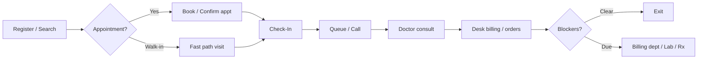

# Receptionist Role Module — Product & Implementation Plan

**Last updated:** 2026-05-21  
**App:** `apps/hospital-os` · **Role key:** `receptionist` · **Base path:** `/reception`  
**Navigation source:** `apps/hospital-os/src/config/roleNavigation.ts` (`ROLE_TABS.receptionist`)

This plan describes everything a hospital **front desk / reception** needs in a serious HMS SaaS, mapped to what exists today (Live / C1-leaning / Preview per [MASTER_OPERATIONAL_CONNECTIVITY_MATRIX.md](../../MASTER_OPERATIONAL_CONNECTIVITY_MATRIX.md)) and what to build next. It does **not** specify a visual redesign — all new work must reuse `AppLayout`, role tabs, shadcn/ui, `PatientContextBar`, platform runtime hooks, and existing reception page patterns.

---

## 1. Role purpose and personas

### Purpose

The receptionist module is the **operational front door** of the hospital: identity, visit creation, appointment coordination, OPD queue control, light billing at desk, IPD admission intake, and handoffs to clinical and back-office roles. Reception does **not** own clinical documentation, full revenue cycle, or marketing automation.

### Personas

| Persona | Typical duties | Primary screens |
|---------|----------------|-----------------|
| **OPD front desk** | Register/search patients, book/reschedule appointments, check-in, issue tokens, call queue, collect registration/consultation fees | Registration, Appointments, Check-In, Queue, Billing |
| **Walk-in / emergency desk** | Fast-path visit start, redirect to ER module when needed | Registration (walk-in tab), Check-In |
| **IPD admission desk** | Admission request, bed assignment handoff, deposit collection start, attendant/visitor capture | IPD, Beds, Billing |
| **Branch / counter lead** | Counter selection, shift handover, daily census | Dashboard, Flow hub (planned tab), shift notes (gap) |

---

## 2. Screen and tab inventory

### 2.1 Current role tabs (`roleNavigation.ts`)

| Tab key | Label | Path | Page component | Connectivity (2026-05-20) |
|---------|-------|------|----------------|---------------------------|
| `dashboard` | Dashboard | `/reception` | `ReceptionDashboard` | C1-leaning (store + hydration); KPI tiles still mixed demo |
| `registration` | Registration | `/reception/registration` | `ReceptionRegistration` | **C1-leaning** — patient create/search, walk-in fast path |
| `appointments` | Appointments | `/reception/appointments` | `ReceptionAppointments` | **C1-leaning** — book/cancel/complete via scheduling API |
| `checkin` | Check-In | `/reception/checkin` | `ReceptionCheckIn` | **C1-leaning** — ties to OPD visit lifecycle |
| `queue` | Queue | `/reception/queue` | `ReceptionQueue` | **C1-leaning** — `GET /opd/visits/board`, SSE refresh |
| `billing` | Billing | `/reception/billing` | `ReceptionBilling` | C1/C2 — front-desk charges; dept billing is separate role |
| `beds` | Beds | `/reception/beds` | `ReceptionBeds` | C2 — bed board + `platformAssignBed` when runtime on |
| `ipd` | IPD | `/reception/ipd` | `ReceptionIPD` | C2 — admission intake panels |
| `photos` | Patient Photos | `/reception/photos` | `ReceptionPatientPhotos` | **Preview (C4)** — local/demo |

### 2.2 Routed but not in role tabs

| Path | Component | Notes |
|------|-----------|-------|
| `/reception/flow` | `ReceptionFlowHub` | **C1-leaning** operational command center — `Operational*` panels, `PatientContextBar`, `InlinePlatformError`. Should become a first-class tab or dashboard deep-link. |

### 2.3 Removed from reception (relocated)

| Former path | New owner | Notes |
|-------------|-----------|-------|
| `/reception/drip-marketing` | `/crm/drip-campaigns` (`CrmDripCampaigns`) | Redirect in `App.tsx`. Marketing drips are **CRM**, not front desk. |

### 2.4 Planned screens (gaps — not in nav yet)

Grouped by enterprise HMS expectation. Priority in §3.

| Proposed path | Screen | Rationale |
|---------------|--------|-----------|
| `/reception/enquiries` | Enquiries & callbacks | Log walk-in questions; not full CRM pipeline |
| `/reception/visitors` | Visitor & attendant passes | IPD/OPD visitor control |
| `/reception/print` | Print center | OPD slip, token, labels, consent batch |
| `/reception/documents` | Desk document scan | ID proof, insurance card at registration |
| `/reception/handover` | Shift handover notes | Counter-to-counter continuity |
| `/reception/branches` | Branch / counter selector | Multi-site front desk |
| `/reception/feedback` | Quick feedback capture | Single-question exit survey → CRM, not campaigns |

---

## 3. Feature breakdown by screen (P0 / P1 / P2)

### Dashboard (`/reception`)

| Priority | Features |
|----------|----------|
| **P0** | Live counts: today appointments, waiting queue, check-ins pending, open admissions; link CTAs to registration/queue/check-in; `usePlatformHydration` error surfacing |
| **P1** | Per-counter metrics; no-show rate; revenue at desk today; drill-down to flow hub |
| **P2** | Multi-branch rollup; customizable widgets |

### Front desk flow hub (`/reception/flow`) — promote to tab P0

| Priority | Features |
|----------|----------|
| **P0** | Visible tab or dashboard card; step hints aligned to `frontDeskSpine`; single active patient `PatientContextBar` |
| **P1** | Deep links from each step to target screen with patient pre-selected |
| **P2** | Shift-level checklist export |

### Registration (`/reception/registration`)

| Priority | Features |
|----------|----------|
| **P0** | Demographics, mobile, gender/DOB, department/doctor for visit; platform patient create + search; **walk-in fast path** (`startFrontDeskVisit`); duplicate warning on mobile; `InlinePlatformError` |
| **P1** | ID proof type/number, address, emergency contact; insurance payer at registration; photo capture link; family/guarantor; referral source |
| **P2** | ABHA/UHID linking; Aadhaar last-4 search; barcode wristband print; consent capture signature; multilingual labels |

### Appointments (`/reception/appointments`)

| Priority | Features |
|----------|----------|
| **P0** | Day list; book, reschedule, cancel; check-in from appointment; platform `platformBookAppointment` / cancel / complete; list sync |
| **P1** | No-show marking; waitlist add (handoff to Scheduler role); read-only doctor calendar slice; teleconsult flag |
| **P2** | Recurring appointments; package-linked booking; SMS/WhatsApp reminder trigger (via CRM/notification service) |

### Check-In (`/reception/checkin`)

| Priority | Features |
|----------|----------|
| **P0** | Appointment check-in → OPD visit; walk-in check-in; primary CTA per row; platform transitions |
| **P1** | Copay collection prompt before queue; insurance eligibility quick check |
| **P2** | Kiosk mode layout |

### Queue (`/reception/queue`)

| Priority | Features |
|----------|----------|
| **P0** | Board from platform; call next / recall; wait minutes from `createdAt`; called-patient highlight; SSE refresh |
| **P1** | Token number print; department filter; TV board push |
| **P2** | Priority queue rules (elderly, emergency bump) with audit |

### Billing (`/reception/billing`)

| Priority | Features |
|----------|----------|
| **P0** | Registration fee, consultation fee, package selection; invoice create/settle at desk; handoff indicator to Billing dept for complex cases |
| **P1** | Copay, partial payment, receipt print; mirror **billing blocker strip** (like doctor consultation) for unpaid exit |
| **P2** | UPI/card terminal integration hooks |

### Beds (`/reception/beds`)

| Priority | Features |
|----------|----------|
| **P0** | Bed board read; assign bed on admission when runtime on (`GET /beds`, `platformAssignBed`) |
| **P1** | Housekeeping status; expected discharge date column |
| **P2** | Bed reservation holds |

### IPD (`/reception/ipd`)

| Priority | Features |
|----------|----------|
| **P0** | Admission request create; link patient; deposit handoff to billing |
| **P1** | Attendant registration; package/ward class selection; pre-auth status read-only from billing |
| **P2** | Transfer in from other facility |

### Patient photos (`/reception/photos`)

| Priority | Features |
|----------|----------|
| **P1** | Capture/upload linked to `platformPatientId` |
| **P2** | Face match / duplicate assist |

### Planned: enquiries, visitors, print, documents, handover

See §2.4 — most are **P1** for enterprise parity; **P2** for multi-site and India-specific integrations.

---

## 4. End-to-end workflows

### 4.1 OPD: register → appointment → check-in → queue → billing → exit

**Platform spine:** patient (`POST` patients) → appointment (`/scheduling/appointments`) → OPD visit (`OpdService` transitions) → board (`GET /opd/visits/board`) → billing (`BillingSyncService` / invoices).

**UI spine:** prefer `/reception/flow` step hints + `PatientContextBar` on active visit; do not reintroduce `WorkflowStepStrip` on reception routes (parent constraint).

### 4.2 IPD: admission request → bed → nursing handoff

Reception creates admission intent → assigns bed (or requests from bed board) → Nurse `admissions` / ward receives → Billing deposit.

### 4.3 Discharge coordination (reception role)

Reception does not complete clinical discharge — surfaces **read-only clearance** via `OperationalDischargePanel` on flow hub and coordinates patient departure billing with Billing role.

### 4.4 Cross-role handoffs

| To role | Trigger | Data passed |
|---------|---------|-------------|
| **Doctor** | Queue `call_patient` | `platformOpdVisitId`, department, token |
| **Nurse** | IPD admission confirmed | `platformAdmissionId`, ward/bed |
| **Billing** (`billing`) | Complex IPD/insurance/TPA | Invoice ids, admission id |
| **Scheduler** | Overflow booking / waitlist | Appointment id, slot request |
| **CRM** | Lead/enquiry, drip, lifecycle | Patient id — **not** created at reception desk for campaigns |
| **Lab / Pharmacy / Radiology** | Orders after consult | Via doctor; reception sees status on flow panels only |
| **Emergency** | Red-flag triage | `createEmergencyCase` from registration |

---

## 5. API and domain dependencies

### 5.1 Runtime and store

| Layer | Usage in reception |
|-------|-------------------|
| `hospitalStore` (`HospitalProvider`) | Patients, appointments, queue, invoices, admissions — primary UI state |
| `isPlatformRuntimeEnabled()` / `platform-session` | Gate API calls |
| `usePlatformHydration` | Dashboard, flow hub, list refresh |
| `useClinicalPlatformListSync` | Queue, appointments, patients (P0 routes) |
| `isPlatformAuthoritative()` | UI badges when server is source of truth |

### 5.2 Domain-api (representative)

| Domain | Endpoints / actions | Screens |
|--------|----------------------|---------|
| Patients | Create, search, hydrate | Registration |
| Scheduling | Appointments book/cancel/range | Appointments, Check-In |
| OPD | Visit start, transitions, board | Registration fast path, Check-In, Queue |
| Beds / IPD | `GET /beds`, admissions, assign bed | Beds, IPD |
| Billing | Invoice/charges at desk | Billing, flow financial panel |
| CRM | — | **Out of scope** at reception |

### 5.3 Kernel-api

Tenant/branch context via session headers; staff identity for audit (who registered whom — **P1** expose in UI).

### 5.4 Hooks and shared components (reuse)

| Asset | Path |
|-------|------|
| `PatientContextBar` | `@/components/shared/PatientContextBar` |
| `InlinePlatformError` | `@/components/opd/InlinePlatformError` |
| `OperationalCommandCenterPanel` etc. | `@/components/operational/*` |
| `averageWaitMinutes`, `formatWaitMinutes` | `@/lib/opd/queue-presenters` |
| `startFrontDeskVisit`, `refreshQueueFromPlatform`, … | `hospitalStore` |

---

## 6. Explicitly out of scope for Reception

| Capability | Owner module |
|------------|--------------|
| Drip / multi-step marketing campaigns | **CRM** — `/crm/drip-campaigns`, `/crm/campaigns` |
| Lead pipeline, lifecycle journeys | **CRM** |
| Clinical charting, prescriptions, diagnosis | **Doctor** |
| Nursing tasks, MAR, vitals documentation | **Nurse** |
| Full revenue cycle, GST, TPA reconciliation | **Billing** |
| Master appointment calendar management | **Scheduler** |
| ER triage and treatment | **Emergency** |
| Inventory, OT scheduling | respective roles |

Reception may capture **enquiries** and **one-shot feedback** (P1) but must not host campaign builders.

---

## 7. Definition of Done — Receptionist P0

P0 is done when a front desk user can run a full OPD day on **platform runtime on** without demo-only blockers on the core path:

1. **Register or find** a patient with platform id backfill.
2. **Book or walk-in** into an OPD visit that appears on the **authoritative queue**.
3. **Check in** scheduled patients and see correct visit state.
4. **Call queue** with visible wait times and called-state highlight.
5. **Collect basic desk charges** or see clear handoff to Billing.
6. **Start IPD admission** with bed assignment path when applicable.
7. **No marketing/drip** UI in reception nav (CRM only).
8. **Flow hub** reachable from dashboard with `PatientContextBar` + platform errors visible.
9. `pnpm --filter hospital-os typecheck` passes; route readiness badges honest (Preview only where still demo).

---

## 8. Implementation waves

| Wave | Focus | Deliverables |
|------|-------|--------------|
| **W0** (done) | OPD spine UX | Registration walk-in, queue board, check-in, platform sync, flow hub panels — see `ops/HOSPITAL_OS_PRODUCT_BACKLOG.md` |
| **W1** | Nav + discoverability | Add **Flow** tab; dashboard CTAs; remove stray demo-only tabs from P0 path |
| **W2** | Desk financial exit | Reception billing blockers; receipt print; registration fee packages |
| **W3** | IPD desk parity | Admission wizard, deposit handoff, visitor pass (minimal) |
| **W4** | Search + documents | Universal search route; ID scan upload on registration |
| **W5** | Enterprise | Merge duplicates, display board, shift handover, branch/counter |
| **W6** | Compliance (P2) | ABHA, audit trail UI, multilingual |

---

## 9. UI theme constraints (no redesign)

All reception work must match existing Hospital OS patterns:

- **Shell:** `AppLayout` with role tabs from `ROLE_TABS` / `getTabsForRole` (tenant overrides in `tenantSettings`).
- **Layout:** `motion.div` `space-y-6` page headers (`text-2xl font-bold tracking-tight` + `text-muted-foreground text-sm`).
- **Components:** shadcn `Card`, `Button`, `Badge`, `Input`, `AppSelect`; `toast` from `sonner`.
- **Status:** `routeReadiness` Preview/Live badges — do not mark Live until platform-backed.
- **Patient context:** `PatientContextBar` on any single-patient operational view (flow hub, check-in when patient selected).
- **Errors:** `InlinePlatformError` for hydration/SSE failures — no silent fallback.
- **Platform:** `isPlatformRuntimeEnabled()` guards; never assume API without session.
- **Do not add** `WorkflowStepStrip` back to reception routes (product decision).

---

## 10. Honesty checklist (audit alignment)

Per [ENTERPRISE_AUDIT_REPORT.md](../../ENTERPRISE_AUDIT_REPORT.md) and connectivity matrix:

- Reception **P0 routes** are **C1-leaning**, not full C1 — some writes still merge with local store.
- **Photos** and former drip UI were **Preview (C4)** — drip moved to CRM 2026-05-21.
- Production safety (auth, RLS, tests) is **not** implied by this UI plan.

---

## Appendix A — Exhaustive feature backlog (P2 / future)

For roadmap completeness — not committed dates.

- Patient master: aliases, VIP flag, corporate tie-up, employee ID
- Insurance: card OCR, eligibility API, prior auth status chip
- Queue: voice call integration, multilingual token display
- Appointments: overbooking rules, slot templates per doctor
- Billing: health plan auto-apply, estimate before consult
- IPD: attendant meal coupons, parking pass
- Legal: consent forms library, minor guardian rules
- Audit: immutable log of registration edits
- Integrations: WhatsApp appointment confirm (notification service), ABHA creation widget
- Accessibility: WCAG contrast on queue board, screen reader for token call
- Analytics: desk wait time SLA, registration throughput

---

## Appendix B — File map (implementation reference)

| Concern | Location |
|---------|----------|
| Role tabs | `apps/hospital-os/src/config/roleNavigation.ts` |
| Routes | `apps/hospital-os/src/App.tsx` → `RECEPTION_PAGES` |
| Readiness | `apps/hospital-os/src/config/routeReadiness.ts` |
| Pages | `apps/hospital-os/src/pages/reception/*.tsx` |
| CRM drip (relocated) | `apps/hospital-os/src/pages/crm/CrmDripCampaigns.tsx` |

