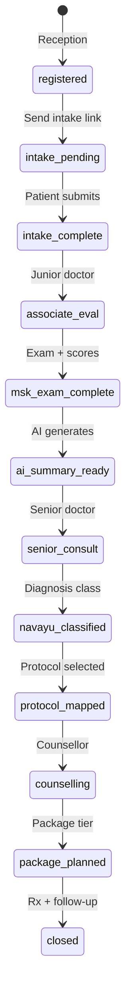
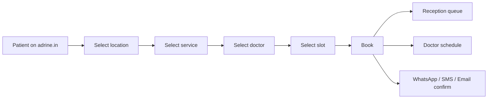

# Navayu — Implementation Specification

**Last updated:** 2026-06-03  
**Client:** Navayu Spine & Joint Care (Navayuhealth)  
**Platform:** Adrine Hospital OS + Patient App + CRM + AI Gateway  
**Commercial:** Setup fee + ₹1L/year (both centers — confirm per-site vs total)  
**Deploy target:** [Hostinger KVM 4 + Coolify + R2](../../docs/DEPLOYMENT_HOSTINGER_COOLIFY.md)

**Platform principle:** Navayu is **configuration on the seven engines** — not a custom HMS fork. See [ADRINE_PLATFORM_VISION.md](../../docs/ADRINE_PLATFORM_VISION.md).

**Workflow detail:** Form IDs, state machine, AI touchpoints — [NAVAYU_MSK_WORKFLOW.md](./NAVAYU_MSK_WORKFLOW.md).

---

## Scope decision (Navayu customization)

| Capability | Navayu timeline | Notes |
|------------|-----------------|-------|
| **Editable forms** | **Now** (UAT v0 hardcoded fields → Phase 1 form designer) | Registration, intake, MSK exam, counsellor forms — client can add/change fields without code |
| **Editable workflow UI** | **Later** (post–Phase 2+) | No admin workflow builder for Navayu in v0 or Phase 1 |
| **MSK journey** | **Fixed config** | `navayu_msk_visit` published via seed/provision script; staff follow standard OPD routes — Adrine updates workflow JSON when process changes until designer ships |

**Principle:** Navayu admins edit **forms**; Adrine platform team (or JSON publish) owns **workflow steps** until the Workflow Engine designer is productized.

---

## 1. One-sentence product

**Navayu Flow** = Reception (identity + referral CRM) → **Patient AI intake** (tablet) → **Junior MSK assessment** → **Structured exam + scores** → **AI one-page summary** → **Senior consult** → **Navayu diagnosis class + protocol** → **Counsellor package** → **Digital outputs** (Rx, PDFs, WhatsApp).

---

## 2. Business structure

| | **Branch A — Pataudi Hospital** | **Branch B — Gurgaon Center** |
|--|-----------------------------------|-------------------------------|
| **Model** | Mini hospital (~15 beds) — OPD, IPD, lab, pharmacy | Specialty spine & joint center (primary MSK spec) |
| **Workflow pack** | `multi_specialty` (OPD + IPD-lite + LIMS + pharmacy) | Full `navayu_msk_visit` lifecycle |
| **Modules** | OPD, IPD, LIMS, Pharmacy, Analytics | OPD, Pharmacy, Analytics, CRM |
| **Roles** | Reception, doctor, nurse, billing | Full role set (see §4) |
| **Forms** | Registration + basic consult | Full form catalog (§6) |
| **Branch key** | `branch_navayu_pataudi` | `branch_navayu_gurgaon` |
| **Online booking** | Location selectable on public page | Location selectable on public page |

**Tenant:** One organization (`tenant_navayu`), **branch chosen at login** (or inferred from booking).

**Patient identity:** Shared UHID across both locations — same tenant patient registry.

---

## 3. Engine mapping (how Navayu is built)

Navayu does **not** get `NavayuRegistration.tsx` or other one-off screens. Each requirement maps to an engine + seed data:

| Engine | Navayu use | Seed / config artifact |
|--------|------------|------------------------|
| **Form Engine** | Registration, intake, associate history, regional MSK exams, investigations, senior review, protocol map, counselling | `clients/navayu/forms/*.json` → published `FormDefinition` |
| **Workflow Engine** | `navayu_msk_visit` state machine on OPD visit | WorkflowDefinition publish + branch override |
| **Role Engine** | Gurgaon role set, junior doctor nav restriction, counsellor as CRM/billing persona | `clients/navayu/tenant-settings.json` |
| **Dashboard Engine** | Reception queue KPIs, doctor pending notes, management revenue/outcomes | Tenant dashboard config (Phase 2+) |
| **AI Engine** | Red-flag rules, intake tags, one-page summary (AI-4), investigation summarize (AI-3) | AI Gateway templates + tenant policy |
| **Protocol Engine** | Disc Care, Frozen Shoulder, Knee OA, AVN, Regenerative — stages + billing link | `clients/navayu/protocols.json` |
| **Analytics Engine** | Referral source MIS, treatment outcomes, counsellor conversion | CRM reports + admin MIS widgets |

**Provisioning pack:** `navayu_msk` — onboarding + operational templates in `packages/hospital-operations`; seed via [PROVISIONING.md](./PROVISIONING.md).

---

## 4. Roles and modules

### 4.1 Gurgaon Center — required users

| Role | Adrine mapping | Notes |
|------|----------------|-------|
| Admin | `admin` | Full admin nav (§4.2) |
| Doctor (senior) | `doctor` | MSK dept; sees AI summary on queue |
| Junior Doctor | `doctor` + dept `MSK` + restricted nav | Alias `clinical_associate` in config — no IPD/OT |
| Reception | `receptionist` | Registration + CRM referral fields |
| Pharmacy | `pharmacist` | Dispense + inventory subset |
| CRM | `crm_manager` | Leads, lifecycle, referral analytics |
| Nurse | `nurse` | Vitals, assessments (when IPD/observation used) |
| Counsellor | `crm_manager` or `billing` | Package tier + financial proposal — **no dedicated role enum yet** |

### 4.2 Gurgaon — module inventory (from requirements)

Modules below are **navigation targets** configured via Role Engine (visibility + labels), not new code modules.

**Admin:** Dashboard, Command Center, Approvals, Staff, Audit, Settings, AI Briefing, AI Workflow, Disease Mapping, Data Mining, Kaizen, Revenue Cycle, Treatment Outcomes, Departments, Finance, Expenses, Claims, Doctor Sharing, MRD, MIS Reports, Call Book.

**Doctor:** Dashboard, OPD Queue, Patients, IPD Rounds, Schedule, Analytics.

**Pharmacy:** Dashboard, Inventory, Schedule H, Drugs, Suppliers, Purchase Orders, Billing, Returns, Ward Indent, Reports.

**Reception:** Dashboard, Registration, Appointments, Check-in, Queue, Billing, Feedback, Visitors, Inquiry, Handover.

**Nurse:** Dashboard, My Ward, Vitals, Medication, Discharge, Shift Handover, Task Board, Admission, Order Verification, Assessment, Intake/Output, Reports.

**CRM / Counsellor:** Lead Pipeline, Lifecycle, Care Journeys, Analytics (see `/crm/*`).

**Honesty:** Many admin and analytics routes are **Preview** today — Navayu UAT v0 uses the **OPD spine** only; management tiles come in Phase 2+.

### 4.3 Pataudi Hospital — mini hospital scope

| Capability | Pataudi |
|------------|---------|
| Workflow | `multi_specialty` pack — OPD + IPD admission + discharge checklist |
| Modules | OPD, IPD, LIMS, Pharmacy, Analytics |
| Forms | Registration + consult + IPD admission (standard hospital forms) |
| Roles | Reception, doctor, nurse, billing |
| MSK AI summary | Optional / Phase 2 (Gurgaon-first for full MSK path) |
| Counsellor / protocol | Optional / Phase 2 |

**Staff accounts:** `reception.pataudi@`, `doctor@pataudi.`, `nurse@pataudi.`, `billing@pataudi.` @ `navayuhealth.in`

Same tenant URL; branch picker at login.

---

## 5. MSK specialty workflow

Configurable lifecycle: **`navayu_msk_visit`** (extends OPD visit).

| Step | Actor | Engine | Platform reuse |
|------|-------|--------|----------------|
| 1 Registration | Reception | Form + CRM | OPD visit create; lead from referral source |
| 2 AI intake | Patient (tablet/app) | Form + AI | Patient app route; red-flag rule (AI-1) |
| 3 Junior evaluation | Junior doctor | Form | Clinical note sections + structured JSON |
| 4 Functional assessment | Junior doctor | Form | Region template + score widgets |
| 5 AI summary | System → Senior | AI | AI Gateway job → document on visit |
| 6 Senior consultation | Senior doctor | Workflow + EMR | `complete_consultation`; summary pinned |
| 7 Disease classification | Senior doctor | Form + config | Client-maintained diagnosis class list |
| 8 Protocol mapping | Senior doctor | Protocol | Protocol Engine catalog |
| 9 Counsellor planning | Counsellor | Form + Billing | Tier + package SKUs |
| 10 Prescription + follow-up | Doctor + system | Workflow + notifications | Rx + automation (Phase 3) |

---

## 6. Clinical system

### 6.1 Specialties (configurable templates)

Spine, knee, hip, shoulder, AVN, sports medicine — each maps to a **region exam FormDefinition**, not a hardcoded screen.

### 6.2 Supported scores

| Score | Region / use |
|-------|----------------|
| ODI | Lumbar |
| NDI | Cervical |
| WOMAC, KOOS | Knee |
| DASH, SPADI | Shoulder |
| Harris Hip Score | Hip |
| VAS | All regions |

Score fields are **Form Engine calculator widgets** — client-editable question sets in Admin (Phase 1+).

### 6.3 Form catalog (FormDefinition IDs)

Full field lists: [NAVAYU_MSK_WORKFLOW.md §4](./NAVAYU_MSK_WORKFLOW.md#4-form-catalog-editable-saas--formdefinition-ids).

Summary:

| Form ID | Purpose |
|---------|---------|
| `navayu.reception.registration` | Identity, referral, lifestyle, pain regions |
| `navayu.patient.intake` | Chief complaint, VAS, functional difficulty, red flags |
| `navayu.associate.history` | Junior doctor history |
| `navayu.exam.general` / `systemic` | Vitals + systemic exam |
| `navayu.exam.cervical` / `lumbar` / `knee` / `hip` / `shoulder` | Region exams + scores |
| `navayu.investigations` | MRI, X-ray, CT, labs, prior Rx uploads |
| `navayu.senior.review` | Confirm AI summary, pathway decision |
| `navayu.protocol.map` | Protocol family + stage + components |
| `navayu.counselling.package` | Tier + package lines |

### 6.4 Investigation management

Uploads (MRI, CT, X-ray, blood, prior Rx) → stored in R2 → **AI-3** radiology/lab summary paragraph (Phase 3).

### 6.5 Client-editable catalogs (config JSON, not code)

- **Referral sources:** Google, Instagram, Facebook, YouTube, existing patient, doctor/GP referral, corporate camp, walk-in, newspaper, village camp, website, other  
- **Navayu diagnosis classes:** e.g. "Chronic inflammatory degenerative disc disease"  
- **Protocol library:** Disc Care (stages 1–4), Frozen Shoulder, Knee OA (KL grade), AVN (Ficat + EBOO)  

---

## 7. AI Engine (Navayu)

All calls via **AI Gateway** — tenant budget, audit, no free chat in consult.

| ID | Trigger | Output | Priority |
|----|---------|--------|----------|
| AI-1 | Red flags on intake | `urgent` + reason | UAT v0: rule-only; LLM optional |
| AI-2 | Intake complete | Queue priority tags | Phase 1 |
| AI-3 | Investigation upload | Radiology/lab summary | Phase 3 |
| AI-4 | Pre-senior consult | **One-page clinical summary** | **Phase 2 (P0 for full Navayu)** |
| AI-5 | Post-protocol | Patient-facing explanation | Phase 2+ |

**AI-4 summary sections:** Complaints, duration, severity, functional limitations, exam findings, investigations, previous treatments, risk factors, classification, suggested pathway.

UAT v0: **static placeholder** panel on senior queue — proves handoff, not intelligence.

---

## 8. Protocol Engine + counsellor

### 8.1 Protocol families

| Protocol | Components (examples) |
|----------|-------------------------|
| Disc Care | Stages 1–4, ozone, DSCB, physio |
| Frozen Shoulder | Staging, hydrodilatation, PRP, ozone |
| Knee OA | KL grade, PRP/GFC/BMAC |
| AVN | Ficat staging, EBOO integration |
| Regenerative Medicine | Cross-cutting tier |

Editable in Admin without code (Phase 2).

### 8.2 Counsellor module

**Patient tiers:** Basic | Advanced | Regenerative | Premium

**Outputs:** Treatment plan, package recommendation, financial proposal → linked to **billing packages** + CRM lifecycle stage.

---

## 9. Digital outputs

Patient receives via **WhatsApp, SMS, email, Patient Portal:**

| Output | Phase |
|--------|-------|
| Prescription | UAT v0 (existing Rx path) |
| Diagnosis summary | Phase 2 |
| Exercise / diet plan | Phase 3 |
| Investigation summary | Phase 3 |
| Follow-up reminders | Phase 3 |
| Package details | Phase 2 |

**Today:** Notification outbox stub; WhatsApp integration **Phase 3**. Files via R2 signed URLs when file service wired on Lite deploy.

---

## 10. Online booking

**Public booking** on adrine.in (or tenant subdomain):

| Requirement | Status |
|-------------|--------|
| Location = branch (Pataudi / Gurgaon) | **Missing** — public booking page |
| Service + doctor + slot selection | **Partial** — `/scheduling/*` internal only |
| Auto-create appointment in Adrine | **Partial** — scheduling API exists |
| Appear in reception queue + doctor schedule | **Partial** — when platform runtime on |
| WhatsApp / SMS / email confirmation | **Missing** — Phase 3 |

Patient App today: appointments list when signed in; **no self-serve booking flow** for Navayu.

---

## 11. Gap analysis — today vs must build

### 11.1 By engine

| Engine | Exists today | Must build for Navayu |
|--------|--------------|------------------------|
| **Form Engine** | Static tenant form templates (localStorage); free-text consult | FormDefinition API, renderer, score widgets, pain diagram, Navayu form JSON publish |
| **Workflow Engine** | OPD lifecycle + workflow-config CRUD | `navayu_msk_visit` **fixed via provision** — no admin workflow designer for Navayu yet |
| **Role Engine** | 16 roles + local TenantSettings | Server-persisted settings; junior doctor + counsellor config; Gurgaon nav preset |
| **Dashboard Engine** | Role dashboards (many Preview) | Live queue/reception KPIs for UAT; configurable MIS Phase 2+ |
| **AI Engine** | Stub orchestration; optional UI scribe key | AI Gateway wire-up; AI-4 summary template; AI-1 red-flag rules |
| **Protocol Engine** | — | Catalog schema, mapper UI, package link |
| **Analytics Engine** | CRM partial; admin MIS Preview | Referral → lead reports; outcome tracking Phase 2+ |

### 11.2 By capability (honest)

| Capability | Today | For Navayu |
|------------|-------|------------|
| Multi-tenant + 2 branches | Kernel supports; **no Navayu seed script** | `scripts/provision-navayu.ts` + JSON seeds |
| Tenant branding / nav | localStorage TenantSettings | **Server-persisted** Wave 0 |
| Reception register | C1-leaning basic fields | Extend via registration form (referral, lifestyle, pain regions) |
| CRM lead source | CRM module partial | Wire `hearAboutNavayu` → lead on register |
| Patient tablet intake | Patient app minimal | `/intake?visitId=` route + subset form |
| Structured MSK exam | Free-text consult | Form renderer + one region template (UAT v0) |
| NDI/ODI/WOMAC scores | None | Score widgets Phase 2 |
| Body pain diagram | None | P1 custom component Phase 2 |
| AI summary | Consultation AI scribe partial | Navayu template AI-4 Phase 2; placeholder UAT v0 |
| Protocol mapper | None | Protocol Engine Phase 2 |
| Package / counsellor | Billing packages Preview | CRM stage + package Phase 2 |
| WhatsApp automation | Notification stub | Phase 3 |
| Online public booking | Missing | Phase 1–2 (after OPD spine stable) |
| Hostinger deploy | Documented | Coolify apps + migrations + R2 + env |
| PHI production hardening | Audit gaps ([ENTERPRISE_AUDIT_REPORT.md](../../ENTERPRISE_AUDIT_REPORT.md)) | Staging OK; real PHI needs RLS + secrets |

### 11.3 What we explicitly do not build

- `Navayu*` React pages or Navayu-only API routes  
- Forked Hospital OS build per client  
- Separate Coolify stack per Navayu branch  
- On-VPS LLM inference  

---

## 12. Phased delivery (engine-aligned)

Phases build **engines + Navayu seed data** — not Navayu-only features.

### UAT v0 — first client test (realistic first ship)

**Goal:** Prove end-to-end flow, branding, 2 branches — **not** full AI MSK.

| Ship | Detail |
|------|--------|
| Tenant + 2 branches | Kernel seed (`tenant_navayu`, Pataudi + Gurgaon) |
| Navayu branding + nav | Tenant settings JSON (Wave 0 lite — server or import) |
| Registration | Extra fields: referral dropdown + lifestyle yes/no + pain regions (**no diagram**) |
| Queue | Reception → doctor queue (existing OPD spine) |
| Consult | Junior fills **one** MSK form (lumbar **or** cervical JSON) |
| Senior | Second login sees patient + **static AI summary placeholder** |
| CRM | Lead created from referral source |
| Patient app | Intake **subset** (complaint, VAS, red flags) on phone/tablet |
| Deploy | Staging URL on Hostinger KVM 4 + smoke script |

**Explicitly not in v0:** Body diagram, all region modules, real AI MRI summary, protocol engine, WhatsApp, validated score calculators, public booking, full Gurgaon admin MIS.

### Phase 1 — Weeks 1–2 (Form Engine + Role foundation)

- Server-persisted tenant customization (Wave 0)  
- **Form designer v1** + publish Navayu form pack (registration, intake, MSK exams)  
- Full intake on tablet; red-flag rules (AI-1 rule engine)  
- ~~Editable workflow UI / step strip in consult~~ — **deferred** (workflow stays provisioned JSON + OPD spine)  
- Provision script already in repo (`pnpm provision:navayu`)

### Phase 2 — Weeks 3–4 (Clinical depth + AI + Protocol)

- All region exam modules + score calculators  
- **AI-4** one-page summary via AI Gateway  
- Protocol Engine v1 + counsellor package mapper  
- Pain diagram tablet UI  
- Digital outputs: diagnosis summary + package PDF  

### Phase 3 — Weeks 5+ (Automation + booking + integrations)

- Investigation upload + AI-3 summarize  
- WhatsApp / SMS / email automation (client API keys)  
- Follow-up sequences  
- Public online booking on adrine.in  
- Analytics: referral MIS, treatment outcomes  

---

## 13. Deployment checklist (Hostinger KVM 4)

See [DEPLOYMENT_HOSTINGER_COOLIFY.md](../../docs/DEPLOYMENT_HOSTINGER_COOLIFY.md).

| Step | Item |
|------|------|
| 1 | Coolify: Postgres 16 + Redis 7 + kernel-api + domain-api |
| 2 | Hospital OS static build; Patient app (second Coolify app or Vercel) |
| 3 | R2 bucket + `FILE_STORAGE=s3` on kernel |
| 4 | `pnpm prisma migrate deploy` on deploy |
| 5 | Provision `tenant_navayu` + branches + users |
| 6 | Import `clients/navayu/*.json` (settings, forms, protocols) |
| 7 | External LLM API URL for AI Gateway (not on VPS) |
| 8 | Daily pg_dump → R2; disable dev-login before real PHI |

---

## 14. UAT v0 execution checklist

**Provisioning runbook:** [PROVISIONING.md](./PROVISIONING.md) — Postgres, migrations, `pnpm provision:navayu`, dev-login table, Hostinger staging.

1. [x] Create tenant `tenant_navayu` + branches (Pataudi, Gurgaon) — `scripts/provision-navayu.ts`  
2. [x] Seed users: reception, associate dr, senior dr, counsellor/CRM — `clients/navayu/users.json` + script  
3. [x] `clients/navayu/tenant-settings.json` — branding, nav, referral list  
4. [x] `clients/navayu/forms/` — registration + intake + one lumbar template JSON  
5. [x] Reception: render extra fields (Navayu registration component)  
6. [x] Patient app: `/intake?visitId=` + copy link from registration  
7. [x] Doctor consult: intake panel + lumbar MSK form + senior AI placeholder  
8. [x] CRM: create lead on register with referral source  
9. [ ] Deploy staging URL + test script (12-step walkthrough, 6 functional)  
10. [ ] Client sign-off: v0 scope vs Phase 1–3 ([§12](#12-phased-delivery-engine-aligned))  

---

## 15. Related documentation

| Document | Use |
|----------|-----|
| [ADRINE_PLATFORM_VISION.md](../../docs/ADRINE_PLATFORM_VISION.md) | Seven engines + no-hardcoding principle |
| [NAVAYU_MSK_WORKFLOW.md](./NAVAYU_MSK_WORKFLOW.md) | Form IDs, AI table, state diagram |
| [DEPLOYMENT_HOSTINGER_COOLIFY.md](../../docs/DEPLOYMENT_HOSTINGER_COOLIFY.md) | Lite tier deploy |
| [CURRENT_FEATURES_AND_WORKFLOWS.md](../../docs/CURRENT_FEATURES_AND_WORKFLOWS.md) | Platform today-state |
| [docs/ROLE_MODULES/README.md](../../docs/ROLE_MODULES/README.md) | Reception, doctor, CRM depth |
| [ops/HOSPITAL_OS_PRODUCT_BACKLOG.md](../../ops/HOSPITAL_OS_PRODUCT_BACKLOG.md) | OPD spine shipped items |
