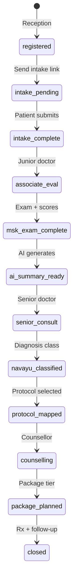

# Navayu Spine & Joint Care — Implementation Map

> **Full spec:** [NAVAYU_IMPLEMENTATION_SPEC.md](./NAVAYU_IMPLEMENTATION_SPEC.md) — business structure, engine mapping, gaps, phased delivery.

**Client:** Navayu (Gurgaon MSK center + Pataudi mini hospital)  
**Product:** AI-assisted structured MSK functional medicine workflow  
**Platform:** Adrine Hospital OS + Patient App + CRM + AI Gateway  
**Commercial:** Setup fee + ₹1L/year (both centers — confirm per-site vs total)

This document maps the client blueprint to **roles, forms, workflows, and AI** on Adrine — and what can ship for **UAT** vs **Phase 2+**.

---

## 1. One-sentence product

**Navayu Flow** = Reception (identity + referral CRM) → **Patient AI intake** (tablet) → **Junior MSK assessment** → **Structured exam + scores** → **AI one-page summary** → **Senior consult** → **Navayu diagnosis class + protocol** → **Counsellor package** → **Digital outputs** (Rx, PDFs, WhatsApp).

---

## 2. Role mapping (Hospital OS launch workspace)

| Navayu step | Adrine role | Route / module |
|-------------|-------------|----------------|
| Step 1 — Reception registration | **Receptionist** | `/reception/registration` (+ CRM fields) |
| Step 2 — AI intake questionnaire | **Patient** (tablet / patient app) | Patient app `/intake` (new) or reception tablet mode |
| Step 3–4 — Junior doctor + MSK exam | **Doctor** (role: `clinical_associate` or doctor w/ dept) | `/doctor/consultation` → **MSK encounter type** |
| Step 5 — AI summary | **Doctor** + AI Gateway | Pre-consult panel on senior queue |
| Step 6 — Senior consultation | **Doctor** (senior) | `/doctor/queue` → consult with AI summary pinned |
| Step 7–8 — Navayu class + protocol | **Doctor** | Consult sub-panel **Protocol mapper** |
| Step 9 — Counsellor + package | **CRM** or **Reception/Billing** | `/crm/leads` lifecycle → `/billing-dept/packages` |
| Step 10 — Digital output | **CRM** + notifications | WhatsApp stub + document service |
| Referral analytics | **CRM Manager** | `/crm`, campaigns, lead source reports |

**New persona (config):** `clinical_associate` can map to **Doctor** login with department `MSK` + restricted nav (no IPD, no OT).

---

## 3. Workflow as platform state machine

Treat the Navayu journey as **`navayu_msk_visit`** lifecycle (extends OPD visit):

**Handoffs to existing engines:**

| Navayu state | Reuse |
|--------------|--------|
| `registered` | OPD visit create + patient register |
| Intake | Custom `FormDefinition` + patient submission API |
| Associate / exam | `ClinicalNote` sections + structured JSON |
| AI summary | AI Gateway job → stored document linked to visit |
| Senior consult | `complete_consultation` + orders/Rx |
| Protocol | Branch config catalog (not hard-coded UI) |
| Package | Billing packages + CRM lifecycle stage |
| Outputs | Notification outbox + file service |

---

## 4. Form catalog (editable SaaS — FormDefinition IDs)

Each block below = **one publishable form** the client can edit in Admin (Wave 1 form designer).

### 4.1 `navayu.reception.registration`

| Section | Fields |
|---------|--------|
| Basic | fullName, age, sex, dob, mobile, whatsApp, email, address, occupation |
| Referral source | hearAboutNavayu (dropdown — client list) |
| Lifestyle snapshot | smoker, alcohol, diabetes, htn, thyroid, obesity, prevSurgery, steroidUse, sportsInjury (yes/no) |
| Pain mapping | bodyRegions[] (neck, back, knee, shoulder, hip, multiple) + **painDiagram** (P1: tablet SVG) |

**Outputs (automations — Phase 2):** welcome WhatsApp, consent link, intake link.

### 4.2 `navayu.patient.intake` (Step 2 — tablet/mobile)

| Section | Fields |
|---------|--------|
| Chief complaint | complaintType (enum), free text |
| Duration | durationBucket |
| Pain severity | vas 0–10 |
| Functional difficulty | spine[] + knee[] checklists |
| Previous treatments | treatment[] checkbox |
| Red flags | redFlag[] → **AI/rule urgent flag** |

### 4.3 `navayu.associate.history` (Step 3)

Present illness, past/family/personal history, smoking pack-years.

### 4.4 `navayu.exam.general` (Step 4A)

Height, weight, BMI (calc), BP, pulse, SpO2, temp, gait, posture.

### 4.5 `navayu.exam.systemic` (Step 4B)

CVS, respiratory, CNS, abdomen (structured normal/abnormal + notes).

### 4.6 Region templates (Step 5–6 — pick one per visit)

| Form ID | Scores |
|---------|--------|
| `navayu.exam.cervical` | NDI, ROM, Spurling, Hoffmann, reflexes, motor, dermatomes |
| `navayu.exam.lumbar` | ODI, VAS, SLRT, femoral stretch, claudication optional |
| `navayu.exam.knee` | WOMAC, KOOS, VAS, special tests |
| `navayu.exam.hip` | Harris Hip Score, FABER, FADIR, Trendelenburg |
| `navayu.exam.shoulder` | DASH, SPADI, ROM, impingement tests |

### 4.7 `navayu.investigations` (Step 7)

File uploads: MRI, X-ray, CT, labs, prior Rx → AI summarize job.

### 4.8 `navayu.senior.review` (Step 9)

Confirm AI summary, re-exam notes, pathway decision.

### 4.9 `navayu.protocol.map` (Step 10)

Protocol family (disc / frozen shoulder / knee OA / AVN) + stage + treatment components checklist.

### 4.10 `navayu.counselling.package` (Step 11)

Tier: Basic | Advanced | Regenerative | Premium + package lines.

---

## 5. AI touchpoints (AI Gateway — governed)

| # | Trigger | Input | Output | Gate |
|---|---------|-------|--------|------|
| AI-1 | Red flags on intake | intake JSON | `urgent: true/false` + reason | Rule + optional LLM |
| AI-2 | Intake complete | questionnaire | Structured tags for queue priority | |
| AI-3 | Investigations uploaded | PDF/image text | Radiology summary paragraph | AI Gateway + audit |
| AI-4 | Pre-senior consult | All forms + scores | **One-page clinical summary** (template) | **P0 for Navayu** |
| AI-5 | Post-protocol | class + protocol | Patient-facing explanation text | Phase 2 |

**Not:** free chat in consult without audit — all via AI Gateway with tenant budget.

---

## 6. Navayu-specific catalogs (client-editable config)

Store as **tenant/branch config JSON** (not code):

### 6.1 Referral sources (dropdown)

Google, Instagram, Facebook, YouTube, Existing Patient, Doctor Referral, GP Referral, Corporate Camp, Walk-in, Newspaper, Village Camp, Website, Other.

### 6.2 Navayu diagnosis classification (Step 7)

Client-maintained list — e.g. “Chronic inflammatory degenerative disc disease”.

### 6.3 Protocol library (Step 10)

| Protocol | Stages / components |
|----------|---------------------|
| Disc Care | Stage 1–4 + ozone, DSCB, physio, etc. |
| Frozen Shoulder | staging + hydrodilatation, PRP, ozone |
| Knee OA | KL grade + PRP/GFC/BMAC |
| AVN | Ficat + EBOO integration |

Counsellor maps **package tier** to protocol components + billing package SKUs.

---

## 7. Two centers deployment

| | **Branch A — Gurgaon Center (MSK spec)** | **Branch B — Pataudi Hospital (mini hospital)** |
|--|------------------------------------------|--------------------------------------------------|
| Workflow | `navayu_msk_visit` full | `multi_specialty` — OPD + IPD + LIMS + pharmacy |
| Modules | OPD, Pharmacy, Analytics, CRM | OPD, IPD, LIMS, Pharmacy, Analytics |
| Roles | Reception, 2 doctor tiers, CRM/counsellor, nurse, pharmacy | Reception, doctor, nurse, billing |
| Forms | Full MSK catalog (§4) | Registration + consult + IPD admission |
| Branch key | `gurgaon` | `pataudi` |

Same tenant, same URL, **branch at login**.

---

## 8. What exists today vs gap

| Capability | Today | For Navayu |
|------------|-------|------------|
| Reception register | C1-leaning basic fields | **Extend** referral + lifestyle + pain map |
| CRM lead source | CRM module partial | **Wire** referral → lead |
| Patient tablet intake | Patient app minimal | **New** intake form route |
| Structured MSK exam | Free-text consult | **Form renderer** + region templates |
| NDI/ODI/WOMAC scores | None | **Score widgets** in forms |
| Body pain diagram | None | **P1** custom component |
| AI summary | Consultation AI scribe partial | **Navayu summary template** |
| Protocol mapper | None | **Config catalog UI** |
| Package/counsellor | Billing packages preview | **CRM stage + package** |
| WhatsApp automation | Notification stub | **Phase 2** integration |

---

## 9. Phased delivery (honest)

### UAT v0 — “Tomorrow testing” (frozen spine)

**Goal:** Prove flow + branding + 2 branches — **not** full AI MSK.

| Ship | Detail |
|------|--------|
| Tenant + 2 branches | kernel seed |
| Navayu branding + nav | TenantSettings JSON on server (Wave 0 lite) |
| Registration | Extra fields: referral dropdown + lifestyle yes/no + pain regions (no diagram yet) |
| Queue | Reception → doctor queue |
| Consult | Junior fills **one** MSK form (lumbar OR cervical template as JSON) |
| Senior | Second login sees patient + **static** AI summary placeholder |
| CRM | Lead created from referral source |
| Patient app | Intake form **subset** (complaint, VAS, red flags) on phone |

**Explicitly not in v0:** body diagram, all region modules, real AI MRI summary, protocol engine, WhatsApp, all scores validated.

### Phase 1 — Week 1–2 (editable forms only)

- Server-persisted customization  
- **Form designer** for Navayu forms (registration, intake, MSK exams)  
- Full intake on tablet  
- Red-flag rules  

**Deferred:** Admin workflow designer / step strip — Navayu MSK journey remains fixed via `navayu_msk_visit` provision config until a later platform release.

### Phase 2 — Week 3–4

- Region exam modules + score calculators  
- AI one-page summary (AI-4)  
- Protocol + package mapper  
- Pain diagram tablet UI  

### Phase 3 — Week 5+

- Investigation upload + AI summarize  
- WhatsApp/consent automation  
- Follow-up sequences  

---

## 10. Tonight execution checklist (if UAT tomorrow)

1. [ ] Create tenant `tenant_navayu` + branches  
2. [ ] Seed users: reception, associate dr, senior dr, counsellor  
3. [ ] `clients/navayu/tenant-settings.json` — branding, nav, referral list  
4. [ ] `clients/navayu/forms/` — registration + intake + one lumbar template JSON  
5. [ ] Reception: render extra fields (even hardcoded first, migrate to DynamicForm next)  
6. [ ] Patient app: `/intake?visitId=` linked from registration  
7. [ ] Doctor consult: load intake answers in sidebar  
8. [ ] CRM: create lead on register with `hearAboutNavayu`  
9. [ ] Deploy staging URL + test script (12 steps **walkthrough**, 6 **functional**)  
10. [ ] Client doc: “v0 scope vs Phase 1–3” sign-off  

---

## 11. Editable SaaS — how Navayu becomes self-serve

After Wave 0–1:

- Client edits **referral dropdown**, **lifestyle questions**, **MSK exam fields**, **protocol form sections** in Admin (Form designer)  
- Client edits **NDI/ODI questions** without developer  
- ~~Workflow designer~~ — **later**; MSK steps stay fixed config until Workflow Engine UI ships  
- Branch B health center uses **different form pack** same engine — Pataudi runs `multi_specialty` hospital modules; Gurgaon runs MSK specialty pack.  

Navayu spec becomes **initial published pack**: `operational-pack: navayu-msk-v1`.

---

## 12. Related repo docs

- [RECEPTIONIST_MODULE.md](../ROLE_MODULES/RECEPTIONIST_MODULE.md)  
- [DOCTOR_MODULE.md](../ROLE_MODULES/DOCTOR_MODULE.md)  
- [CRM](../ROLE_MODULES/README.md)  
- [CURRENT_FEATURES_AND_WORKFLOWS.md](../CURRENT_FEATURES_AND_WORKFLOWS.md)  
