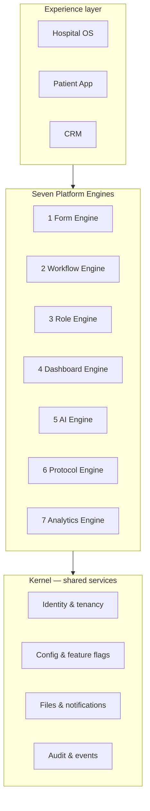

# Adrine Platform Vision

**Last updated:** 2026-06-03  
**Audience:** Product, engineering, client onboarding, investors  
**Status:** North-star definition — implementation is incremental; see gap notes per engine

Adrine is **not** a hospital management system, clinic software, lab software, or a single vertical healthcare application. Adrine is a **global healthcare infrastructure cloud platform** — a healthcare operating system, workflow infrastructure, AI runtime, app platform, integration cloud, and patient ecosystem that many organizations share on **one deployment**.

This document captures the platform vision, the **seven reusable engines**, and the **no hardcoding** principle that governs every client implementation (Navayu is the first advanced specialty reference).

For long-term AWS/enterprise architecture, see [.cursor/plans/adrine_master_blueprint_3a1b9ff0.plan.md](../.cursor/plans/adrine_master_blueprint_3a1b9ff0.plan.md). For what ships in Hospital OS today, see [CURRENT_FEATURES_AND_WORKFLOWS.md](./CURRENT_FEATURES_AND_WORKFLOWS.md).

---

## 1. What Adrine must become

After a client completes payment, Adrine should **provision their organization within hours**, not months.

Each client receives:

| Capability | Client-owned | Platform-owned |
|------------|--------------|----------------|
| Organization & branches | ✓ | — |
| Branding & white-label | ✓ | Shell UI |
| Workflows & clinical journeys | ✓ (config) | Engine runtime |
| Forms & assessments | ✓ (config) | Form renderer + API |
| Role permissions & navigation | ✓ (config) | Auth + RBAC shell |
| Dashboards & KPIs | ✓ (config) | Widget runtime |
| AI workflows & templates | ✓ (config) | AI Gateway + audit |
| Protocol libraries | ✓ (config) | Protocol mapper |
| Reports & analytics | ✓ (config) | Analytics queries |
| Patient database | ✓ (isolated) | Multi-tenant DB |

Adrine must function as **healthcare ERP + EMR + AI operating system + workflow engine + analytics platform** — without forking code per client.

---

## 2. Multi-tenant requirements

**One Adrine deployment. Unlimited organizations.**

Examples on the same stack:

- Navayu Spine & Joint Care  
- Hospital A, Hospital B  
- Clinic C, Diagnostic Center D  

**Data isolation is mandatory.** Each organization sees only its own patients, doctors, billing, appointments, EMR, reports, analytics, inventory, and CRM.

| Layer | Isolation mechanism | Today |
|-------|---------------------|-------|
| API | `x-tenant-id` + JWT claims | **Exists** (kernel-api) |
| Database | `tenant_id` on rows; RLS target | **Partial** — app-level isolation; RLS not production-hardened |
| Files | `{tenantId}/{branchId}/…` in object store | **Designed** (R2/S3 path convention) |
| UI | Single Hospital OS build; tenant at login | **Exists** |
| Branches | Branch session after login | **Exists** (kernel branch config) |

**Deployment tiers:**

| Tier | Target | Doc |
|------|--------|-----|
| **Adrine Lite** | Navayu + ~15–20 small OPD tenants on one VPS | [DEPLOYMENT_HOSTINGER_COOLIFY.md](./DEPLOYMENT_HOSTINGER_COOLIFY.md) |
| **Enterprise** | Large hospitals, compliance, scale-out | Master blueprint (AWS ap-south-1) |

Do **not** deploy separate stacks per client on Lite tier — tenant isolation lives in the database.

---

## 3. Core principle: configuration over code

> **Never build client-specific hardcoded modules.**

| Forbidden | Required instead |
|-----------|------------------|
| Hardcoded forms (`NavayuRegistration.tsx`) | `FormDefinition` JSON + dynamic renderer |
| Hardcoded workflows per client | Published `WorkflowDefinition` + lifecycle bindings |
| Hardcoded role screens per client | Role Engine: enable roles, nav, permissions via config |
| Hardcoded KPI tiles per client | Dashboard Engine: configurable widgets |
| Direct LLM calls in domain code | AI Engine: all calls through AI Gateway with policy + audit |
| Navayu-only protocol UI | Protocol Engine: tenant/branch catalog JSON |
| One-off MIS reports | Analytics Engine: saved queries + role dashboards |

**Provisioning model:** Payment → seed **operational pack** (tenant, branches, users, forms, workflow, protocols, branding) → UAT → go-live. Navayu's pack is `navayu-msk-v1`; the next clinic gets `opd_clinic` or a custom pack — same engines, different data.

Onboarding template packs today (`packages/hospital-operations/src/provisioning/onboarding-templates.ts`): `opd_clinic`, `multi_specialty`, `emergency_pack`. Navayu requires a new **`navayu_msk`** pack — not a fork.

---

## 4. The seven engines

These are the **only** primitives needed to onboard hospitals, clinics, specialty centers, and healthcare chains. Hospital OS, Patient App, and CRM are **experiences** that consume engines — not the source of truth.

---

### 4.1 Form Engine

**Purpose:** Every organization creates and publishes forms without developer involvement.

**Supports:**

- Registration, intake, clinical assessment, nursing, counsellor, follow-up, consent, insurance, NABH, specialty forms  
- Field types: text, number, date/time, dropdown, multi-select, radio, checkbox, signature, file/image upload, **pain mapping**, rich text, **score calculators** (ODI, NDI, WOMAC, etc.)  
- Responses attached to patient records and visit lifecycles  

**Implementation status:** **Missing (core)** / **Partial (UI flags)**

| Component | Status |
|-----------|--------|
| Admin feature flag `formBuilderEnabled` | **Partial** — flag exists in `tenantSettings.ts` |
| Static form templates (5 keys) in TenantSettings | **Partial** — localStorage only |
| `FormDefinition` schema + publish API | **Missing** |
| Dynamic form renderer in consult/reception | **Missing** |
| Score calculator widgets | **Missing** |
| Pain diagram component | **Missing** |

---

### 4.2 Workflow Engine

**Purpose:** Configurable state machines for any clinical or operational journey.

**Examples:**

- Navayu: Reception → AI intake → Junior doctor → Assessment → AI summary → Senior → Protocol → Counsellor → Rx → Follow-up  
- Standard OPD: Registration → Queue → Consult → Lab → Pharmacy → Billing  
- Emergency: Triage → Treatment → Observation → IPD  

**Implementation status:** **Partial**

| Component | Status |
|-----------|--------|
| Domain lifecycle engines (OPD, lab, rad, pharmacy, IPD, OT, …) | **Exists** — `@adrine/hospital-operations` runtime engines |
| `WorkflowDefinition` draft/publish/rollback API | **Exists** — `services/domain-api/src/workflow-config/` |
| Branch workflow overrides | **Exists** — `WorkflowBranchOverride` |
| UI workflow designer | **Partial** — flag `workflowDesignerEnabled`; admin tile preview |
| Navayu `navayu_msk_visit` lifecycle binding | **Missing** — extends OPD visit |
| Temporal / durable automation | **Missing** — worker skeleton only |

---

### 4.3 Role Engine

**Purpose:** Organizations define roles, permissions, and navigation — not fixed HMS menus.

**Supports:** Custom role labels, enable/disable on login, per-role tab visibility, permission matrices, branch-scoped access.

**Implementation status:** **Partial**

| Component | Status |
|-----------|--------|
| 16 fixed `UserRole` keys + `ROLE_TABS` | **Exists** — `roleNavigation.ts` |
| TenantSettings: role labels, enable, nav visibility | **Partial** — **localStorage only** (`TenantSettingsContext.tsx`) |
| Server-persisted tenant settings | **Missing** — Wave 0 blocker |
| Custom roles beyond enum (e.g. `clinical_associate`, `counsellor`) | **Missing** — map via config to doctor/CRM today |
| ABAC / fine-grained permissions | **Partial** — RBAC at route level |

---

### 4.4 Dashboard Engine

**Purpose:** Every role gets a configurable dashboard — registrations, queue, revenue, outcomes, etc.

**Implementation status:** **Partial**

| Component | Status |
|-----------|--------|
| Role dashboard routes (reception, doctor, admin, …) | **Exists** — many routes **Preview** with demo KPIs |
| Platform-hydrated reception/doctor OPD dashboards | **Partial** — P0 spine wired per backlog |
| Configurable KPI/widget builder | **Missing** |
| Management MIS (revenue cycle, treatment outcomes) | **Partial** — admin tiles illustrative |

---

### 4.5 AI Engine

**Purpose:** Governed AI across intake processing, clinical summaries, investigation summarization, follow-ups, analytics insights, and workflow recommendations.

**Rules:**

- All model calls through **AI Gateway** (policy, budget, audit, redaction)  
- No raw SDK keys in Hospital OS or domain-api in production  
- Clinical AI outputs are **assistive** — audited, template-bound  

**Implementation status:** **Missing (production)** / **Partial (stubs)**

| Component | Status |
|-----------|--------|
| `services/ai-gateway` (FastAPI) | **Partial** — package exists; not production-wired |
| Domain `AIOrchestrationService` | **Partial** — stub `runAction` strings |
| Consultation AI scribe (UI + optional OpenRouter key) | **Partial** — dev-only pattern |
| Navayu one-page summary template (AI-4) | **Missing** |
| Investigation upload → AI summarize | **Missing** |
| Per-tenant AI budget + governance UI | **Partial** — admin platform hub preview |

---

### 4.6 Protocol Engine

**Purpose:** Editable treatment protocol libraries — stages, components, package mapping — without code changes.

**Examples:** Disc Care, Frozen Shoulder, Knee OA, AVN, Regenerative Medicine.

**Implementation status:** **Missing**

| Component | Status |
|-----------|--------|
| Protocol catalog schema (tenant/branch JSON) | **Designed** — not implemented |
| Protocol mapper UI in consultation | **Missing** |
| Link protocol stage → billing package SKU | **Missing** |
| Counsellor tier mapping (Basic / Advanced / Regenerative / Premium) | **Missing** |

---

### 4.7 Analytics Engine

**Purpose:** Configurable MIS, treatment outcomes, referral analytics, revenue cycle, doctor performance.

**Implementation status:** **Partial**

| Component | Status |
|-----------|--------|
| Operational analytics service (domain-api) | **Partial** |
| Admin MIS / revenue cycle / treatment success routes | **Partial** — mostly Preview |
| CRM referral source reports | **Partial** |
| Saved report builder | **Missing** |
| ClickHouse / data lake | **Missing** — future tier |

---

## 5. Engine implementation summary

| # | Engine | Status | Notes |
|---|--------|--------|-------|
| 1 | **Form Engine** | **Missing** | Flags + static templates only; no FormDefinition runtime |
| 2 | **Workflow Engine** | **Partial** | Lifecycle engines + workflow-config API; designer + MSK binding missing |
| 3 | **Role Engine** | **Partial** | 16 roles + local tenant settings; no server sync or custom roles |
| 4 | **Dashboard Engine** | **Partial** | Routes exist; configurable widgets missing; many Preview KPIs |
| 5 | **AI Engine** | **Missing** | Gateway stub; no governed Navayu summary pipeline |
| 6 | **Protocol Engine** | **Missing** | Catalog + mapper not built |
| 7 | **Analytics Engine** | **Partial** | Backend hooks; MIS mostly illustrative |

**Strategic sequence (all clients, including Navayu):**

1. **Wave 0** — Server-persisted tenant settings + provisioning scripts  
2. **Wave 1** — Form Engine v1 + DynamicFormRenderer + FormResponse API  
3. **Wave 2** — Workflow bindings to OPD/visit + published Navayu pack  
4. **Wave 3** — AI Gateway v1 + summary templates  
5. **Wave 4** — Protocol Engine + counsellor/package bridge  
6. **Wave 5** — Dashboard/Analytics configurability  

---

## 6. Experience layer (not engines)

These are **clients** of the engines:

| Experience | Role |
|------------|------|
| **Hospital OS** (`apps/hospital-os`) | Staff workspace — reception through admin |
| **Patient App** (`apps/patient-app`) | Intake, appointments, reports, portal outputs |
| **CRM** (Hospital OS `/crm`) | Leads, lifecycle, campaigns, counsellor handoff |
| **Public booking** (adrine.in) | Location → service → doctor → slot → queue |

Experiences must not embed tenant-specific business logic — they render engine output.

---

## 7. Universal engineering principles

Aligned with the master blueprint:

- **Multi-tenant by default** — no code path without resolved `tenantId`  
- **Event-first** — state changes emit typed domain events  
- **Configuration over code** — tenant behavior in config, not forks  
- **API-first** — contracts before UI  
- **AI only through AI Gateway**  
- **Async-first UX** — AI and notifications queued; API p95 target &lt; 200 ms  
- **Healthcare-grade security** — PHI encryption, audit, RLS roadmap ([ENTERPRISE_AUDIT_REPORT.md](../ENTERPRISE_AUDIT_REPORT.md))  

---

## 8. First reference client: Navayu

Navayu Spine & Joint Care is the first **advanced specialty** implementation — proof that the seven engines can deliver a structured MSK functional-medicine workflow without a custom fork.

| Item | Value |
|------|-------|
| Tenant | `tenant_navayu` (one org) |
| Branches | **Pataudi Hospital** + **Gurgaon Center** |
| Pack | `navayu-msk-v1` (forms + workflow + protocols as data) |
| Spec | [NAVAYU_IMPLEMENTATION_SPEC.md](../clients/navayu/NAVAYU_IMPLEMENTATION_SPEC.md) |
| Workflow detail | [NAVAYU_MSK_WORKFLOW.md](../clients/navayu/NAVAYU_MSK_WORKFLOW.md) |
| Deploy target | [DEPLOYMENT_HOSTINGER_COOLIFY.md](./DEPLOYMENT_HOSTINGER_COOLIFY.md) |

---

## 9. Related documentation

| Document | Use |
|----------|-----|
| [CURRENT_FEATURES_AND_WORKFLOWS.md](./CURRENT_FEATURES_AND_WORKFLOWS.md) | Honest today-state |
| [DEPLOYMENT_HOSTINGER_COOLIFY.md](./DEPLOYMENT_HOSTINGER_COOLIFY.md) | Navayu Lite deploy |
| [ops/HOSPITAL_OS_PRODUCT_BACKLOG.md](../ops/HOSPITAL_OS_PRODUCT_BACKLOG.md) | Shipped vs next |
| [ENTERPRISE_AUDIT_REPORT.md](../ENTERPRISE_AUDIT_REPORT.md) | PHI / production gaps |
| [ROLE_MODULES/README.md](./ROLE_MODULES/README.md) | Per-role depth |
| [adrine_master_blueprint](../.cursor/plans/adrine_master_blueprint_3a1b9ff0.plan.md) | Enterprise roadmap |
