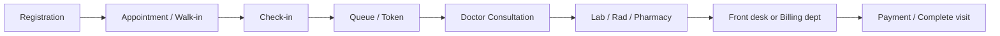
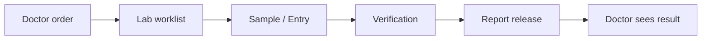
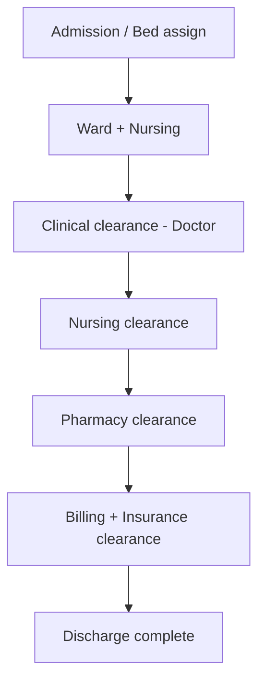

# Adrine Hospital OS — Current Features & Workflows

**Last updated:** 2026-05-25  
**Product:** `apps/hospital-os` (staff UI) on **Adrine Infra** monorepo  
**Live demo UI:** [https://adrine-hospital-os.vercel.app](https://adrine-hospital-os.vercel.app) (UI only unless API env vars are set)

This document describes **what exists today** — features, role workspaces, and cross-department workflows. It is written for hospital owners, demo presenters, and engineers. For route-level connectivity detail, see [MASTER_OPERATIONAL_CONNECTIVITY_MATRIX.md](../MASTER_OPERATIONAL_CONNECTIVITY_MATRIX.md). For production safety, see [ENTERPRISE_AUDIT_REPORT.md](../ENTERPRISE_AUDIT_REPORT.md).

---

## 1. How the product works (two modes)

| Mode | When | What you get |
|------|------|----------------|
| **Demo / local** | `VITE_PLATFORM_RUNTIME=false` or APIs down | Full UI with **local store** data — good for screenshots and navigation demos |
| **Platform / live** | `VITE_PLATFORM_RUNTIME=true` + kernel-api + domain-api + tenant | **Authoritative** visits, queues, orders, billing transitions, worklists, SSE refresh |

**Login:** Role-based launch screen (16 roles). **Doctor** also picks **department + doctor name**. Staging auth uses kernel dev-login — see `ops/PRODUCTION_AUTH.md`.

**UI cues:** Many routes show **Live** or **Preview** badges (`routeReadiness.ts`). **Preview** = illustrative or local-only; do not treat as production workflow.

---

## 2. Role workspaces (what each role can open)

Each role gets a **top tab bar** (customizable under Admin → Settings). Base paths:

| Role | Base path | Primary purpose |
|------|-----------|-----------------|
| **Administrator** | `/admin` | Tenant config, command center, MIS, audit, platform hub, onboarding |
| **Doctor** | `/doctor` | OPD queue, consultation, orders, Rx, IPD, results |
| **Nurse** | `/nurse` | Ward, tasks, vitals, MAR, admissions, discharge nursing clearance |
| **Receptionist** | `/reception` | Registration, appointments, check-in, queue, front desk billing, IPD intake, flow hub |
| **Lab Technician** | `/lab` | Worklist, samples, entry, verification, release |
| **Pharmacist** | `/pharmacy` | Prescriptions, dispense, inventory |
| **Billing & Finance** | `/billing-dept` | Invoices, payments, IPD billing, insurance, GST (hospital revenue — not Adrine SaaS billing) |
| **Radiologist** | `/radiology` | Orders, worklist, reports |
| **OT Coordinator** | `/ot` | Schedule, board, rooms, pre/intra/post-op |
| **Inventory Manager** | `/inventory` | Catalog, issue, GRN, requisitions, procurement |
| **Emergency / ER** | `/emergency` | Triage, cases, treatment, observation, ambulance, MLC |
| **HR & Staff** | `/hr` | Staff profiles, roster links, attendance (partial) |
| **Scheduling** | `/scheduling` | Book, calendar, resources, waitlist, teleconsult |
| **Dialysis Unit** | `/dialysis` | Sessions, machines, consumables |
| **CRM & Patient Relations** | `/crm` | Leads, lifecycle, campaigns, drip marketing |

**Extra routes:** Many roles have additional screens beyond tabs (e.g. `/doctor/consultation/:patientId`, `/doctor/emr`, `/nurse/vitals/chart/:id`). Planned doctor screens are registered in `App.tsx` (`DOCTOR_PAGES` + `DoctorPlannedScreens`).

**Deep plans per role:** [docs/ROLE_MODULES/README.md](./ROLE_MODULES/README.md)

---

## 3. Hospital customization (no-code, today)

Configured at **`/admin/settings`** (stored in browser `localStorage` until server sync is complete):

| Area | What you can change |
|------|---------------------|
| **Branding** | Platform name, org name, login headline, support contacts |
| **Roles** | Enable/disable roles on login screen; custom labels and descriptions |
| **Navigation** | Per role: show/hide tabs, rename tab labels |
| **Feature flags** | White-label, telemedicine, CRM, form builder, custom fields, workflow designer, API access |
| **Registration** | Departments list; patient types and journey (OPD, IPD, Emergency, etc.) |
| **Form templates** | Field lists for admission, consent, nursing chart, doctor order sheet, discharge summary |
| **Advanced JSON** | Full settings export/import for demo presets |

**Branch policies (API):** On login, kernel **branch config** loads (e.g. `billing.allow_partial_payment`) and feeds billing/OT/inventory guards.

**Module entitlements:** Platform can enable/disable module packs per tenant (kernel `TenantModuleEntitlement`).

**Demo tip:** Configure as Admin in one browser profile, then log in as Doctor to show customized tabs and branding.

---

## 4. End-to-end workflows (current)

### 4.1 OPD day (main spine)

| Step | Who | Screens | Platform (when runtime on) |
|------|-----|---------|----------------------------|
| Register / search patient | Reception | `/reception/registration` | Patient create/search; walk-in fast path |
| Book / manage appointment | Reception | `/reception/appointments` | Scheduling API; cancel/complete |
| Check-in | Reception | `/reception/checkin` | Links to OPD visit |
| Queue / call patient | Reception | `/reception/queue` | `GET /opd/visits/board`; SSE refresh |
| Command center view | Reception | `/reception/flow` | Operational panels: lab, pharmacy, rad, IPD, discharge, financial strip |
| OPD queue | Doctor | `/doctor/queue` | Department queue; start consult |
| Consultation | Doctor | `/doctor/consultation/:patientId` | Complaints, diagnosis, Rx, lab/rad orders; **blocker strip** for pending diagnostics/billing; complete consultation transition |
| Result review | Doctor | `/doctor/labs`, `/doctor/radiology` | Released results |
| Front desk charges | Reception | `/reception/billing` | Charges; handoff to billing dept |
| Invoices / payments | Billing | `/billing-dept/invoices`, `/payments` | Billing dept API; GAP-006/007 gates |

**Not yet enterprise EMR:** Structured problem list, ICD-10 required, allergy hard-stop, unified vitals timeline — see [DOCTOR_MODULE.md](./ROLE_MODULES/DOCTOR_MODULE.md).

---

### 4.2 Diagnostics — Lab

| Step | Screen | Notes |
|------|--------|--------|
| Worklist | `/lab/worklist` | Branch worklist + SSE; `LabWorkflowStepStrip` |
| Sample / entry | `/lab/samples`, `/lab/entry` | Stage transitions |
| Verify / release | `/lab/verification`, `/lab/reports` | **GAP-005** governed verify/release |
| Dashboard | `/lab` | **Preview** KPIs — use worklist for live ops |

---

### 4.3 Diagnostics — Radiology

| Step | Screen | Notes |
|------|--------|--------|
| Orders | `/radiology/orders` | Create/update status |
| Worklist | `/radiology/worklist` | Branch worklist + SSE |
| Reports | `/radiology/reports` | Reporting workflow (no full PACS in P0) |

---

### 4.4 Pharmacy

| Step | Screen | Notes |
|------|--------|--------|
| Prescriptions queue | `/pharmacy/prescriptions` | From doctor orders; verify → dispense |
| Inventory | `/pharmacy/inventory` | Stock when platform on |
| Demo / preview | Schedule H, purchase, suppliers, many extra tabs | Illustrative until procurement spine |

---

### 4.5 IPD + discharge (multi-department)

| Step | Who | Screens |
|------|-----|---------|
| Admission request / beds | Reception | `/reception/ipd`, `/reception/beds` |
| Ward census, tasks, vitals, MAR | Nurse | `/nurse/ward`, `/tasks`, `/vitals`, `/medications` |
| IPD list / patient | Doctor | `/doctor/ipd`, `/doctor/ipd/:id` |
| Discharge panel (shared component) | Doctor, Nurse, Billing, Pharmacy, Reception flow | **`OperationalDischargePanel`** — clinical, nursing, pharmacy, billing, insurance clearances then `complete_discharge` |
| IPD billing | Billing | `/billing-dept/ipd-billing` |

---

### 4.6 Emergency (ER)

| Step | Screen | Notes |
|------|--------|--------|
| Emergency registration | Reception | `/reception/registration` (Emergency journey) → `createEmergencyCase` |
| Triage / board | ER | `/emergency`, `/emergency/triage` |
| Cases / treatment | ER | `/emergency/cases`, `/treatment` |
| Orders | ER | `/emergency/orders` → handoff to consultation |
| Observation / IPD | ER | `/emergency/observation` → **transfer to IPD** |
| Ambulance / MLC | ER | `/emergency/ambulance`, `/mlc` |

**Known gap:** Reception emergency register does not always deep-link to `/emergency/triage` — see [EMERGENCY_MODULE.md](./ROLE_MODULES/EMERGENCY_MODULE.md).

---

### 4.7 OT, inventory, dialysis

| Module | Flow (summary) | Live-leaning routes |
|--------|----------------|---------------------|
| **OT** | Schedule → pre-op → intra → post-op → complete (charges) | `/ot/board`, `/ot/schedule`, lifecycle transitions |
| **Inventory** | Requisition → issue / GRN → stock | `/inventory/issue`, `/inventory/grn` (platform); procurement tabs often **demo** |
| **Dialysis** | Patient → session → machine → billing on complete | `/dialysis/*` module lifecycle |

---

### 4.8 Scheduling, HR, CRM

| Module | Features (current) |
|--------|-------------------|
| **Scheduling** | Book appointment, week calendar, resources, waitlist; campaign → appointment (CRM link) |
| **HR** | Staff list/cards from kernel; attendance/leave/training often **preview** |
| **CRM** | Lead pipeline, lifecycle, campaigns; **drip marketing** at `/crm/drip-campaigns` (moved from reception) |

---

### 4.9 Administration & platform

| Feature | Route | Notes |
|---------|-------|--------|
| Command center | `/admin/command-center` | Operational snapshot |
| Platform admin hub | `/admin/platform` | Tenant/module/AI budget (platform runtime) |
| Onboarding wizard | `/admin/onboarding` | New tenant bootstrap |
| Settings / customization | `/admin/settings` | See §3 |
| Audit / MIS / AI workflow | `/admin/audit`, `/mis`, `/ai-workflow` | Mixed live and preview tiles |
| Doctor revenue sharing | `/admin/doctor-sharing` | Configuration UI |

---

## 5. Cross-cutting platform features

| Feature | Description |
|---------|-------------|
| **Multi-tenant / multi-branch** | `x-tenant-id`, branch session after login |
| **Lifecycle engines** | OPD, lab, rad, pharmacy, IPD, discharge, OT, inventory, dialysis — state transitions with audit |
| **Operational SSE** | Live refresh on queue, worklists, emergency board, panels |
| **Billing gates** | GAP-006 encounter close; GAP-007 insurance/pre-auth |
| **Discharge orchestration** | Single checklist across departments |
| **Patient context bar** | Shared header on consultation and operational flows |
| **Inline platform errors** | Surfaces API failures instead of silent demo fallback (where wired) |
| **Idempotency** | Billing charge lines, platform events |
| **GST / India context** | INR, GST fields in billing models (full e-invoice not complete) |

**Backend (not on Vercel):** `kernel-api` (auth, tenant, config, metering), `domain-api` (~174 endpoints), optional `ai-gateway` stub.

---

## 6. Live vs preview — honest summary

| Class | Meaning | Examples |
|-------|---------|----------|
| **Live / C1-leaning** | Core actions hit platform when runtime on | Reception queue, doctor consultation, lab worklist/verify, pharmacy Rx, billing invoices, nurse MAR/vitals, ER triage |
| **Preview** | UI works; data mostly local/demo | Admin dashboard, doctor analytics, lab dashboard, pharmacy procurement, billing revenue/GST packages, many MIS tiles |

**Rule:** Badge **Live** in the app ≈ operational spine connected. **Preview** ≈ do not demo as go-live ready.

Full matrix: [MASTER_OPERATIONAL_CONNECTIVITY_MATRIX.md](../MASTER_OPERATIONAL_CONNECTIVITY_MATRIX.md)

---

## 7. What is not production-ready (read before PHI)

From [ENTERPRISE_AUDIT_REPORT.md](../ENTERPRISE_AUDIT_REPORT.md):

- Domain API **PHI tier** needs hardened JWT + RLS (not safe for real patient data on public internet yet).
- **Not a full EMR** — thin clinical documentation vs enterprise chart.
- No complete **charge master**, **LIS catalog (LOINC)**, **PACS**, **payroll/ERP**.
- **ai-gateway** / **event-router** largely stubs; AI scribe uses optional `VITE_OPENROUTER_API_KEY` in UI only.
- **IaC** skeleton — production deploy is manual (Vercel for UI + separate API host).

---

## 8. Related documentation

| Document | Use |
|----------|-----|
| [ROLE_MODULES/README.md](./ROLE_MODULES/README.md) | Per-role P0/P1/P2 plans |
| [DEPLOY_VERCEL.md](./DEPLOY_VERCEL.md) | Host Hospital OS UI |
| [ops/HOSPITAL_OS_PRODUCT_BACKLOG.md](../ops/HOSPITAL_OS_PRODUCT_BACKLOG.md) | Shipped vs next work |
| [ops/PRODUCTION_AUTH.md](../ops/PRODUCTION_AUTH.md) | Auth for staging/production |
| [ops/GO_LIVE_RUNBOOK.md](../ops/GO_LIVE_RUNBOOK.md) | Go-live steps |
| [.cursor/plans/adrine_master_blueprint_3a1b9ff0.plan.md](../.cursor/plans/adrine_master_blueprint_3a1b9ff0.plan.md) | Long-term platform vision |

---

## 9. Quick demo script (15 minutes)

1. Open live URL → show **role launch** and **branding**.
2. **Admin → Settings** → toggle doctor nav / rename a tab → show **customization**.
3. **Reception** → registration → appointment → check-in → **queue** (or explain demo mode if APIs off).
4. **Doctor** → queue → **consultation** → place lab/Rx → **blocker strip**.
5. **Lab** or **Pharmacy** → worklist action (if platform on).
6. **Billing dept** → invoice/payment (if platform on).
7. Optional: **Flow hub** `/reception/flow` or **discharge panel** on IPD patient.

State clearly whether the session is **UI demo** or **connected staging**.
